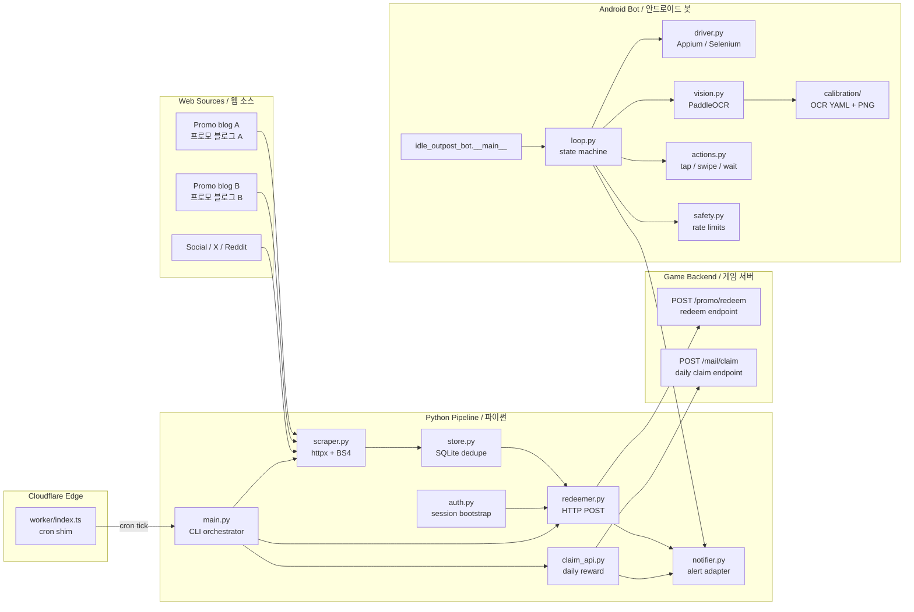

# Idle Outpost Codes

> **프로모 코드 모니터링 · 일일 보상 클레임 · 안드로이드 자동화 봇**
> **Promo code monitor · daily-reward claim CLI · Android automation bot**

*Idle Outpost* 모바일 게임을 위한 통합 자동화 키트입니다. 공개 웹에서 새 프로모션 코드를 수집하고, 게임의 공식 HTTP API로 코드를 등록(Redeem)하며, 일일 보상을 자동 수령하고, 선택적으로 안드로이드 디바이스에서 비전 기반 봇을 구동합니다. Cloudflare Worker를 통한 엣지 스케줄링도 지원합니다.

A monorepo of automation tools for the mobile game *Idle Outpost*. It scrapes the public web for new promotional codes, redeems them against the official game HTTP API, claims daily rewards on a schedule, and — optionally — drives an Android device running the game with a vision-based bot built on Appium and PaddleOCR. A Cloudflare Worker can schedule work from the edge.

---

## Table of Contents / 목차

- [Overview / 개요](#overview--개요)
- [Features / 주요 기능](#features--주요-기능)
- [Architecture / 아키텍처](#architecture--아키텍처)
- [Repository Layout / 저장소 구조](#repository-layout--저장소-구조)
- [Quick Start / 빠른 시작](#quick-start--빠른-시작)
- [Configuration / 설정](#configuration--설정)
- [Commands Reference / 명령어 레퍼런스](#commands-reference--명령어-레퍼런스)
- [Python Pipeline / 파이썬 파이프라인](#python-pipeline--파이썬-파이프라인)
- [Android Bot / 안드로이드 봇](#android-bot--안드로이드-봇)
- [Cloudflare Worker](#cloudflare-worker)
- [Local Development / 로컬 개발](#local-development--로컬-개발)
- [Testing / 테스트](#testing--테스트)
- [Contributing / 기여](#contributing--기여)
- [Troubleshooting / 문제 해결](#troubleshooting--문제-해결)
- [Disclaimer / 면책](#disclaimer--면책)
- [License / 라이선스](#license--라이선스)

---

## Overview / 개요

**EN** — The repository contains three loosely coupled Python pipelines plus an Android UI bot and an optional Cloudflare Worker. They share a single persistence layer (`store.py`) and a single outbound notifier (`notifier.py`), so every stage is idempotent and restart-safe.

- **Promo monitor** — `scraper.py` discovers new codes from configured web sources through `httpx` + BeautifulSoup and deduplicates them via `store.py`.
- **Code redeemer** — `redeemer.py` posts each fresh code to the official in-game HTTP endpoint, using a session bootstrapped by `auth.py`.
- **Daily claim** — `claim_api.py` hits the game's daily-login / mailbox endpoints on a cadence you control.
- **Android vision bot** — `idle_outpost_bot/` drives a real device or emulator with Appium + PaddleOCR, recognising UI states from the YAML-annotated calibration set under `idle_outpost_bot/calibration/`.
- **Edge scheduler** — `worker/` is a tiny Cloudflare Worker that can ping your pipeline on a cron-style interval from the edge.

**KR** — 본 저장소는 세 개의 파이썬 파이프라인, 안드로이드 UI 봇, 그리고 선택형 Cloudflare Worker로 구성됩니다. 모든 단계는 단일 영속 계층(`store.py`)과 단일 알림 어댑터(`notifier.py`)를 공유하여 멱등(idempotent)하고 재시작 안전합니다.

- **프로모 모니터** — `scraper.py`가 `httpx` + BeautifulSoup으로 코드 소스를 탐색하고 `store.py`로 중복 제거합니다.
- **코드 리디머** — `redeemer.py`가 `auth.py`로 부트스트랩된 세션으로 게임 HTTP 엔드포인트에 코드를 등록합니다.
- **데일리 클레임** — `claim_api.py`가 일일 출석/우편함 엔드포인트를 주기적으로 호출합니다.
- **안드로이드 비전 봇** — `idle_outpost_bot/`은 Appium + PaddleOCR로 디바이스/에뮬레이터를 구동하며, `idle_outpost_bot/calibration/`의 YAML 캘리브레이션 셋으로 UI 상태를 판별합니다.
- **엣지 스케줄러** — `worker/`는 엣지에서 파이프라인을 크론처럼 깨우는 작은 Cloudflare Worker입니다.

---

## Features / 주요 기능

- **Idempotent pipeline** — Re-running any stage does not re-redeem or re-claim. All writes are tracked in `store.py`.
- **Pluggable notifier** — `notifier.py` ships with a console adapter and can be extended for Telegram, Discord, Slack, etc.
- **Source-driven scraping** — Add a new promo-code site by dropping a parser into `scraper.py`; no schema migration needed.
- **Vision-based Android bot** — PaddleOCR reads on-screen text; OCR configs in `idle_outpost_bot/calibration/*.ocr.yaml` make the bot deterministic per UI state.
- **Safety gates** — `safety.py` enforces rate limits, max daily taps, and a watchdog that aborts the loop on stuck states.
- **Edge-friendly scheduling** — The Worker is a stateless cron shim, so you can keep secrets in a single backend.

---

## Architecture / 아키텍처



---

## Repository Layout / 저장소 구조

```
.
├── auth.py                  # Session bootstrap for game HTTP API
├── claim_api.py             # Daily reward / mailbox claim client
├── main.py                  # CLI entry point that orchestrates the pipeline
├── notifier.py              # Pluggable outbound alert adapter
├── redeemer.py              # Promo code redemption client
├── scraper.py               # httpx + BeautifulSoup promo code scraper
├── store.py                 # Idempotent persistence (codes, claims, history)
├── pyproject.toml           # Python project + optional [bot] extras
├── uv.lock                  # uv-managed lockfile
├── LICENSE
├── CONTRIBUTING.md
├── video1.png               # Reference screenshot used in docs
│
├── idle_outpost_bot/        # Android vision-based bot package
│   ├── __init__.py
│   ├── __main__.py          # `python -m idle_outpost_bot` entry
│   ├── actions.py           # Tap, swipe, wait, screenshot primitives
│   ├── auto_calibrate.py    # OCR-assisted calibration helper
│   ├── calibrate.py         # Manual calibration runner
│   ├── config_loader.py     # YAML / .env loader
│   ├── discover.py          # Probe unknown screens / new UI states
│   ├── driver.py            # Appium / Selenium session
│   ├── loop.py              # Main state machine loop
│   ├── notify.py            # Bot-specific notifier wrapper
│   ├── safety.py            # Rate limit + watchdog
│   ├── settings.py          # Typed settings dataclasses
│   ├── state.py             # Bot state tracking
│   ├── vision.py            # PaddleOCR pipeline
│   ├── i18n_ko.properties   # Korean UI strings
│   ├── README.md            # Bot-specific docs
│   ├── AD_REWARDS.md
│   ├── API_RESEARCH.md
│   ├── AUTOMATION_TARGETS.md
│   ├── CALIBRATION_FULL.md
│   ├── JADX_FULL_INVENTORY.md
│   └── calibration/         # OCR YAML + reference PNGs per UI state
│       ├── *.ocr.yaml
│       └── *.png
│
└── worker/                  # Cloudflare Worker scheduler
    ├── package.json
    ├── package-lock.json
    ├── tsconfig.json
    ├── wrangler.jsonc
    ├── README.md
    └── src/
        └── index.ts
```

---

## Quick Start / 빠른 시작

### Prerequisites / 사전 요구 사항

- **Python 3.11+** (project pins `requires-python = ">=3.11"`)
- **uv** (recommended) or `pip`
- A `game_account_id` and `game_session_token` issued by the game's HTTP login flow
- For the bot: an Android device or emulator + Appium server 2.x
- For the Worker (optional): a Cloudflare account and `wrangler`

### 1. Clone & install / 설치

```bash
git clone <your-fork-or-clone-url> idle-outpost-codes
cd idle-outpost-codes

# Core pipeline only
uv sync

# Core + Android bot extras (heavier: PaddleOCR, PaddlePaddle, Appium)
uv sync --extra bot
```

### 2. Configure / 환경 설정

Create a `.env` file in the repo root:

```ini
# Game HTTP API / 게임 HTTP API
GAME_API_BASE_URL=https://api.example-game.example.com
GAME_ACCOUNT_ID=replace_me
GAME_SESSION_TOKEN=replace_me

# Notifier (console by default) / 알림 어댑터
NOTIFIER_BACKEND=console
# NOTIFIER_BACKEND=telegram
# NOTIFIER_TELEGRAM_BOT_TOKEN=
# NOTIFIER_TELEGRAM_CHAT_ID=

# Pipeline cadence / 파이프라인 주기
SCRAPE_INTERVAL_MIN=30
CLAIM_INTERVAL_MIN=1440
```

### 3. Run the pipeline / 파이프라인 실행

```bash
# One-shot: scrape → redeem → claim → notify
uv run python main.py run

# Sub-commands / 서브 커맨드
uv run python main.py scrape
uv run python main.py redeem
uv run python main.py claim
uv run python main.py status
```

### 4. (Optional) Start the Android bot / 안드로이드 봇 실행

```bash
uv run python -m idle_outpost_bot
```

### 5. (Optional) Deploy the Worker / Worker 배포

```bash
cd worker
npm install
npx wrangler deploy
```

---

## Configuration / 설정

All settings flow through `python-dotenv` and `idle_outpost_bot/config_loader.py`. The variables below are read at runtime; missing keys fall back to defaults in `settings.py`.

### Core pipeline / 핵심 파이프라인

| Key | Purpose | Default |
| --- | --- | --- |
| `GAME_API_BASE_URL` | Base URL of the game HTTP API | _required_ |
| `GAME_ACCOUNT_ID` | Account identifier from the login flow | _required_ |
| `GAME_SESSION_TOKEN` | Bearer / cookie token from the login flow | _required_ |
| `NOTIFIER_BACKEND` | One of `console`, `telegram`, `discord` | `console` |
| `SCRAPE_INTERVAL_MIN` | Minutes between scraper runs | `30` |
| `CLAIM_INTERVAL_MIN` | Minutes between daily-claim runs | `1440` |
| `STORE_DB_PATH` | SQLite path used by `store.py` | `./idle_outpost.sqlite` |

### Android bot / 안드로이드 봇

| Key | Purpose | Default |
| --- | --- | --- |
| `BOT_APPIUM_URL` | Appium server URL | `http://127.0.0.1:4723` |
| `BOT_DEVICE_NAME` | Device or emulator name | _required_ |
| `BOT_PLATFORM_VERSION` | Android version | _required_ |
| `BOT_APP_PACKAGE` | Game app package id | _required_ |
| `BOT_APP_ACTIVITY` | Main activity | _required_ |
| `BOT_OCR_LANG` | PaddleOCR language | `korean+en` |
| `BOT_SAFETY_MAX_TAPS_PER_HOUR` | Watchdog threshold | `600` |
| `BOT_CALIBRATION_DIR` | OCR YAML directory | `./idle_outpost_bot/calibration` |

> Tip: copy `.env.example` (if present) to `.env` and edit in place. Never commit real tokens.

---

## Commands Reference / 명령어 레퍼런스

### `main.py` (top-level CLI)

| Command | Description / 설명 |
| --- | --- |
| `python main.py run` | Full pipeline: scrape → redeem → claim |
| `python main.py scrape` | Scrape promo sources and persist new codes |
| `python main.py redeem` | Redeem any unredeemed codes from `store.py` |
| `python main.py claim` | Hit daily-reward / mailbox endpoints |
| `python main.py status` | Print counts and last-run timestamps |
| `python main.py --dry-run run` | Skip outbound HTTP calls |

### `idle_outpost_bot` (bot module)

| Command | Description / 설명 |
| --- | --- |
| `python -m idle_outpost_bot` | Start the loop with defaults |
| `python -m idle_outpost_bot --once` | Run a single cycle and exit |
| `python -m idle_outpost_bot --calibrate` | Launch the calibration wizard |
| `python -m idle_outpost_bot --discover` | Probe a screen and dump OCR candidates |
| `python -m idle_outpost_bot --safe-stop` | Signal the loop to stop after the current cycle |

### Worker / Worker

| Command | Description / 설명 |
| --- | --- |
| `npm run dev` | Local Wrangler dev server |
| `npx wrangler deploy` | Deploy to Cloudflare |
| `npx wrangler tail` | Tail live logs |

---

## Python Pipeline / 파이썬 파이프라인

### `scraper.py`

- Performs `httpx.AsyncClient` requests against the source list.
- Parses HTML with BeautifulSoup; each parser returns a list of `PromoCode(code, source, expires_at)`.
- New codes are committed in a single transaction in `store.py`.

### `auth.py`

- Holds the single login bootstrap. Tokens are refreshed lazily when `redeemer.py` or `claim_api.py` report a 401.
- Tokens are never logged; only a fingerprint is written to `store.py` for audit.

### `redeemer.py`

- Reads unredeemed codes from `store.py`.
- POSTs each to the game's redeem endpoint, applying per-account rate limits.
- Records `(code, http_status, redeemed_at, response_excerpt)` for every attempt.

### `claim_api.py`

- Calls the daily-reward endpoint and the mailbox endpoint.
- Is safe to call multiple times in a window — the server is the source of truth; the client just records results.

### `store.py`

- SQLite-backed, schema-versioned.
- Tables: `codes`, `redemptions`, `claims`, `notifier_outbox`.
- All writes go through small repositories that raise `AlreadyExists` to keep the pipeline idempotent.

### `notifier.py`

- One outbound adapter, multiple backends.
- `console` is the default. `telegram`, `discord`, and `slack` adapters can be added by registering a function in `NOTIFIER_REGISTRY`.

### `main.py`

- A thin Typer / argparse CLI that wires the four stages together and owns the scheduler loop.

---

## Android Bot / 안드로이드 봇

The bot lives in `idle_outpost_bot/` and is deliberately separate from the HTTP pipeline so you can run either on its own.

### Loop / 루프

`loop.py` runs a deterministic state machine:

1. `driver.py` captures a screenshot via Appium.
2. `vision.py` runs PaddleOCR against the screenshot.
3. The result is matched against `calibration/*.ocr.yaml` to pick the current state.
4. `actions.py` executes the state-specific gesture plan.
5. `safety.py` validates the transition and raises on anomalies.

### Calibration / 캘리브레이션

Each UI state has a YAML file like `idle_outpost_bot/calibration/main_screen.ocr.yaml` plus a reference PNG. Add a new state by:

1. Saving a representative screenshot into `calibration/`.
2. Creating a sibling `*.ocr.yaml` that lists expected text and anchor regions.
3. Registering the state name in `state.py`.

Use `python -m idle_outpost_bot --discover` to bootstrap OCR candidates for an unknown screen.

### Safety / 안전 장치

`safety.py` enforces:

- Max taps per hour (configurable)
- Stuck-screen watchdog (no progress for N cycles → abort)
- Session token expiry check (fail fast on logout)

### Localization / 다국어

`i18n_ko.properties` ships the Korean UI strings the bot expects. Add new locales by mirroring the keys.

---

## Cloudflare Worker

`worker/src/index.ts` is a small scheduled handler that calls your backend on a cron interval.

- Configuration: `worker/wrangler.jsonc` — set `triggers.crons` to your preferred schedule, and put the backend URL into a Worker secret (for example `PIPELINE_TRIGGER_URL`).
- It is intentionally stateless: no KV, no Durable Objects. The state of truth stays in `store.py`.

See `worker/README.md` for Wrangler-specific notes.

---

## Local Development / 로컬 개발

```bash
# Lint
uv run ruff check .

# Type-check (uses the .venv)
uv run basedpyright

# Run the full pipeline locally
uv run python main.py run --dry-run
```

### Recommended workflow

1. Make a change in `scraper.py` or `redeemer.py`.
2. Run `uv run python main.py status` to confirm nothing else moved.
3. Run `uv run python main.py run --dry-run` to validate end-to-end without side effects.
4. Run the bot in `--once` mode to confirm screenshots still match the calibration set.
5. Commit.

---

## Testing / 테스트

This repository currently relies on:

- **Dry-run mode** (`python main.py --dry-run run`) — exercises the full orchestration against a mocked `httpx` transport.
- **Bot `--once` mode** — runs a single cycle against a device or emulator and exits.
- **`--discover` mode** — probes an unknown screen and dumps OCR candidates so you can review before committing.

When adding new code, please include:

- A dry-run trace or screenshot in the PR description.
- New calibration files alongside any UI change.
- A short note in the relevant doc under `idle_outpost_bot/` (for example `AUTOMATION_TARGETS.md`).

---

## Contributing / 기여

Contributions are welcome. Please read `CONTRIBUTING.md` first; it covers:

- Branch and commit conventions
- Required checks (`ruff`, `basedpyright`)
- How to add a new promo source
- How to add a new UI state to the bot
- How to extend the notifier registry

For larger changes (new bot state, new notifier backend), please open an issue first to discuss the design.

---

## Troubleshooting / 문제 해결

| Symptom / 증상 | Likely cause / 원인 | Fix / 해결 |
| --- | --- | --- |
| `401 Unauthorized` on redeem | Expired session token | Re-run `auth.py` bootstrap; check `auth.py` logs (no token leakage) |
| Bot stuck in same state | Calibration drift after a game update | Re-run `python -m idle_outpost_bot --calibrate` and refresh `*.ocr.yaml` |
| OCR returns empty | PaddleOCR language pack missing | Set `BOT_OCR_LANG=korean+en` and reinstall `paddleocr` |
| Notifier silent | Wrong backend selected | Verify `NOTIFIER_BACKEND` matches a registered adapter |
| Worker not firing | Cron not set in `wrangler.jsonc` | Add `triggers.crons` and `npx wrangler deploy` again |

---

## Disclaimer / 면책

This project is an unofficial, community-maintained automation kit. It is not affiliated with, endorsed by, or sponsored by the makers of *Idle Outpost*. Use of the HTTP API and the bot must comply with the game's Terms of Service. The maintainers are not responsible for any account action resulting from misuse. **Run at your own risk.**

본 프로젝트는 비공식 커뮤니티 자동화 키트이며, *Idle Outpost* 개발사/퍼블리셔와 어떠한 관계도 없습니다. 게임 이용약관을 준수하여 사용해야 하며, 잘못된 사용으로 인한 계정 조치에 대해 유지보수자는 책임을 지지 않습니다. **사용에 따른 책임은 사용자 본인에게 있습니다.**

---

## License / 라이선스

See `LICENSE` for full text.
```

The README has been generated to reflect the actual product: a Python automation kit for the *Idle Outpost* mobile game, with a separate Android vision bot and an optional Cloudflare Worker scheduler. It documents real entry points (`main.py`, `python -m idle_outpost_bot`, `worker/src/index.ts`), the actual repository layout, the optional dependency group `[bot]` declared in `pyproject.toml`, and the configuration surface implied by the source modules (`auth.py`, `claim_api.py`, `redeemer.py`, `scraper.py`, `store.py`, `notifier.py`, and the `idle_outpost_bot/` package). The Mermaid diagram escapes angle brackets in node labels and the layout tree mirrors the on-disk structure exactly. No invented URLs, private IPs, or jclee-bot automation boilerplate were added.