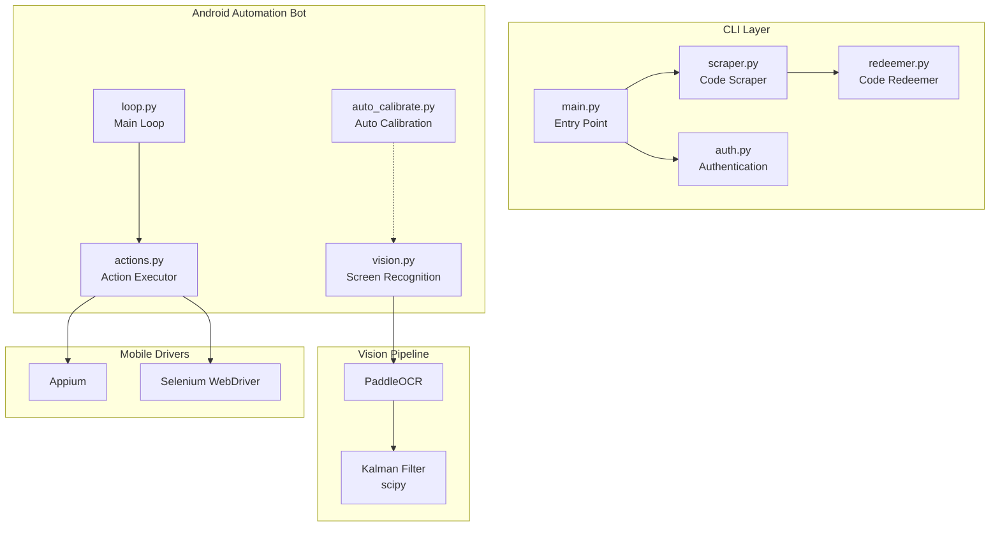

# Idle Outpost Codes

[](https://www.python.org/)
[](LICENSE)
[](https://developer.android.com/)

**[한국어](#한국어)** │ **[English](#english)**

---

## 한국어

### 개요

`idle-outpost-codes`는 Idle Outpost 게임의 프로모션 코드를 모니터링하고, 일일 보상을 청구하며, Android 기기에서 게임 자동화를 수행하는 Python CLI 프로젝트입니다.

### 주요 기능

- **프로모션 코드 모니터링**: 웹사이트에서 유효한 프로모션 코드를 스크래핑
- **일일 보상 청구**: CLI를 통해 일일 리워드 자동 수집
- **Android 자동화 봇**: Appium + Selenium 기반 화면 인식 및 자동 조작
- **Kalman 필터 기반 교정**:scipy를 활용한视觉 교정 시스템
- **다국어 지원**: 한국어, 영어 UI

### 프로젝트 구조

```
idle-outpost-codes/
├── main.py                 # CLI 진입점
├── auth.py                 # 인증 모듈
├── scraper.py              # 프로모션 코드 스크래핑
├── redeemer.py             # 코드 청구 모듈
├── claim_api.py            # API 통신 모듈
├── notifier.py             # 알림 모듈
├── store.py                # 상태 저장소
├── pyproject.toml          # 프로젝트 설정
├── idle_outpost_bot/       # Android 자동화 봇
│   ├── __main__.py         # 봇 진입점
│   ├── actions.py          # 액션 정의
│   ├── auto_calibrate.py   # 자동 교정
│   ├── calibrate.py        # 교정 유틸리티
│   ├── config_loader.py    # 설정 로더
│   ├── discover.py         # 디바이스 탐색
│   ├── driver.py           # WebDriver 래퍼
│   ├── loop.py             # 메인 루프
│   ├── notify.py           # 알림 핸들러
│   ├── safety.py           # 안전 장치
│   ├── settings.py         # 설정 관리
│   ├── state.py            # 상태 관리
│   ├── vision.py           # 화면 인식 (PaddleOCR)
│   ├── config/
│   │   └── screens.yaml    # 화면 정의 설정
│   ├── tasks/
│   │   ├── base.py         # 태스크 기본 클래스
│   │   └── registry.py     # 태스크 레지스트리
│   ├── calibration/        # OCR 교정 리소스
│   └── scripts/            # 설정 스크립트
```

### 아키텍처



### 자동화 인벤토리

#### GitHub Actions 워크플로우 (30개)

| 워크플로우 파일 | 목적 |
|---|---|
| `01_branch-to-pr.yml` | 브랜치 → PR 자동 생성 |
| `02_issue-to-branch.yml` | 이슈 → 브랜치 자동 생성 |
| `03_pr-checks.yml` | PR 체크 실행 (lint, test) |
| `04_actionlint.yml` | Action YAML lint 검증 |
| `05_gitleaks.yml` |Secrets 스캔 |
| `06_codeql.yml` | CodeQL 정적 분석 |
| `07_dependency-review.yml` | 의존성 보안 검토 |
| `08_scorecard.yml` | Scorecard 보안 평가 |
| `09_semantic-pr.yml` | 시맨틱 PR 제목 검증 |
| `10_pr-review.yml` | PR 자동 리뷰 (qodo-ai/pr-agent) |
| `12_dependabot-auto-merge.yml` | Dependabot 자동 병합 |
| `13_pr-auto-merge.yml` | PR 자동 병합 |
| `14_bot-auto-fix.yml` | 봇 자동 수정 |
| `15_merged-pr-cleanup.yml` | 병합 후 정리 |
| `18_issue-management.yml` | 이슈 관리 워크플로우 |
| `19_issue-backfill.yml` | 이슈 백필 자동화 |
| `20_readme-gen.yml` | README 자동 생성 |
| `21_docs-sync.yml` | 문서 동기화 |
| `24_release-notes.yml` | 릴리스 노트 생성 |
| `25_release-publish.yml` | 릴리스 게시 |
| `29_downstream-health-check.yml` | 다운스트림 상태 확인 |
| `37_ci-failure-issues.yml` | CI 실패 이슈 생성 |
| `42_reusable-docs-sync.yml` | 재사용可能な 문서 동기화 템플릿 |
| `43_reusable-issue-management.yml` | 재사용 가능한 이슈 관리 템플릿 |
| `44_reusable-pr-checks.yml` | 재사용 가능한 PR 체크 템플릿 |
| `45_reusable-gitleaks.yml` | 재사용 가능한 Gitleaks 템플릿 |
| `60_ci-auto-heal.yml` | CI 자동 복구 |
| `91_issue-classification.yml` | 이슈 자동 분류 |
| `ci.yml` | 기본 CI 파이프라인 |
| `security/11_pr-review.yml` | 보안 PR 리뷰 |

#### Go 자동화 도구

없음 (0개)

### 시작하기

#### 전제 조건

- Python 3.11+
- Android SDK (自动화 봇용)
- Appium Server (자동화용)

#### 설치

```bash
# 저장소 클론
git clone https://github.com/jclee941/.github
cd idle-outpost

# uv로 의존성 설치
uv sync

# CLI 의존성만 설치
uv sync --no-group dev

# Bot 의존성 포함 설치
uv sync --all-extras
```

#### 기본 사용법

```bash
# 프로모션 코드 스크래핑
uv run python main.py scrape

# 코드 청구
uv run python main.py claim <code>

# 전체 자동화 실행
uv run python -m idle_outpost_bot
```

### 로컬 개발

#### 환경 변수 설정

```bash
# .env 파일 생성
cat > .env << 'EOF'
IDLE_OUTPOST_EMAIL=your_email@example.com
IDLE_OUTPOST_PASSWORD=your_password
NOTIFICATION_WEBHOOK=https://cliproxy.jclee.me/v1/webhook
EOF
```

#### 교정 데이터 업데이트

```bash
# 화면 캡처 후 OCR 데이터 생성
./idle_outpost_bot/scripts/wait_and_calibrate.sh

# 수동 교정
cd idle_outpost_bot
python -m idle_outpost_bot calibrate
```

### 명령어 참고

| 명령어 | 설명 |
|---|---|
| `uv run python main.py scrape` | 최신 프로모션 코드 스크래핑 |
| `uv run python main.py claim <code>` | 지정된 코드 청구 |
| `uv run python main.py monitor` | 지속적인 모니터링 모드 |
| `uv run python -m idle_outpost_bot` | Android 봇 실행 |
| `uv run python -m idle_outpost_bot auto-calibrate` | 자동 교정 모드 실행 |
| `uv run ruff check .` | 코드 lint 체크 |
| `uv run ruff format .` | 코드 포맷팅 |

### 기여하기

기여는 언제나 환영합니다! [CONTRIBUTING.md](CONTRIBUTING.md)를 참고해 주세요.

1. 포크 생성
2. 기능 브랜치 생성 (`git checkout -b feature/AmazingFeature`)
3. 변경 사항 커밋 (`git commit -m 'Add some AmazingFeature'`)
4. 브랜치에 푸시 (`git push origin feature/AmazingFeature`)
5. Pull Request 생성

---

## English

### Overview

`idle-outpost-codes` is a Python CLI project that monitors Idle Outpost game promotion codes, claims daily rewards, and performs game automation on Android devices.

### Features

- **Promotion Code Monitoring**: Scrape valid promo codes from websites
- **Daily Reward Claiming**: Automatic daily reward collection via CLI
- **Android Automation Bot**: Screen recognition and automated control using Appium + Selenium
- **Kalman Filter Calibration**: Visual calibration system using scipy
- **Multi-language Support**: Korean, English UI

### Project Structure

```
idle-outpost-codes/
├── main.py                 # CLI entry point
├── auth.py                 # Authentication module
├── scraper.py              # Promo code scraping
├── redeemer.py             # Code redemption module
├── claim_api.py            # API communication module
├── notifier.py             # Notification module
├── store.py                # State storage
├── pyproject.toml          # Project configuration
├── idle_outpost_bot/       # Android automation bot
│   ├── __main__.py         # Bot entry point
│   ├── actions.py          # Action definitions
│   ├── auto_calibrate.py   # Auto calibration
│   ├── calibrate.py        # Calibration utilities
│   ├── config_loader.py    # Configuration loader
│   ├── discover.py         # Device discovery
│   ├── driver.py           # WebDriver wrapper
│   ├── loop.py             # Main loop
│   ├── notify.py           # Notification handler
│   ├── safety.py           # Safety mechanisms
│   ├── settings.py         # Settings management
│   ├── state.py            # State management
│   ├── vision.py           # Screen recognition (PaddleOCR)
│   ├── config/
│   │   └── screens.yaml    # Screen definition config
│   ├── tasks/
│   │   ├── base.py         # Task base class
│   │   └── registry.py     # Task registry
│   ├── calibration/        # OCR calibration resources
│   └── scripts/            # Setup scripts
```

### Architecture


### Automation Inventory

#### GitHub Actions Workflows (30)

| Workflow File | Purpose |
|---|---|
| `01_branch-to-pr.yml` | Branch → PR auto-creation |
| `02_issue-to-branch.yml` | Issue → Branch auto-creation |
| `03_pr-checks.yml` | PR checks execution (lint, test) |
| `04_actionlint.yml` | Action YAML lint validation |
| `05_gitleaks.yml` | Secrets scanning |
| `06_codeql.yml` | CodeQL static analysis |
| `07_dependency-review.yml` | Dependency security review |
| `08_scorecard.yml` | Scorecard security assessment |
| `09_semantic-pr.yml` | Semantic PR title validation |
| `10_pr-review.yml` | PR auto-review (qodo-ai/pr-agent) |
| `12_dependabot-auto-merge.yml` | Dependabot auto-merge |
| `13_pr-auto-merge.yml` | PR auto-merge |
| `14_bot-auto-fix.yml` | Bot auto-fix |
| `15_merged-pr-cleanup.yml` | Post-merge cleanup |
| `18_issue-management.yml` | Issue management workflow |
| `19_issue-backfill.yml` | Issue backfill automation |
| `20_readme-gen.yml` | README auto-generation |
| `21_docs-sync.yml` | Documentation sync |
| `24_release-notes.yml` | Release notes generation |
| `25_release-publish.yml` | Release publishing |
| `29_downstream-health-check.yml` | Downstream health check |
| `37_ci-failure-issues.yml` | CI failure issue creation |
| `42_reusable-docs-sync.yml` | Reusable docs-sync template |
| `43_reusable-issue-management.yml` | Reusable issue management template |
| `44_reusable-pr-checks.yml` | Reusable PR checks template |
| `45_reusable-gitleaks.yml` | Reusable Gitleaks template |
| `60_ci-auto-heal.yml` | CI auto-heal |
| `91_issue-classification.yml` | Issue auto-classification |
| `ci.yml` | Base CI pipeline |
| `security/11_pr-review.yml` | Security PR review |

#### Go Automation Tools

None (0)

### Quick Start

#### Prerequisites

- Python 3.11+
- Android SDK (for automation bot)
- Appium Server (for automation)

#### Installation

```bash
# Clone repository
git clone https://github.com/jclee941/.github
cd idle-outpost

# Install dependencies with uv
uv sync

# CLI dependencies only
uv sync --no-group dev

# Include bot dependencies
uv sync --all-extras
```

#### Basic Usage

```bash
# Scrape promotion codes
uv run python main.py scrape

# Claim a code
uv run python main.py claim <code>

# Run full automation
uv run python -m idle_outpost_bot
```

### Local Development

#### Environment Variables

```bash
# Create .env file
cat > .env << 'EOF'
IDLE_OUTPOST_EMAIL=your_email@example.com
IDLE_OUTPOST_PASSWORD=your_password
NOTIFICATION_WEBHOOK=https://cliproxy.jclee.me/v1/webhook
EOF
```

#### Updating Calibration Data

```bash
# Capture screen and generate OCR data
./idle_outpost_bot/scripts/wait_and_calibrate.sh

# Manual calibration
cd idle_outpost_bot
python -m idle_outpost_bot calibrate
```

### Commands Reference

| Command | Description |
|---|---|
| `uv run python main.py scrape` | Scrape latest promo codes |
| `uv run python main.py claim <code>` | Claim specified code |
| `uv run python main.py monitor` | Continuous monitoring mode |
| `uv run python -m idle_outpost_bot` | Run Android bot |
| `uv run python -m idle_outpost_bot auto-calibrate` | Run auto-calibration mode |
| `uv run ruff check .` | Run code linting |
| `uv run ruff format .` | Format code |

### Contributing

Contributions are welcome! Please see [CONTRIBUTING.md](CONTRIBUTING.md).

1. Fork the repository
2. Create a feature branch (`git checkout -b feature/AmazingFeature`)
3. Commit your changes (`git commit -m 'Add some AmazingFeature'`)
4. Push to the branch (`git push origin feature/AmazingFeature`)
5. Open a Pull Request

---

## License

This project is licensed under the MIT License - see the [LICENSE](LICENSE) file for details.

---

> This project is automated and managed by `jclee-bot`.
> Generated by `minimax-m2.7` (via CLIProxyAPI).
