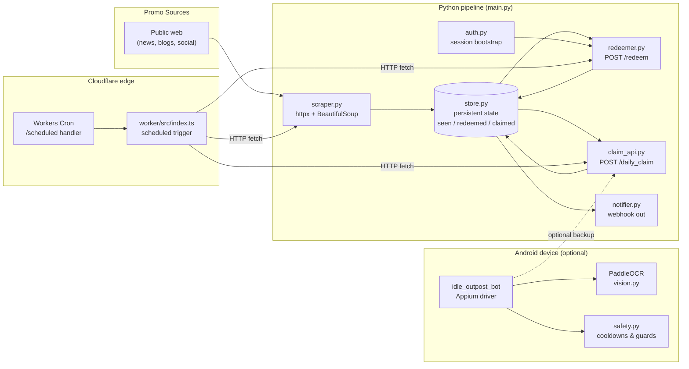

# Idle Outpost Codes

> **프로모 코드 모니터링 · 일일 보상 클레임 · 안드로이드 자동화 봇**
> **Promo code monitor · daily-reward claim CLI · Android automation bot**

*Idle Outpost* 모바일 게임을 위한 통합 자동화 키트입니다. 공개 웹에서 새 프로모션 코드를 수집하고, 게임의 공식 HTTP API로 코드를 등록(Redeem)하며, 일일 보상을 자동 수령하고, 선택적으로 안드로이드 디바이스에서 비전 기반 봇을 구동합니다. Cloudflare Worker를 통한 엣지 스케줄링도 지원합니다.

A monorepo of automation tools for the mobile game *Idle Outpost*. It scrapes the public web for new promotional codes, redeems them against the official game HTTP API, claims daily rewards on a schedule, and — optionally — drives an Android device running the game with a vision-based bot built on Appium and PaddleOCR. A Cloudflare Worker can schedule work from the edge.

---

## Table of Contents / 목차

- [Overview / 개요](#overview--개요)
- [Features / 주요 기능](#features--주요-기능)
- [Architecture / 아키텍처](#architecture--아키텍처)
- [Repository Layout / 저장소 구조](#repository-layout--저장소-구조)
- [Quick Start / 빠른 시작](#quick-start--빠른-시작)
- [Configuration / 설정](#configuration--설정)
- [Commands Reference / 명령어 레퍼런스](#commands-reference--명령어-레퍼런스)
- [Components / 컴포넌트별 설명](#components--컴포넌트별-설명)
- [Android Bot / 안드로이드 봇](#android-bot--안드로이드-봇)
- [Cloudflare Worker](#cloudflare-worker)
- [Local Development / 로컬 개발](#local-development--로컬-개발)
- [Testing / 테스트](#testing--테스트)
- [Contributing / 기여](#contributing--기여)
- [Troubleshooting / 문제 해결](#troubleshooting--문제-해결)
- [Disclaimer / 면책](#disclaimer--면책)
- [License / 라이선스](#license--라이선스)

---

## Overview / 개요

**EN** — The repository contains three loosely coupled Python pipelines plus an Android UI bot and an optional Cloudflare Worker. They share a single persistence layer (`store.py`) and a single outbound notifier (`notifier.py`), so each stage is idempotent and restart-safe.

- **Promo monitor** — `scraper.py` discovers new codes from configured web sources via `httpx` + BeautifulSoup and deduplicates them through `store.py`.
- **Code redeemer** — `redeemer.py`, with a session bootstrapped by `auth.py`, POSTs unclaimed codes to the game's `/redeem` endpoint.
- **Daily claim** — `claim_api.py` posts the daily reward request and records the result.
- **Notifier** — `notifier.py` pushes status to Discord / Slack / generic webhook URLs.
- **Android bot** — `idle_outpost_bot/` drives the game UI on a connected device through Appium and PaddleOCR; runtime guards live in `safety.py`.
- **Edge scheduler** — `worker/src/index.ts` runs on Cloudflare Workers and periodically hits your `main.py` orchestrator.

**KR** — 이 저장소는 세 개의 느슨하게 결합된 파이썬 파이프라인과 안드로이드 UI 봇, 그리고 Cloudflare Worker로 구성됩니다. 모든 단계는 동일한 영속 계층(`store.py`)과 알림 채널(`notifier.py`)을 공유하므로 멱등(idempotent)하고 재시작 안전합니다.

- **프로모 모니터** — `scraper.py`가 `httpx` + BeautifulSoup으로 웹 소스를 훑어 새 코드를 찾고, `store.py`로 중복을 제거합니다.
- **코드 리디머** — `redeemer.py`가 `auth.py`로 만든 세션으로 게임의 `/redeem` 엔드포인트에 코드를 등록합니다.
- **데일리 클레임** — `claim_api.py`가 일일 보상 요청을 보내고 결과를 기록합니다.
- **알림** — `notifier.py`가 Discord / Slack / 일반 웹훅으로 상태를 전송합니다.
- **안드로이드 봇** — `idle_outpost_bot/`이 Appium과 PaddleOCR로 게임 UI를 자동 조작하고, `safety.py`가 런타임 가드를 적용합니다.
- **엣지 스케줄러** — `worker/src/index.ts`가 Cloudflare Workers에서 주기적으로 `main.py`를 깨웁니다.

---

## Features / 주요 기능

### EN
- **End-to-end promo pipeline** — scrape → store → redeem → notify, restart-safe at every stage.
- **Idempotent state store** — every seen code, every redeemed attempt, every daily claim is recorded so re-runs are no-ops.
- **Pluggable sources** — add new scraper sources by dropping modules next to `scraper.py`.
- **Multi-channel notifications** — webhook URLs for Discord, Slack, or any JSON-accepting endpoint.
- **Edge scheduling** — Cloudflare Worker triggers the orchestrator on a cron-like schedule without a long-running server.
- **Android UI bot** — Appium driver + PaddleOCR with screen-state calibration data in `idle_outpost_bot/calibration/`.
- **Safety guards** — `safety.py` enforces cooldowns, screen-state checks, and stop-on-mismatch to avoid wasted taps.
- **Bilingual UX** — Korean translations shipped in `idle_outpost_bot/i18n_ko.properties`; CLI messages support `LANG` switches.

### KR
- **엔드투엔드 프로모 파이프라인** — 스크랩 → 저장 → 등록 → 알림. 모든 단계가 재시작에 안전합니다.
- **멱등 상태 저장소** — 본 모든 코드, 모든 등록 시도, 모든 일일 클레임이 기록되어 재실행은 무해합니다.
- **확장 가능한 소스** — `scraper.py` 옆에 모듈을 추가하여 새 스크랩 소스를 연결할 수 있습니다.
- **멀티채널 알림** — Discord, Slack, JSON 웹훅 URL을 모두 지원합니다.
- **엣지 스케줄링** — Cloudflare Worker가 상시 서버 없이 cron 수준으로 오케스트레이터를 깨웁니다.
- **안드로이드 UI 봇** — Appium 드라이버 + PaddleOCR. 캘리브레이션 데이터는 `idle_outpost_bot/calibration/`에 포함됩니다.
- **안전 가드** — `safety.py`가 쿨다운, 화면 상태 체크, 불일치 시 정지를 강제합니다.
- **이중 언어 UX** — `idle_outpost_bot/i18n_ko.properties`로 한국어 번역 제공. CLI 메시지도 `LANG`로 전환됩니다.

---

## Architecture / 아키텍처

The pipeline is intentionally simple: each step reads/writes `store.py` so the system can be paused and resumed at any boundary. The Android bot is fully optional and operates independently of the HTTP pipeline.



### Data flow summary / 데이터 흐름 요약

| Stage | Input | Output | Persistence |
|---|---|---|---|
| `scraper.py` | Source URLs | Candidate codes | `store.mark_seen()` |
| `redeemer.py` | Unredeemed codes | API responses | `store.mark_redeemed()` |
| `claim_api.py` | Current date / account | Reward payload | `store.mark_claimed()` |
| `notifier.py` | Stage result | Webhook POST | — |
| `idle_outpost_bot` | Screen captures | Tap / swipe actions | `state.py` (in-memory) |

---

## Repository Layout / 저장소 구조

```
.
├── main.py                       # CLI orchestrator / entry point
├── auth.py                       # HTTP session + auth bootstrap
├── scraper.py                    # Promo code scraper
├── redeemer.py                   # Code redemption against game API
├── claim_api.py                  # Daily reward claim endpoint
├── store.py                      # Persistence layer (seen / redeemed / claimed)
├── notifier.py                   # Outbound webhook notifier
├── pyproject.toml                # Project + dependency metadata
├── uv.lock                       # uv-managed lockfile
├── CONTRIBUTING.md
├── LICENSE
│
├── worker/                       # Cloudflare Worker (edge scheduler)
│   ├── package.json
│   ├── package-lock.json
│   ├── tsconfig.json
│   ├── wrangler.jsonc
│   ├── README.md
│   └── src/
│       └── index.ts              # Workers scheduled handler
│
└── idle_outpost_bot/             # Android UI automation package
    ├── __init__.py
    ├── __main__.py               # `python -m idle_outpost_bot`
    ├── actions.py                # High-level game actions
    ├── driver.py                 # Appium session management
    ├── vision.py                 # PaddleOCR wrappers
    ├── loop.py                   # Main automation loop
    ├── state.py                  # In-memory state machine
    ├── safety.py                 # Runtime guards / cooldowns
    ├── settings.py               # Tunables
    ├── config_loader.py          # YAML / .env loader
    ├── discover.py               # Element discovery helpers
    ├── calibrate.py              # Manual calibration tool
    ├── auto_calibrate.py         # Auto calibration driver
    ├── notify.py                 # Bot-specific notifier
    ├── i18n_ko.properties        # Korean UI strings
    ├── AD_REWARDS.md
    ├── API_RESEARCH.md
    ├── AUTOMATION_TARGETS.md
    ├── CALIBRATION_FULL.md
    ├── JADX_FULL_INVENTORY.md
    ├── README.md
    └── calibration/              # OCR templates + reference screenshots
        ├── *.ocr.yaml
        ├── *.png
        └── main.yaml             # Composite calibration descriptor
```

---

## Quick Start / 빠른 시작

### 1. Requirements / 요구 사항

- **Python** ≥ 3.11
- **uv** (recommended) or `pip`
- For the Android bot: a real device or emulator with USB debugging, Appium server, and `adb`
- For edge scheduling: a Cloudflare account + `wrangler`

### 2. Install / 설치

```bash
# Clone and enter the repo
git clone <your-fork-url> idle-outpost-codes
cd idle-outpost-codes

# Create a virtualenv with uv (recommended)
uv venv
source .venv/bin/activate

# Install core dependencies
uv pip install -e .

# Optional: install Android bot dependencies
uv pip install -e ".[bot]"
```

If you prefer `pip`:

```bash
python -m venv .venv
source .venv/bin/activate
pip install -e .
pip install -e ".[bot]"   # optional
```

### 3. Configure / 설정

```bash
cp .env.example .env       # create one if it does not exist
```

See [Configuration](#configuration--설정) below for all keys.

### 4. Run the pipeline / 파이프라인 실행

```bash
# Each stage is independently runnable
python main.py scrape
python main.py redeem
python main.py claim

# Or run the full pipeline
python main.py run
```

### 5. (Optional) Run the Android bot / 안드로이드 봇 실행

```bash
# Make sure Appium server is up and a device is attached (`adb devices`)
python -m idle_outpost_bot
```

### 6. (Optional) Deploy the edge worker / 엣지 워커 배포

```bash
cd worker
npm install
npx wrangler deploy
```

---

## Configuration / 설정

All runtime configuration is read from environment variables (a `.env` file is honored via `python-dotenv`). Module-level tunables that should not be secret live in `idle_outpost_bot/settings.py`.

### Core environment variables / 핵심 환경변수

| Key | Required | Description |
|---|---|---|
| `GAME_API_BASE` | yes | Base URL of the game HTTP API (e.g. `https://api.example.game`) |
| `GAME_ACCOUNT_ID` | yes | Account identifier sent to the auth endpoint |
| `GAME_AUTH_TOKEN` | yes | Bearer token or session token used by `auth.py` |
| `NOTIFY_WEBHOOK_URL` | no | Generic JSON webhook for `notifier.py` |
| `DISCORD_WEBHOOK_URL` | no | Discord-specific webhook (preferred if set) |
| `SLACK_WEBHOOK_URL` | no | Slack-specific webhook (preferred if set) |
| `STORE_PATH` | no | Filesystem path to the state DB / JSON (default: `./state`) |
| `SCRAPER_SOURCES` | no | Comma-separated list of scraper modules to enable |
| `HTTP_TIMEOUT_SECONDS` | no | Request timeout, default `15` |
| `LOG_LEVEL` | no | `DEBUG`, `INFO`, `WARNING`, `ERROR` (default `INFO`) |

### Android bot variables / 봇 환경변수

| Key | Default | Description |
|---|---|---|
| `APPIUM_SERVER_URL` | `http://127.0.0.1:4723` | Appium server endpoint |
| `ANDROID_DEVICE_UDID` | first attached | Target device UDID |
| `BOT_DRY_RUN` | `false` | If `true`, log actions without tapping |
| `BOT_SCREENSHOT_DIR` | `./shots` | Where screenshots are saved |
| `BOT_LANG` | `en` | `en` or `ko` (uses `i18n_ko.properties`) |
| `BOT_COOLDOWN_MS` | `1500` | Minimum delay between actions |

> Replace any internal/private host with your own placeholder. Never commit real tokens.

### Worker variables / 워커 환경변수

| Key | Description |
|---|---|
| `ORCHESTRATOR_URL` | Public URL of the deployed `main.py` HTTP endpoint |
| `ORCHESTRATOR_TOKEN` | Shared secret expected in `Authorization` header |
| `CRON_SCHEDULE` | Cron expression in `wrangler.jsonc` (e.g. `*/15 * * * *`) |

---

## Commands Reference / 명령어 레퍼런스

### `main.py`

`main.py` is the CLI orchestrator. Use `python main.py <command>`.

| Command | Purpose |
|---|---|
| `python main.py scrape` | Run `scraper.py` once and persist any new codes |
| `python main.py redeem` | Redeem every unseen code via `redeemer.py` |
| `python main.py claim` | Perform one daily claim via `claim_api.py` |
| `python main.py run` | Scrape → redeem → claim → notify in order |
| `python main.py serve` | Start an HTTP server so the Worker can trigger jobs |
| `python main.py status` | Print counts from `store.py` (seen / redeemed / claimed) |
| `python main.py reset --confirm` | Wipe the state store (destructive) |

Common flags:

```bash
python main.py scrape --dry-run     # print candidates, do not persist
python main.py redeem --limit 10    # process at most N codes
python main.py claim --force        # ignore "already claimed today" guard
python main.py run --skip notify    # run pipeline without webhook step
```

### `idle_outpost_bot`

Run as a module so package-relative imports resolve correctly.

```bash
python -m idle_outpost_bot                      # main loop
python -m idle_outpost_bot.calibrate            # interactive calibration
python -m idle_outpost_bot.auto_calibrate       # auto calibration pass
python -m idle_outpost_bot.discover             # dump discoverable elements
```

### `worker/` (Cloudflare)

```bash
cd worker
npm install
npx wrangler dev          # local simulation
npx wrangler deploy       # deploy to Cloudflare
npx wrangler tail         # live log streaming
```

---

## Components / 컴포넌트별 설명

### `scraper.py`
A pluggable web scraper. Each scraper is a callable that takes an `httpx.Client` and returns a list of candidate codes. New scrapers are registered by appending to `SCRAPER_SOURCES` or by adding a module under the same package and decorating it with `@register_source`.

### `auth.py`
Bootstraps an authenticated `httpx.Client`. It loads `GAME_AUTH_TOKEN` (and optionally performs a refresh handshake) and exposes a context manager so all downstream modules share the same session and cookies.

### `redeemer.py`
Iterates over codes flagged as `seen` but not `redeemed`, calls the redeem endpoint, and records the response in `store.py`. Errors are classified into `transient` (retry) and `permanent` (mark as `failed`) buckets.

### `claim_api.py`
Issues a single daily claim request. Honors a `claimed_today` guard stored in `store.py` so double-claims are impossible. The `--force` flag exists for manual recovery only.

### `store.py`
The single source of truth. It persists three sets: `seen`, `redeemed`, and `claimed`. Implementations may be SQLite (default) or JSON for simple deployments. Every mutation returns the previous value so callers can decide whether to notify.

### `notifier.py`
Outbound webhook dispatcher. Sends a structured payload (stage, code, status, error) to all configured URLs. Failures are logged but never raise so they cannot poison the pipeline.

### `main.py`
The CLI orchestrator that wires everything together. `serve` mode exposes a tiny HTTP surface (e.g. `POST /scrape`, `POST /redeem`, `POST /claim`) so the Cloudflare Worker can drive it without exposing credentials beyond a shared token.

---

## Android Bot / 안드로이드 봇

The `idle_outpost_bot/` package is a separate concern from the HTTP pipeline. It is meant for users who want to drive the actual game client on a device — useful when the HTTP API does not expose a needed action.

### Layout

- **`driver.py`** — Appium session lifecycle. Owns the `webdriver.Remote` object and waits for app readiness.
- **`vision.py`** — Wraps PaddleOCR. Loads reference images from `calibration/` and produces text matches with bounding boxes.
- **`actions.py`** — High-level verbs (`open_inbox`, `claim_daily`, `play_ad`, etc.) composed from `vision.py` primitives.
- **`loop.py`** — The outer event loop. Ticks the state machine forward with cooldowns from `safety.py`.
- **`state.py`** — In-memory state machine tracking which screens have been visited and which rewards have been collected in this session.
- **`safety.py`** — Hard guards: minimum delay between actions, abort if the screen text does not match expected calibration, abort after N consecutive failures.
- **`settings.py`** — Tunables consumed at startup (cooldowns, retry counts, screenshot paths).
- **`config_loader.py`** — Loads `settings.yaml` if present and overlays environment variables.
- **`calibrate.py` / `auto_calibrate.py`** — Tools for capturing reference screenshots and OCR templates stored in `calibration/`.
- **`discover.py`** — One-shot helper that dumps every visible UI element to stdout for debugging or new calibration.
- **`i18n_ko.properties`** — Korean UI strings used by `vision.py` and `notify.py`.

### Calibration data

The `calibration/` directory contains two kinds of files:

- **`*.png`** — reference screenshots for each known game screen
- **`*.ocr.yaml`** — OCR expectations: which text fragments must appear, where, and in what order
- **`*.yaml`** — composite descriptors (e.g. `main_screen.yaml`) that combine multiple OCR expectations and probe images

When the game updates its UI, refresh these files with `python -m idle_outpost_bot.calibrate`.

### Bot-specific docs / 봇 전용 문서

The package ships with deep-dive markdown files that complement this README:

- `AD_REWARDS.md` — how rewarded ads are detected and watched
- `API_RESEARCH.md` — notes from reverse-engineering the game client
- `AUTOMATION_TARGETS.md` — full list of automatable UI targets
- `CALIBRATION_FULL.md` — calibration workflow
- `JADX_FULL_INVENTORY.md` — JADX-decompiled inventory of the APK

---

## Cloudflare Worker

The `worker/` directory is an optional companion that schedules `main.py` from the edge, so you do not need to keep a long-running host online.

### How it works

1. Wrangler deploys `src/index.ts` to Cloudflare Workers.
2. A **Cron Trigger** (`scheduled` handler) fires on the schedule defined in `wrangler.jsonc`.
3. The worker POSTs to your orchestrator's `ORCHESTRATOR_URL` with `ORCHESTRATOR_TOKEN`.
4. `main.py serve` receives the request, runs the requested stage, and returns a JSON summary.

### Local development

```bash
cd worker
npm install
npx wrangler dev
# In another shell, simulate a cron tick:
curl "http://127.0.0.1:8787/__scheduled?cron=*/15+*+*+*+*"
```

See `worker/README.md` for worker-specific notes.

---

## Local Development / 로컬 개발

### Project tooling

- **`uv`** — package manager and venv driver (uses `uv.lock`)
- **Ruff** — linter, configured in `pyproject.toml` (`line-length = 100`, `target-version = "py311"`)
- **basedpyright** — type checker, configured in `pyproject.toml`

### Common tasks

```bash
# Lint
ruff check .

# Format
ruff format .

# Type check
basedpyright .

# Install all extras (bot included)
uv pip install -e ".[bot]"

# Run a single module
python -m scraper
python -m redeemer
python -m claim_api
```

### Code style

- Type hints everywhere on public functions.
- Module-level docstrings in English; user-facing strings localizable via `i18n_ko.properties`.
- Logging through the standard `logging` module; do not `print` from library code.

---

## Testing / 테스트

There is no mandatory test runner configured in `pyproject.toml` today. The recommended approach is `pytest`, and the layout below mirrors the package structure.

```text
tests/
├── test_scraper.py
├── test_redeemer.py
├── test_claim_api.py
├── test_store.py
├── test_notifier.py
└── idle_outpost_bot/
    ├── test_vision.py
    ├── test_actions.py
    └── test_safety.py
```

### Smoke tests

For a quick sanity check without running the full pipeline:

```bash
python main.py scrape --dry-run
python main.py redeem --dry-run
python main.py status
```

A healthy run should show monotonically increasing counts and no `failed` codes after the first successful cycle.

---

## Contributing / 기여

Contributions are welcome. Please read `CONTRIBUTING.md` for the full guidelines. At a glance:

1. Fork the repository and create a topic branch.
2. Keep PRs small and focused on a single component (scraper, redeemer, bot, etc.).
3. Run `ruff check`, `ruff format --check`, and `basedpyright` before opening a PR.
4. Add or update unit tests for any behavior change.
5. Do not commit credentials, device screenshots containing personal data, or proprietary APK content.
6. If you add a new scraper source, document it in `scraper.py` and add an entry to `SCRAPER_SOURCES` example in `.env.example`.

---

## Troubleshooting / 문제 해결

### `scraper.py` returns nothing

- Check `HTTP_TIMEOUT_SECONDS`; some sources are slow.
- Verify your network can reach the configured source domains.
- Run with `--dry-run` and `--log-level DEBUG` to see raw HTTP responses.

### `redeemer.py` reports `401` / `403`

- `GAME_AUTH_TOKEN` likely expired. Refresh it through `auth.py` and retry.
- Confirm `GAME_API_BASE` matches the region of your account.

### Android bot taps the wrong element

- The game UI probably changed. Refresh calibration: `python -m idle_outpost_bot.calibrate`.
- Verify `BOT_LANG` matches the in-game language; OCR templates are language-specific.

### Worker cannot reach orchestrator

- Confirm `ORCHESTRATOR_URL` is publicly reachable from Cloudflare's edge.
- Confirm `ORCHESTRATOR_TOKEN` matches what `main.py serve` validates.

### Bot stops with "screen mismatch"

- `safety.py` aborted because the OCR output did not match the expected calibration for the current screen. Recalibrate or roll back the app version you target.

---

## Disclaimer / 면책

This project automates interactions with a third-party mobile game. Use it at your own risk and respect the game's Terms of Service and applicable laws. The maintainers are not affiliated with the game's developer or publisher. Do not use this tool to harass, exploit, or gain unfair advantage over other players, and do not use it on accounts you do not own.

본 프로젝트는 제3자 모바일 게임의 상호작용을 자동화합니다. 사용으로 인한 책임은 사용자 본인에게 있으며, 게임의 이용약관 및 관련 법령을 준수해야 합니다. 본 저장소 유지보수자는 해당 게임의 개발사/배급사와 제휴 관계가 아닙니다. 본 도어를 타인에게 피해를 주거나 부정한 이득을 취하는 용도로 사용하지 마십시오.

---

## License / 라이선스

Released under the terms described in `LICENSE`.