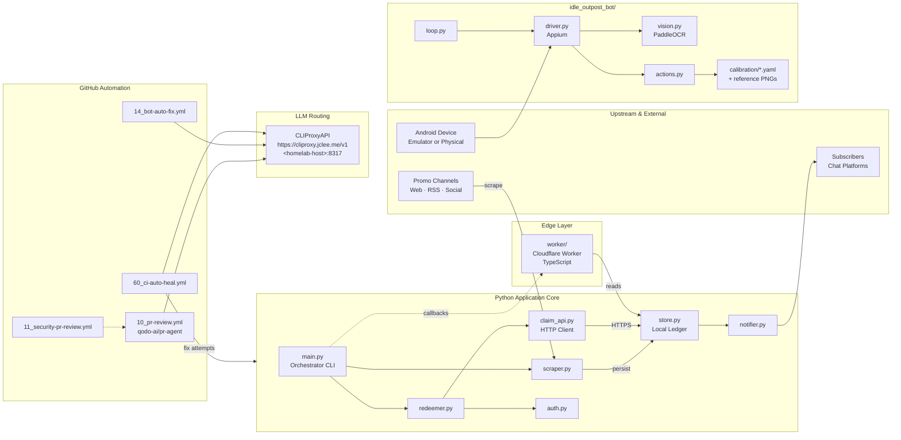

# Idle Outpost Codes

> Promotional-code monitoring, daily-claim CLI, Android automation bot, and Cloudflare Worker API for the Idle Outpost ecosystem — all wrapped in a heavily automated GitHub workflow environment.
>
> Idle Outpost 프로모션 코드 모니터링, 일일 보상 수령 CLI, Android 자동화 봇, Cloudflare Worker API를 하나의 자동화 프로젝트로 묶었습니다.


---

## Overview / 개요

`idle-outpost-codes` is a Python-based automation toolkit that covers the full lifecycle of Idle Outpost promo-code operations: scraping new codes from upstream channels, persisting local state, redeeming rewards through the official claim HTTP API, notifying subscribers via chat platforms, and — optionally — driving an Android device through Appium + PaddleOCR to handle quests, calendar rewards, and ad bonuses hands-free. A companion Cloudflare Worker (under `worker/`) exposes a lightweight edge API, and the repository itself is maintained by **17 GitHub Actions workflows** that handle AI-powered review (`qodo-ai/pr-agent`), security review, Dependabot auto-merge, PR auto-merge, LLM-driven CI auto-healing, post-merge branch cleanup, release notes, release publishing, and issue triage.

`idle-outpost-codes`는 Idle Outpost 프로모션 코드 운영의 전체 수명 주기를 다루는 Python 자동화 툴킷입니다. 신규 코드를 스크래핑하고, 로컬 상태를 저장하며, 공식 수령 HTTP API를 통해 보상을 수령하고, 채팅 플랫폼으로 구독자에게 알림을 전송하며, 선택적으로 Appium과 PaddleOCR로 Android 디바이스를 자동 제어하여 퀘스트 · 캘린더 보상 · 광고 보너스를 무인 처리합니다. `worker/` 하위의 Cloudflare Worker는 경량 엣지 API를 제공하며, 저장소 자체는 **17개의 GitHub Actions 워크플로우**로 유지됩니다 — AI PR 리뷰(`qodo-ai/pr-agent`), 보안 리뷰, Dependabot/PR 자동 머지, LLM 기반 CI 자동 복구, 머지 후 브랜치 정리, 릴리스 노트 · 발행, 이슈 트리아지를 포함합니다.

---

## Features / 기능

### English

- **Promo-code scraping** — `scraper.py` parses upstream sources (web pages, RSS feeds, social posts) to discover new codes.
- **Stateful persistence** — `store.py` keeps a local ledger of seen, claimed, and expired codes with idempotent writes.
- **HTTP claim flow** — `claim_api.py` plus `auth.py` perform authenticated POSTs against the official claim endpoint with retry / backoff.
- **Subscriber notifications** — `notifier.py` fans out results to chat platforms (configurable per environment).
- **Android automation bot** — `idle_outpost_bot/` package drives a real device via Appium, performs OCR through PaddleOCR, and executes the quest / calendar / ad-reward loop.
- **Calibration assets** — `idle_outpost_bot/calibration/` ships reference PNGs and `.ocr.yaml` templates used for visual grounding and screen identification.
- **Cloudflare Worker** — `worker/` exposes a small TypeScript edge API on Cloudflare (Wrangler-deployable) for read-mostly state queries.
- **First-class CI/CD** — 17 GitHub Actions workflows keep code quality, security, releases, and issue hygiene on autopilot.

### 한국어

- **프로모션 코드 스크래핑** — `scraper.py`가 상류 소스(웹 · RSS · 소셜)를 파싱하여 신규 코드를 수집합니다.
- **상태 영속화** — `store.py`가 코드별(발견/수령/만료) 원장(ledger)을 멱등하게 보존합니다.
- **HTTP 수령 흐름** — `claim_api.py`와 `auth.py`가 재시도 · 백오프를 포함한 인증 요청을 공식 수령 엔드포인트로 전송합니다.
- **구독자 알림** — `notifier.py`가 결과를 채팅 플랫폼으로 팬아웃합니다(환경별 설정 가능).
- **Android 자동화 봇** — `idle_outpost_bot/` 패키지가 Appium으로 실기기를 구동하고, PaddleOCR로 OCR을 수행하며, 퀘스트 · 캘린더 · 광고 보상 루프를 실행합니다.
- **캘리브레이션 자산** — `idle_outpost_bot/calibration/`이 화면 식별용 PNG와 `.ocr.yaml` 템플릿을 제공합니다.
- **Cloudflare Worker** — `worker/`는 TypeScript 기반의 경량 엣지 API를 제공하며 Wrangler로 배포됩니다.
- **자급자족 CI/CD** — 17개의 GitHub Actions 워크플로우가 코드 품질 · 보안 · 릴리스 · 이슈 관리를 자동화합니다.

---

## Architecture / 아키텍처



The Python core (`main.py` and its modules) is the single source of truth: scraping, persistence, redemption, and notification all flow through it. The Android bot is an **optional sibling package** that can be run independently for in-game automation. The Cloudflare Worker is a thin read-side adapter that fronts the local ledger. LLM-powered automation in CI calls out to a routed proxy at `https://cliproxy.jclee.me/v1` (with a homelab fallback at `<homelab-host>:8317`).

---

## Automation Inventory / 자동화 인벤토리

### GitHub Actions Workflows / GitHub Actions 워크플로우

The repository ships **17** workflows under `.github/workflows/`. They are grouped below by purpose.

| # | File | Purpose | 설명 |
|---|------|---------|------|
| 01 | `01_branch-to-pr.yml` | Convert a pushed branch into a draft PR with auto-description. | 브랜치 푸시를 초안 PR로 변환 |
| 02 | `02_issue-to-branch.yml` | Generate a feature branch from an issue template. | 이슈로부터 작업 브랜치 생성 |
| 03 | `10_pr-review.yml` | AI PR review via `qodo-ai/pr-agent`. | `qodo-ai/pr-agent` 기반 AI 리뷰 |
| 04 | `11_security-pr-review.yml` | Security-focused review pass on PRs. | PR 보안 리뷰 패스 |
| 05 | `12_dependabot-auto-merge.yml` | Auto-merge qualifying Dependabot PRs. | 조건 충족 Dependabot PR 자동 머지 |
| 06 | `13_pr-auto-merge.yml` | Auto-merge PRs that pass all required checks. | 모든 검사 통과 PR 자동 머지 |
| 07 | `14_bot-auto-fix.yml` | Apply LLM-suggested fixes to bot-related failures. | 봇 관련 실패에 대한 LLM 자동 수정 |
| 08 | `15_merged-pr-cleanup.yml` | Delete merged feature branches. | 머지된 피처 브랜치 삭제 |
| 09 | `19_issue-backfill.yml` | Backfill missing issue metadata. | 누락된 이슈 메타데이터 보강 |
| 10 | `24_release-notes.yml` | Generate release notes from merged PRs. | 머지된 PR 기반 릴리스 노트 생성 |
| 11 | `25_release-publish.yml` | Publish a GitHub Release artifact. | GitHub Release 발행 |
| 12 | `29_downstream-health-check.yml` | Probe downstream consumers (Worker, bot endpoints). | 다운스트림(Worker · 봇 엔드포인트) 헬스 체크 |
| 13 | `37_ci-failure-issues.yml` | Open an issue when CI fails repeatedly. | CI 반복 실패 시 이슈 자동 등록 |
| 14 | `60_ci-auto-heal.yml` | LLM-driven attempt to repair CI failures in-place. | LLM 기반 CI 자동 복구 |
| 15 | `91_issue-classification.yml` | Triage incoming issues by labels. | 신규 이슈 라벨 자동 분류 |
| 16 | `ci.yml` | Lint, type-check, and unit tests. | 린트 · 정적 분석 · 단위 테스트 |
| 17 | `worker-deploy.yml` | Deploy the Cloudflare Worker. | Cloudflare Worker 배포 |

### External Tooling / 외부 도구

| Tool | Role | Link |
|------|------|------|
| `qodo-ai/pr-agent` | AI PR review and suggestions used by `10_pr-review.yml`. | [github.com/qodo-ai/pr-agent](https://github.com/qodo-ai/pr-agent) |
| CLIProxyAPI | LLM proxy fronting `cliproxy.jclee.me` and the local homelab fallback. | [https://cliproxy.jclee.me/v1](https://cliproxy.jclee.me/v1) |
| Bot endpoint | Read-side API for downstream consumers. | [https://bot.jclee.me](https://bot.jclee.me) |

---

## Repository Structure / 저장소 구조

```
.
├── CONTRIBUTING.md
├── LICENSE
├── README.md
├── auth.py                # Authenticated claim-session handling
├── claim_api.py           # HTTP client for the official claim API
├── main.py                # CLI orchestrator (scrape → claim → notify)
├── notifier.py            # Subscriber fan-out
├── pyproject.toml         # Project + dependency manifest
├── redeemer.py            # High-level redemption workflow
├── scraper.py             # Upstream source scraping
├── store.py               # Local ledger / state persistence
├── uv.lock                # uv lockfile
├── video1.png             # Demo / promo asset
│
├── worker/                # Cloudflare Worker (TypeScript)
│   ├── README.md
│   ├── package-lock.json
│   ├── package.json
│   ├── tsconfig.json
│   ├── wrangler.jsonc
│   └── src/
│       └── index.ts
│
└── idle_outpost_bot/      # Optional Android automation bot
    ├── AD_REWARDS.md
    ├── API_RESEARCH.md
    ├── AUTOMATION_TARGETS.md
    ├── CALIBRATION_FULL.md
    ├── JADX_FULL_INVENTORY.md
    ├── README.md
    ├── __init__.py
    ├── __main__.py        # `python -m idle_outpost_bot`
    ├── actions.py         # High-level game actions
    ├── auto_calibrate.py  # Auto-calibration helper
    ├── calibrate.py       # Manual calibration runner
    ├── config_loader.py
    ├── discover.py        # UI element discovery
    ├── driver.py          # Appium driver wrapper
    ├── i18n_ko.properties # Korean strings
    ├── loop.py            # Main automation loop
    ├── notify.py          # Bot-side notifications
    ├── safety.py          # Safety guardrails
    ├── settings.py
    ├── state.py           # Bot state machine
    ├── vision.py          # PaddleOCR wrapper
    └── calibration/       # Reference PNGs + .ocr.yaml templates
        ├── main.png / main_screen.png / main_screen.yaml / main_screen.ocr.yaml
        ├── calendar.png / calendar.yaml / calendar.ocr.yaml
        ├── cards.png / cards.ocr.yaml / back_from_cards.ocr.yaml / after_cards.ocr.yaml
        ├── quest_board.png / quest_board.ocr.yaml
        ├── inbox.png / inbox.ocr.yaml
        ├── closed_check.png / closed_check.ocr.yaml / closed2.ocr.yaml
        ├── clean_main.png / clean_main.ocr.yaml
        ├── fresh_main.png / fresh_main.ocr.yaml
        ├── game_ready.png / game_ready.ocr.yaml
        ├── check_screen.png / check_screen.ocr.yaml
        ├── restart_check.png / restart_check.ocr.yaml
        ├── back_close.png / back_close.ocr.yaml
        ├── after_quest.png / after_quest.ocr.yaml
        ├── after_tasks.png / after_tasks.ocr.yaml
        ├── mainscreen_check.png / mainscreen_check.ocr.yaml
        ├── swipe_test.png / swipe_test.ocr.yaml
        ├── p2_*.png / probe_*.png        # Phase-2 / probe screens
        └── …
```

---

## Quick Start / 빠른 시작

### 1. Clone & install / 클론 및 설치

```bash
git clone <this-repo> idle-outpost-codes
cd idle-outpost-codes

# Core dependencies only (scraper / claim / notify)
uv sync

# Add the Android bot extra
uv sync --extra bot
```

### 2. Configure environment / 환경 변수 설정

Create a `.env` file at the repo root:

```dotenv
# Idle Outpost claim session
IO_AUTH_TOKEN=...
IO_PLAYER_ID=...

# Notifier targets (example: chat webhook)
NOTIFIER_WEBHOOK_URL=...

# LLM routing (used by CI auto-heal and PR review)
CLI_PROXY_API_BASE=https://cliproxy.jclee.me/v1
# Optional homelab fallback:
# CLI_PROXY_API_BASE=http://<homelab-host>:8317/v1
```

### 3. Run a single pass / 1회 실행

```bash
# Scrape + claim + notify
uv run python main.py

# Bot only
uv run python -m idle_outpost_bot
```

### 4. Deploy the Worker / Worker 배포

```bash
cd worker
npm install
npm run deploy        # uses wrangler
```

---

## Local Development / 로컬 개발

| Tool | Version | Purpose |
|------|---------|---------|
| Python | `>= 3.11` | Core runtime |
| [uv](https://docs.astral.sh/uv/) | latest | Dependency + venv manager |
| Node.js | 20+ | Worker build / deploy |
| Wrangler | matches `worker/package.json` | Cloudflare Worker CLI |
| Appium Server | 2.x | Required only for the `bot` extra |
| PaddleOCR | 2.7+ | Required only for the `bot` extra |

### Recommended workflow / 권장 워크플로

```bash
# 1. Sync deps (including bot extra)
uv sync --extra bot

# 2. Lint
uv run ruff check .

# 3. Type-check
uv run basedpyright .

# 4. Tests
uv run pytest -q

# 5. Run a dry scrape
uv run python main.py scrape --dry-run

# 6. Run the bot in dev mode (requires Appium server)
uv run python -m idle_outpost_bot --dev
```

CI mirrors this locally with `ci.yml` (lint → type-check → tests). The repo also configures `tool.ruff` (`line-length = 100`, `target-version = "py311"`) and `tool.basedpyright` (uses `.venv`).

---

## Commands Reference / 명령어 참조

### Core CLI (`main.py`)

```text
python main.py scrape      # Pull latest codes from configured sources
python main.py redeem      # Redeem all unredeemed codes via the claim API
python main.py notify      # Push pending results to subscribers
python main.py             # Default: scrape → redeem → notify
```

### Android bot (`idle_outpost_bot`)

```text
python -m idle_outpost_bot                       # Run the automation loop
python -m idle_outpost_bot --calibrate           # Run the calibration tool
python -m idle_outpost_bot --auto-calibrate      # Auto-tune calibration
python -m idle_outpost_bot --discover            # Probe UI elements only
python -m idle_outpost_bot --once                # Run a single iteration
```

### Worker (`worker/`)

```text
npm install                # Install Wrangler + TypeScript deps
npm run dev                # Local Wrangler dev server
npm run deploy             # Deploy to Cloudflare
npm run tail               # Tail production logs
```

### Quality / 품질

```text
uv run ruff check .        # Lint
uv run ruff format .       # Format
uv run basedpyright .      # Static type check
uv run pytest -q           # Unit tests
```

---

## Configuration / 설정

| Variable | Required | Default | Description |
|----------|----------|---------|-------------|
| `IO_AUTH_TOKEN` | yes (claim) | — | Bearer token for the claim session. |
| `IO_PLAYER_ID`  | yes (claim) | — | Player ID for the claim session. |
| `NOTIFIER_WEBHOOK_URL` | no | — | Chat platform webhook for `notifier.py`. |
| `CLI_PROXY_API_BASE` | no | `https://cliproxy.jclee.me/v1` | LLM proxy base used by CI workflows and the `14_bot-auto-fix.yml` runner. |
| `APP_LAUNCH_ACTIVITY` | bot only | — | Target Android launch activity for Appium. |
| `APPIUM_SERVER_URL` | bot only | `http://127.0.0.1:4723` | Appium server endpoint. |

The bot additionally reads structured config from `idle_outpost_bot/settings.py` and per-screen OCR templates from `idle_outpost_bot/calibration/*.ocr.yaml`. Korean strings live in `idle_outpost_bot/i18n_ko.properties`.

---

## Contribution Guide / 기여 가이드

Contributions are welcome. Please read [`CONTRIBUTING.md`](./CONTRIBUTING.md) for the full process, but the short version is:

1. **Open or pick an issue** — `91_issue-classification.yml` will auto-label it; `02_issue-to-branch.yml` can spawn a branch for you.
2. **Create a branch** — follow the conventional prefix (`feat/`, `fix/`, `chore/`, `bot/`, `ci/`).
3. **Run CI locally** — `uv run ruff check . && uv run basedpyright . && uv run pytest -q`.
4. **Open a PR** — `01_branch-to-pr.yml` may draft it; `10_pr-review.yml` (via `qodo-ai/pr-agent`) and `11_security-pr-review.yml` will review; `14_bot-auto-fix.yml` may apply LLM-suggested patches.
5. **Merge** — `13_pr-auto-merge.yml` merges when required checks pass; `15_merged-pr-cleanup.yml` deletes the branch.
6. **If CI fails** — `60_ci-auto-heal.yml` attempts a fix; otherwise `37_ci-failure-issues.yml` files an issue automatically.

### Coding standards / 코딩 규칙

- Python `>= 3.11`, formatted with `ruff format`, linted with `ruff check` (line length 100).
- Static analysis with `basedpyright` (uses `.venv`).
- Keep new screens in `idle_outpost_bot/calibration/` paired with a reference PNG and a `.ocr.yaml` template.
- Never commit secrets — use the `.env` flow and GitHub Actions secrets.

---

## Releases / 릴리스

- `24_release-notes.yml` drafts release notes from merged PRs.
- `25_release-publish.yml` cuts the GitHub Release.
- `29_downstream-health-check.yml` validates the Worker + bot endpoint after each release.

---

## License / 라이선스

Released under the terms in [`LICENSE`](./LICENSE).

---

## Acknowledgments / 감사의 말

- [`qodo-ai/pr-agent`](https://github.com/qodo-ai/pr-agent) for the AI PR review pipeline.
- The Cloudflare Workers platform for the edge read API.
- The Appium + PaddleOCR open-source communities.
- 모든 기여자 · 캘리브레이션 데이터 제공자.