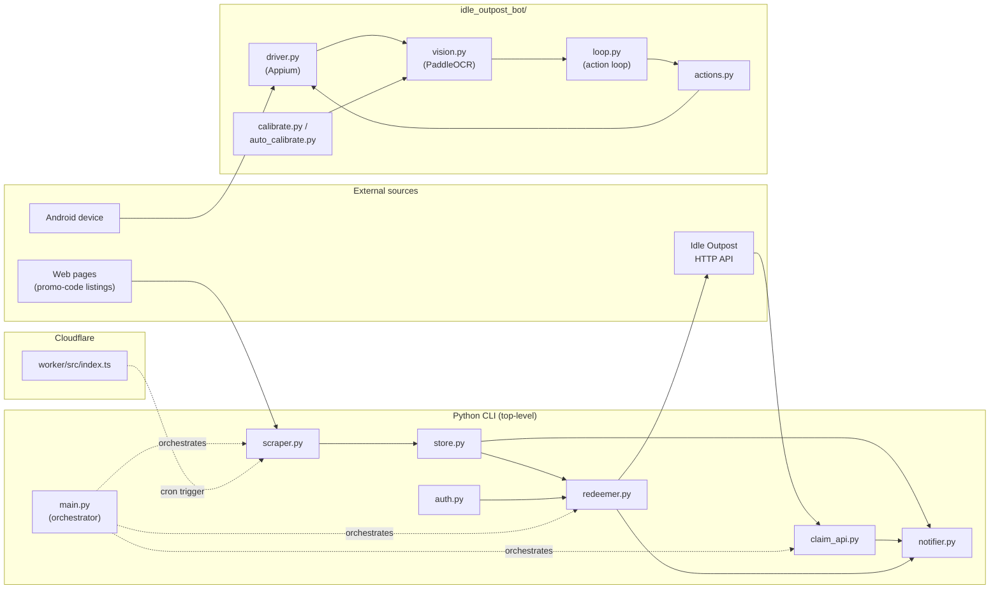

# Idle Outpost Codes

> **프로모 코드 모니터링 · 일일 보상 클레임 · 안드로이드 자동화 봇**
> **Promo code monitor · daily-reward claim CLI · Android automation bot**

A monorepo that bundles three integrated tools for the mobile game *Idle Outpost*:

1. A **promo-code monitor and redeemer** CLI written in Python.
2. A **daily-reward claim** CLI that talks to the game's HTTP API.
3. An **Android automation bot** that drives the game UI through Appium and PaddleOCR.

An optional **Cloudflare Worker** in the `worker/` directory can be deployed to run scheduled triggers (e.g. cron-style scraping) at the edge.

---

## Overview / 개요

**EN** — `idle-outpost-codes` is an automation toolkit for *Idle Outpost*. It scrapes the web for new promotional codes, redeems them against the game's official API, claims daily rewards, and — optionally — drives an Android device running the game with a vision-based automation bot. The toolkit is designed so that each component can be used independently, but they share storage and notification utilities to form a complete pipeline.

**KR** — `idle-outpost-codes`는 *Idle Outpost* 게임을 위한 자동화 도구 모음입니다. 웹에서 새로운 프로모션 코드를 스크랩하고, 게임 공식 API로 코드를 등록(Redeem)하며, 매일 보상을 수령하고, 추가로 안드로이드 디바이스에서 비전 기반 자동화 봇으로 게임을 조작할 수 있습니다. 각 구성 요소는 독립적으로 사용할 수 있도록 설계되었으며, 저장소와 알림 유틸리티를 공유하여 완전한 파이프라인을 구성합니다.

---

## Features / 기능

| Area | Capability |
|------|-----------|
| Promo-code monitor | Fetch code sources with `httpx`, parse with `BeautifulSoup4`, persist results locally. |
| Redemption | Authenticate against the game API and submit codes via `redeemer.py`. |
| Daily claim | Call the daily-reward endpoint through `claim_api.py`. |
| Notifications | Push results to external services (e.g. webhooks) via `notifier.py`. |
| Android bot | Drive the game with Appium, locate UI text with PaddleOCR, run a persistent action loop. |
| Calibration | Reusable OCR templates and YAML configs in `idle_outpost_bot/calibration/` make new screens easy to support. |
| Scheduled jobs | Deploy the bundled Cloudflare Worker to run scrapes on a schedule. |
| Local persistence | File-based store in `store.py` keeps a history of seen and redeemed codes. |

---

## Architecture / 아키텍처



The **CLI** (`main.py`) orchestrates a scrape → redeem → claim → notify pipeline. The **bot** is a self-contained UI driver that does not require the CLI; it reads its own YAML configs and OCR templates under `idle_outpost_bot/calibration/`. The **worker** is an optional external scheduler that calls the scraper endpoint from the edge.

---

## Repository Layout / 저장소 구조

```
.
├── auth.py                    # Game-API authentication
├── claim_api.py               # Daily-reward endpoint client
├── main.py                    # Top-level CLI entry point
├── notifier.py                # Webhook / push notifications
├── redeemer.py                # Promo-code redemption
├── scraper.py                 # Web scraper for promo codes
├── store.py                   # Local persistence (seen / redeemed codes)
├── pyproject.toml             # Project + dependency declaration
├── uv.lock                    # uv dependency lockfile
├── video1.png                 # Demo screenshot
│
├── worker/                    # Cloudflare Worker (optional scheduler)
│   ├── README.md
│   ├── package.json
│   ├── package-lock.json
│   ├── tsconfig.json
│   ├── wrangler.jsonc
│   └── src/
│       └── index.ts
│
└── idle_outpost_bot/          # Android automation bot
    ├── README.md
    ├── __init__.py
    ├── __main__.py            # `python -m idle_outpost_bot`
    ├── actions.py             # UI actions (tap, swipe, wait)
    ├── auto_calibrate.py      # Auto calibration utilities
    ├── calibrate.py           # Manual calibration helpers
    ├── config_loader.py       # YAML config loader
    ├── discover.py            # Screen discovery
    ├── driver.py              # Appium / Selenium driver
    ├── loop.py                # Persistent action loop
    ├── notify.py              # Bot-side notifications
    ├── safety.py              # Safety guards
    ├── settings.py            # Runtime settings
    ├── state.py               # Bot state machine
    ├── vision.py              # PaddleOCR integration
    ├── i18n_ko.properties     # Korean OCR strings
    ├── AD_REWARDS.md          # Research notes
    ├── API_RESEARCH.md
    ├── AUTOMATION_TARGETS.md
    ├── CALIBRATION_FULL.md
    ├── JADX_FULL_INVENTORY.md
    └── calibration/           # OCR templates + YAML per screen
        ├── after_cards.{ocr.yaml,png}
        ├── after_quest.{ocr.yaml,png}
        ├── after_tasks.{ocr.yaml,png}
        ├── back_close.{ocr.yaml,png}
        ├── back_from_cards.{ocr.yaml,png}
        ├── calendar.{ocr.yaml,png,yaml}
        ├── cards.{ocr.yaml,png}
        ├── check_screen.{ocr.yaml,png}
        ├── clean_main.{ocr.yaml,png}
        ├── closed2.{ocr.yaml,png}
        ├── closed_check.{ocr.yaml,png}
        ├── fresh_main.{ocr.yaml,png}
        ├── game_ready.{ocr.yaml,png}
        ├── inbox.{ocr.yaml,png}
        ├── main.png
        ├── main_screen.{ocr.yaml,png,yaml}
        ├── mainscreen_check.{ocr.yaml,png}
        ├── p2_*.png            # Phase-2 / probe screenshots
        ├── quest_board.{ocr.yaml,png}
        ├── restart_check.{ocr.yaml,png}
        └── swipe_test.{ocr.yaml,png}
```

---

## Quick Start / 빠른 시작

### Prerequisites / 사전 요구 사항

- **Python** ≥ 3.11
- **uv** (recommended) or **pip** for dependency management
- For the **bot**: an Android device or emulator with USB debugging enabled, Appium server, and Java
- For the **worker**: Node.js + `wrangler` CLI

### Install / 설치

```bash
# Clone
git clone <repository-url> idle-outpost-codes
cd idle-outpost-codes

# Core dependencies (CLI only)
uv sync

# Or, with pip
python -m venv .venv
source .venv/bin/activate
pip install -e .

# Add the Android bot extras
uv sync --extra bot
# or: pip install -e ".[bot]"
```

### First run / 첫 실행

```bash
# Scrape promo codes from configured sources
python main.py scrape

# Redeem every unseen code in the local store
python main.py redeem

# Claim today's daily reward
python main.py claim
```

See [Commands Reference](#commands-reference--명령어-참조) for the full list.

---

## Configuration / 설정

Configuration is loaded from environment variables (via `python-dotenv`). Create a `.env` file in the repository root:

```dotenv
# Game API
GAME_API_BASE=https://api.idle-outpost.example
GAME_USER_ID=<your-player-id>
GAME_AUTH_TOKEN=<your-auth-token>

# Webhooks (optional)
NOTIFY_WEBHOOK_URL=https://hooks.example.com/<channel>

# Scraper
SCRAPE_SOURCES=https://example.com/codes,https://example.org/news

# Bot (only when running the Android automation)
APPIUM_SERVER_URL=http://<appium-host>:4723
DEVICE_NAME=<your-device-name>
DEVICE_PLATFORM_VERSION=13
```

| Variable | Used by | Purpose |
|----------|---------|---------|
| `GAME_API_BASE` | `auth.py`, `redeemer.py`, `claim_api.py` | Base URL of the game API. |
| `GAME_USER_ID` / `GAME_AUTH_TOKEN` | `auth.py` | Credentials for the redeem / claim endpoints. |
| `NOTIFY_WEBHOOK_URL` | `notifier.py` | Optional webhook target for result delivery. |
| `SCRAPE_SOURCES` | `scraper.py` | Comma-separated list of source URLs. |
| `APPIUM_SERVER_URL` | `idle_outpost_bot/driver.py` | Appium server endpoint. |
| `DEVICE_NAME` / `DEVICE_PLATFORM_VERSION` | `idle_outpost_bot/driver.py` | Target device capabilities. |

> **Tip / 팁** — Never commit a real `.env`. Add it to `.gitignore` and rotate tokens regularly.

---

## Commands Reference / 명령어 참조

### Top-level CLI (`main.py`)

| Command | Description |
|---------|-------------|
| `python main.py scrape` | Fetch every configured source, extract promo codes, write new ones to the store. |
| `python main.py redeem` | Iterate over unseen codes in the store and submit each to the game API. |
| `python main.py claim` | Call the daily-reward endpoint and record the result. |
| `python main.py notify` | Re-send the last pipeline results to the configured webhook. |

### Android bot (`idle_outpost_bot/`)

| Command | Description |
|---------|-------------|
| `python -m idle_outpost_bot` | Start the persistent action loop against a connected device. |
| `python -m idle_outpost_bot.calibrate` | Open the interactive calibration helper. |
| `python -m idle_outpost_bot.auto_calibrate` | Run an automated calibration pass. |
| `python -m idle_outpost_bot.discover` | Enumerate screens and dump OCR text for inspection. |

### Cloudflare Worker (`worker/`)

| Command | Description |
|---------|-------------|
| `npm install` | Install Worker dependencies. |
| `npx wrangler dev` | Run the Worker locally. |
| `npx wrangler deploy` | Deploy to Cloudflare. |

---

## Local Development / 로컬 개발

### Recommended workflow / 권장 워크플로

1. Create a branch off `main`.
2. Use `uv` for fast, reproducible installs (`uv sync`, `uv sync --extra bot`).
3. Keep changes scoped — prefer editing one module (CLI, bot, or worker) per PR.
4. Format with `ruff format` and lint with `ruff check` (configured in `pyproject.toml`).
5. Type-check with `basedpyright` (configured in `pyproject.toml`).

### Adding a new promo-code source

1. Add the URL to `SCRAPE_SOURCES` in `.env`.
2. If the page needs a new parser, extend `scraper.py` with a small parser function.
3. Run `python main.py scrape` and confirm new codes appear in the store.

### Adding a new bot screen

1. Drop a representative screenshot into `idle_outpost_bot/calibration/<screen>.png`.
2. Capture OCR expectations in `<screen>.ocr.yaml`.
3. Reference both from the appropriate YAML config (`<screen>.yaml`).
4. Map new actions in `actions.py` and chain them in `loop.py`.
5. Re-run calibration: `python -m idle_outpost_bot.calibrate`.

---

## Testing / 테스트

The repository ships with no first-party test suite yet. Recommended checks before opening a PR:

- **Lint:** `ruff check .`
- **Format:** `ruff format --check .`
- **Types:** `basedpyright` (Python) / `tsc --noEmit` (Worker)
- **Smoke:** `python main.py scrape --dry-run` and `python -m idle_outpost_bot.discover` against a known-good device.

When adding tests, place them next to the module they cover (`test_<module>.py`) and wire them into your local runner of choice (e.g. `pytest`).

---

## Security & Safety Notes / 보안 및 안전 주의사항

- **Credentials.** Treat the game API token like a password. Use `python-dotenv`, never hard-code tokens in source.
- **Rate limits.** The scraper and bot should honour the API's rate limits; sudden bursts may get the account throttled.
- **Bot safety.** `safety.py` enforces guard rails (cooldowns, max actions per session). Review it before disabling any guard.
- **Research files.** `idle_outpost_bot/JADX_FULL_INVENTORY.md` and similar notes are reverse-engineering references and may go stale across game updates.

---

## Contributing / 기여

See [`CONTRIBUTING.md`](CONTRIBUTING.md) for the project's contribution guidelines. In short:

- Open an issue before large changes so the design can be discussed first.
- Keep PRs focused and well-described.
- Update calibration assets and YAML when changing bot behaviour.
- Be respectful — this is a community automation toolkit, not an official game integration.

---

## License / 라이선스

Released under the terms described in [`LICENSE`](LICENSE). By contributing, you agree that your contributions will be licensed under the same terms.
<br>
<br>

> 한 줄 요약 / One-liner — *Scrape, redeem, claim, notify, and (optionally) drive the game from a single toolkit.*
<br>
<br>

---

<p align="center">
  
</p>