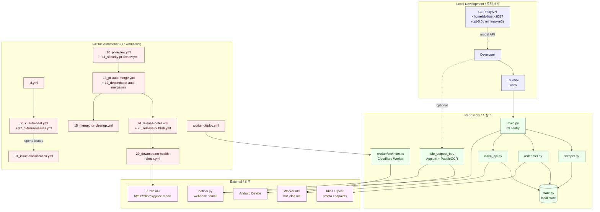

# Idle Outpost Codes

> Promotional-code monitoring, daily-claim CLI, Android automation bot, and Cloudflare Worker API for the Idle Outpost ecosystem — all wrapped in a heavily automated GitHub workflow environment.
>
> Idle Outpost 프로모션 코드 모니터링, 일일 보상 수령 CLI, Android 자동화 봇, Cloudflare Worker API를 하나의 자동화 프로젝트로 묶었습니다.


---

## Overview / 개요

`idle-outpost-codes` is a Python-based automation toolkit that covers the full lifecycle of Idle Outpost promo-code operations: scraping new codes, persisting local state, redeeming rewards via an HTTP API, notifying subscribers, and — optionally — driving an Android device through Appium + PaddleOCR. A companion Cloudflare Worker (under `worker/`) exposes a lightweight API, and the repository itself is maintained by 17 GitHub Actions workflows that handle review, security, dependabot, auto-merge, release, CI auto-healing, and post-merge cleanup.

`idle-outpost-codes`는 Idle Outpost 프로모션 코드 운영의 전체 수명 주기를 다루는 Python 자동화 도구입니다. 신규 코드 스크래핑, 로컬 상태 저장, HTTP API를 통한 보상 수령, 구독자 알림 전송, 그리고 선택적으로 Appium과 PaddleOCR로 Android 디바이스를 자동 제어합니다. `worker/` 디렉터리의 Cloudflare Worker는 경량 API를 제공하며, 저장소 자체는 17개의 GitHub Actions 워크플로우에 의해 리뷰 · 보안 · Dependabot · 자동 머지 · 릴리스 · CI 자동 복구 · 머지 후 정리까지 자동으로 유지됩니다.

---

## Features / 주요 기능

### Core Python automation / 핵심 Python 자동화

| Module | Role / 역할 |
|---|---|
| `scraper.py` | Scrapes and monitors new promotional codes from upstream sources. 신규 프로모션 코드를 스크래핑하고 모니터링합니다. |
| `redeemer.py` | Drives the redemption/claim flow against the target API. 대상 API에 대해 코드 등록·수령 플로우를 실행합니다. |
| `claim_api.py` | Encapsulates the daily-claim HTTP API contract and client logic. 일일 보상 HTTP API 계약과 클라이언트 로직을 캡슐화합니다. |
| `auth.py` | Authentication helper for upstream services. 외부 서비스 인증 헬퍼입니다. |
| `notifier.py` | Sends notifications (webhook/email/etc.) about newly discovered or redeemed codes. 신규·수령된 코드에 대한 알림을 전송합니다. |
| `store.py` | Persists locally discovered state, redemption history, and bot checkpoints. 로컬 발견 상태, 수령 이력, 봇 체크포인트를 저장합니다. |
| `main.py` | CLI entry point that orchestrates the scraper, redeemer, and notifier. 스크래퍼·리디머·알리미를 오케스트레이션하는 CLI 진입점입니다. |

### Android automation bot / Android 자동화 봇 (`idle_outpost_bot/`)

Optional package activated through the `bot` extra dependency. Provides:

`bot` 옵션 의존성으로 활성화되는 선택적 패키지이며 다음 기능을 제공합니다.

- **Device driver (`driver.py`, `actions.py`)** — Appium / Selenium-based control of an Android device.
- **Screen understanding (`vision.py`)** — PaddleOCR-based text recognition with calibration assets.
- **Calibration assets (`calibration/*.png`, `calibration/*.ocr.yaml`)** — 50+ reference screenshots and OCR configs for in-game screens (main screen, calendar, cards, inbox, quest board, ad TV, wheel, etc.).
- **Behavior loop (`loop.py`, `discover.py`)** — High-level navigation, screen probing, and routine execution.
- **Safety & state (`safety.py`, `state.py`)** — Safe-stop conditions and persistent bot state.
- **Notifications (`notify.py`)** — Bot-side alerting.
- **Configuration (`settings.py`, `config_loader.py`, `i18n_ko.properties`)** — Runtime configuration and Korean localization.
- **Auto-calibration (`auto_calibrate.py`, `calibrate.py`)** — Tools to refresh calibration assets against a live device.
- **Package entry (`__main__.py`)** — Run the bot as `python -m idle_outpost_bot`.

### Cloudflare Worker API / Cloudflare Worker API (`worker/`)

A TypeScript Cloudflare Worker (`worker/src/index.ts`) deployed via `wrangler.jsonc`. Provides a lightweight HTTP surface used by the Python CLI and external clients. Deployment is automated by `worker-deploy.yml`.

TypeScript 기반의 Cloudflare Worker(`worker/src/index.ts`)로 `wrangler.jsonc`를 통해 배포됩니다. Python CLI와 외부 클라이언트가 사용하는 경량 HTTP 엔드포인트를 제공하며, `worker-deploy.yml`을 통해 자동 배포됩니다.

### GitHub automation environment / GitHub 자동화 환경

17 workflow files (see [Automation Inventory](#automation-inventory--자동화-목록)) provide branch-to-PR, issue-to-branch, PR review, security review, dependabot auto-merge, auto-merge, bot auto-fix, merged-PR cleanup, issue backfill, release notes, release publishing, downstream health checks, CI failure issue creation, CI auto-heal, and issue classification.

17개의 워크플로우 파일([Automation Inventory](#automation-inventory--자동화-목록) 참조)이 브랜치→PR, 이슈→브랜치, PR 리뷰, 보안 리뷰, Dependabot 자동 머지, 자동 머지, 봇 자동 수정, 머지 후 PR 정리, 이슈 백필, 릴리스 노트, 릴리스 게시, 다운스트림 헬스 체크, CI 실패 이슈 생성, CI 자동 복구, 이슈 분류를 제공합니다.

---

## Architecture / 아키텍처



---

## Repository Structure / 저장소 구조

```
.
├── auth.py                       # Authentication helper
├── claim_api.py                  # Daily-claim HTTP client
├── main.py                       # CLI entry point
├── notifier.py                   # Notification helper
├── redeemer.py                   # Code redemption flow
├── scraper.py                    # Promo code scraper
├── store.py                      # Local persistent state
├── pyproject.toml                # Project metadata & deps (uv-managed)
├── uv.lock                       # uv dependency lock
├── LICENSE
├── CONTRIBUTING.md
├── README.md                     # ← this file
│
├── worker/                       # Cloudflare Worker API
│   ├── README.md
│   ├── package.json
│   ├── package-lock.json
│   ├── tsconfig.json
│   ├── wrangler.jsonc
│   └── src/
│       └── index.ts
│
└── idle_outpost_bot/             # Optional Android automation package
    ├── README.md
    ├── AD_REWARDS.md
    ├── API_RESEARCH.md
    ├── AUTOMATION_TARGETS.md
    ├── CALIBRATION_FULL.md
    ├── JADX_FULL_INVENTORY.md
    ├── __init__.py
    ├── __main__.py               # python -m idle_outpost_bot
    ├── actions.py
    ├── auto_calibrate.py
    ├── calibrate.py
    ├── config_loader.py
    ├── discover.py
    ├── driver.py
    ├── i18n_ko.properties
    ├── loop.py
    ├── notify.py
    ├── safety.py
    ├── settings.py
    ├── state.py
    ├── vision.py
    └── calibration/              # OCR reference assets (50+ PNG/YAML pairs)
        ├── main_screen.ocr.yaml
        ├── main_screen.png
        ├── calendar.ocr.yaml
        ├── calendar.png
        ├── cards.ocr.yaml
        ├── cards.png
        ├── quest_board.ocr.yaml
        ├── quest_board.png
        ├── probe_*.png
        ├── p2_*.png
        └── ... (calibration data for screens, probes, and P2 events)
```

---

## Automation Inventory / 자동화 목록

### GitHub Actions workflows / GitHub Actions 워크플로우 (17)

| # | Workflow file | Purpose / 목적 |
|---|---|---|
| 01 | `01_branch-to-pr.yml` | Converts a feature branch into a pull request. 기능 브랜치를 PR로 변환합니다. |
| 02 | `02_issue-to-branch.yml` | Creates a branch from an issue, wiring the issue into development. 이슈에서 브랜치를 생성하고 개발 흐름과 연결합니다. |
| 10 | `10_pr-review.yml` | Automated PR review (uses [`qodo-ai/pr-agent`](https://github.com/qodo-ai/pr-agent)). 자동 PR 리뷰를 수행합니다. |
| 11 | `11_security-pr-review.yml` | Security-focused PR review. 보안 관점의 PR 리뷰를 수행합니다. |
| 12 | `12_dependabot-auto-merge.yml` | Auto-merges trusted Dependabot PRs. 신뢰 가능한 Dependabot PR을 자동 머지합니다. |
| 13 | `13_pr-auto-merge.yml` | Auto-merges PRs that pass review checks. 리뷰 체크를 통과한 PR을 자동 머지합니다. |
| 14 | `14_bot-auto-fix.yml` | Bot-driven automatic fixes for routine issues. 일상적인 이슈에 대해 봇이 자동 수정합니다. |
| 15 | `15_merged-pr-cleanup.yml` | Cleans up branches and labels after merge. 머지 후 브랜치와 라벨을 정리합니다. |
| 19 | `19_issue-backfill.yml` | Backfills missing issue metadata. 누락된 이슈 메타데이터를 백필합니다. |
| 24 | `24_release-notes.yml` | Generates release notes. 릴리스 노트를 자동 생성합니다. |
| 25 | `25_release-publish.yml` | Publishes the release. 릴리스를 게시합니다. |
| 29 | `29_downstream-health-check.yml` | Verifies the downstream public endpoint ([`https://cliproxy.jclee.me/v1`](https://cliproxy.jclee.me)) is healthy after release. 릴리스 후 다운스트림 공개 엔드포인트 헬스 상태를 확인합니다. |
| 37 | `37_ci-failure-issues.yml` | Opens an issue automatically when CI fails. CI 실패 시 자동으로 이슈를 생성합니다. |
| 60 | `60_ci-auto-heal.yml` | Attempts to self-heal CI failures. CI 실패를 자가 복구합니다. |
| 91 | `91_issue-classification.yml` | Classifies incoming issues into labels/owners. 들어오는 이슈를 라벨/담당자별로 분류합니다. |
| — | `ci.yml` | Core continuous-integration pipeline. 핵심 CI 파이프라인입니다. |
| — | `worker-deploy.yml` | Deploys `worker/` to Cloudflare via `wrangler.jsonc`. `worker/`를 `wrangler.jsonc`로 Cloudflare에 배포합니다. |

### Go automation tools / Go 자동화 도구 (0)

This repository currently ships **no Go-based automation tools**. All automation lives in `.github/workflows/` and in the Python + TypeScript code itself.

현재 이 저장소는 Go 기반 자동화 도구를 포함하지 않습니다. 모든 자동화는 `.github/workflows/`와 Python + TypeScript 코드 자체에 있습니다.

---

## Quick Start / 빠른 시작

### Prerequisites / 사전 요구사항

- Python **3.11+**
- [`uv`](https://github.com/astral-sh/uv) for dependency management (lockfile is `uv.lock`)
- Node.js + `wrangler` (only required if you plan to develop the Cloudflare Worker in `worker/`)
- An Android device + Appium server (only required for `idle_outpost_bot/`)

### Clone & install / 클론 및 설치

```bash
git clone <your-fork-url>.git idle-outpost-codes
cd idle-outpost-codes

# Core CLI (scraper / redeemer / claim)
uv sync

# Optional: Android bot extras (Appium, Selenium, PaddleOCR, PaddlePaddle, Pillow, numpy, pyyaml)
uv sync --extra bot
```

### Configure / 설정

Create a `.env` file with credentials required by `auth.py` / `claim_api.py` / `notifier.py` (refer to module docstrings and `idle_outpost_bot/settings.py` for the exact variable names).

`auth.py` / `claim_api.py` / `notifier.py`에서 요구하는 자격 증명을 `.env` 파일에 작성하세요. 정확한 변수명은 각 모듈의 docstring과 `idle_outpost_bot/settings.py`를 참고하세요.

### Run the CLI / CLI 실행

```bash
uv run python main.py --help
uv run python main.py scrape
uv run python main.py redeem --code YOUR-CODE
uv run python main.py claim
```

### Run the Android bot / Android 봇 실행

```bash
uv run python -m idle_outpost_bot --help
uv run python -m idle_outpost_bot run
```

### Run the Worker locally / Worker 로컬 실행

```bash
cd worker
npm install
npx wrangler dev
```

---

## Local Development / 로컬 개발

### Tooling / 도구

- **Python 3.11+** with `uv` (see `pyproject.toml` / `uv.lock`).
- **Linting & formatting**: `ruff` is configured in `pyproject.toml` (`line-length = 100`, `target-version = "py311"`).
- **Type checking**: `basedpyright` is configured against the local `.venv`.
- **CI**: `ci.yml` plus the auto-healing `60_ci-auto-heal.yml` workflow.
- **Model provider for in-repo assistants**: CLIProxyAPI at `<homelab-host>:8317`, with the public mirror at [`https://cliproxy.jclee.me/v1`](https://cliproxy.jclee.me). Primary model `gpt-5.5`, fallback `minimax-m3`.

### Recommended workflow / 권장 워크플로

1. Create a feature branch: `git checkout -b feat/my-change`.
2. Push the branch — `01_branch-to-pr.yml` will help you open a PR.
3. Wait for `10_pr-review.yml` and `11_security-pr-review.yml` (backed by [`qodo-ai/pr-agent`](https://github.com/qodo-ai/pr-agent)).
4. After approval, `13_pr-auto-merge.yml` will merge automatically when checks pass.
5. `15_merged-pr-cleanup.yml` cleans up the branch.
6. `24_release-notes.yml` and `25_release-publish.yml` cut the release.
7. `29_downstream-health-check.yml` verifies the public endpoint after release.
8. The Worker is redeployed by `worker-deploy.yml` if the change touched `worker/`.

### Worker development / Worker 개발

The `worker/` package uses TypeScript and Cloudflare Workers. Configuration is in `wrangler.jsonc`; entry point is `src/index.ts`. See [`worker/README.md`](worker/README.md) for details.

`worker/` 패키지는 TypeScript와 Cloudflare Workers를 사용합니다. 설정은 `wrangler.jsonc`에, 진입점은 `src/index.ts`에 있습니다. 자세한 내용은 [`worker/README.md`](worker/README.md)를 참고하세요.

### Android bot calibration / Android 봇 보정

Reference screens are stored under `idle_outpost_bot/calibration/` as `.png` + matching `.ocr.yaml` pairs (50+ screens including main_screen, calendar, cards, quest_board, inbox, closed_check, etc.). Use `idle_outpost_bot/auto_calibrate.py` and `calibrate.py` to refresh these against a live device. See `idle_outpost_bot/CALIBRATION_FULL.md` for the full procedure.

기준 화면은 `idle_outpost_bot/calibration/` 하위에 `.png`와 `.ocr.yaml` 쌍으로 저장되어 있습니다(main_screen, calendar, cards, quest_board, inbox, closed_check 등 50개 이상). `idle_outpost_bot/auto_calibrate.py`와 `calibrate.py`를 사용해 실제 디바이스에 맞춰 갱신할 수 있습니다. 자세한 절차는 `idle_outpost_bot/CALIBRATION_FULL.md`를 참고하세요.

---

## Commands Reference / 명령어 참조

| Command | Description / 설명 |
|---|---|
| `uv sync` | Install core dependencies. 핵심 의존성을 설치합니다. |
| `uv sync --extra bot` | Also install Android bot extras (Appium, Selenium, PaddleOCR, …). Android 봇 추가 의존성도 함께 설치합니다. |
| `uv run python main.py --help` | Show top-level CLI help. 최상위 CLI 도움말을 표시합니다. |
| `uv run python main.py scrape` | Run the promo-code scraper. 프로모션 코드 스크래퍼를 실행합니다. |
| `uv run python main.py redeem --code <CODE>` | Redeem a specific code. 특정 코드를 수령합니다. |
| `uv run python main.py claim` | Trigger the daily-claim flow. 일일 보상 수령 플로우를 실행합니다. |
| `uv run python -m idle_outpost_bot` | Run the Android bot package. Android 봇 패키지를 실행합니다. |
| `uv run python -m idle_outpost_bot run` | Start the bot loop. 봇 루프를 시작합니다. |
| `uv run python -m idle_outpost_bot calibrate` | Refresh calibration assets. 보정 자산을 갱신합니다. |
| `uv run python -m idle_outpost_bot auto-calibrate` | Auto-calibrate against a live device. 실제 디바이스에 대해 자동 보정을 수행합니다. |
| `uv run ruff check .` | Lint with `ruff`. `ruff`로 린트를 실행합니다. |
| `uv run ruff format .` | Format with `ruff`. `ruff`로 포맷을 적용합니다. |
| `uv run basedpyright` | Type-check with `basedpyright`. `basedpyright`로 타입 검사를 수행합니다. |
| `cd worker && npm install` | Install Worker dependencies. Worker 의존성을 설치합니다. |
| `cd worker && npx wrangler dev` | Run the Worker locally. Worker를 로컬에서 실행합니다. |
| `cd worker && npx wrangler deploy` | Deploy the Worker (also triggered by `worker-deploy.yml`). Worker를 배포합니다(`worker-deploy.yml`도 트리거). |

---

## Contributing / 기여 가이드

Contributions are welcome. Please read [`CONTRIBUTING.md`](CONTRIBUTING.md) before opening an issue or PR. At a glance:

기여를 환영합니다. 이슈나 PR을 열기 전에 [`CONTRIBUTING.md`](CONTRIBUTING.md)를 먼저 읽어 주세요. 요약하면 다음과 같습니다.

1. **Search before opening / 먼저 검색** — Check existing issues and PRs to avoid duplicates. 중복을 피하기 위해 기존 이슈/PR을 먼저 확인하세요.
2. **File an issue / 이슈 등록** — Use the templates. The `91_issue-classification.yml` workflow will auto-label and route it. 템플릿을 사용하세요. `91_issue-classification.yml` 워크플로우가 자동으로 라벨을 붙이고 라우팅합니다.
3. **Open a PR / PR 열기** — Push your branch; `01_branch-to-pr.yml` will help you convert it to a PR. 브랜치를 푸시하면 `01_branch-to-pr.yml`이 PR로 변환을 도와줍니다.
4. **Pass automated checks / 자동 검사 통과** — `ci.yml`, `10_pr-review.yml`, and `11_security-pr-review.yml` must be green. `ci.yml`, `10_pr-review.yml`, `11_security-pr-review.yml`이 모두 통과해야 합니다.
5. **Wait for auto-merge / 자동 머지 대기** — Once checks pass, `13_pr-auto-merge.yml` will merge eligible PRs. 검사를 통과하면 `13_pr-auto-merge.yml`이 머지 가능한 PR을 자동 머지합니다.
6. **Release / 릴리스** — Releases are produced automatically by `24_release-notes.yml` and `25_release-publish.yml`, then verified by `29_downstream-health-check.yml`. 릴리스는 `24_release-notes.yml`과 `25_release-publish.yml`이 자동 생성하며, 이후 `29_downstream-health-check.yml`이 검증합니다.

### Code style / 코드 스타일

- Python: follow `ruff` configuration in `pyproject.toml` (line length 100, Python 3.11).
- TypeScript (Worker): follow the configuration in `worker/tsconfig.json`.
- Keep commits focused and write meaningful messages — they feed `24_release-notes.yml`.

---

## License / 라이선스

See [`LICENSE`](LICENSE).

[`LICENSE`](LICENSE) 파일을 참고하세요.

---

## Links / 관련 링크

- PR review engine: [`qodo-ai/pr-agent`](https://github.com/qodo-ai/pr-agent)
- Public model endpoint: [`https://cliproxy.jclee.me/v1`](https://cliproxy.jclee.me)
- Cloudflare Worker API: [`https://bot.jclee.me`](https://bot.jclee.me)
- Worker source: [`worker/src/index.ts`](worker/src/index.ts)
- Bot package entry: [`idle_outpost_bot/__main__.py`](idle_outpost_bot/__main__.py)