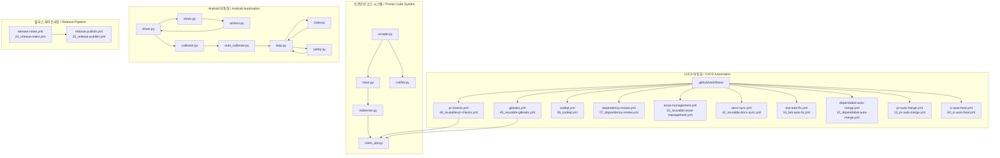

# Idle Outpost Codes

[](https://www.python.org/downloads/)
[](LICENSE)
[](https://www.reddit.com/r/IdleOutpost/)

> Idle Outpost 프로모션 코드 모니터링, 일일 클레임 CLI 및 Android 게임 자동화 봇
> Idle Outpost promo code monitor, daily claim CLI, and Android game automation bot

## 개요 / Overview

이 프로젝트는 Idle Outpost 게임을 위한 자동화 도구 모음입니다. 프로모션 코드를 모니터링하고 브라우저에서 일일 보상을 클레임하며, Android 디바이스에서 Appium/Selenium 기반 비전 시스템으로 게임 플레이를 자동화합니다.

This project is a collection of automation tools for the Idle Outpost game. It monitors promotion codes, claims daily rewards via browser, and automates gameplay on Android devices using an Appium/Selenium-based vision system.

---

## 주요 기능 / Features

### 프로모션 코드 모니터링 (Root Modules)

| 파일 | 설명 |
|------|------|
| `scraper.py` | 웹 스크래핑으로 최신 프로모션 코드 수집 |
| `store.py` | 코드 저장소 관리 (중복 방지, 만료 처리) |
| `redeemer.py` | CLI를 통한 코드 클레임 자동화 |
| `auth.py` | 인증 및 세션 관리 |
| `claim_api.py` | API 기반 일일 보상 클레임 |
| `notifier.py` | 새 코드 발견 시 알림 |

### Android 게임 자동화 (`idle_outpost_bot/`)

| 파일 | 설명 |
|------|------|
| `driver.py` | Appium WebDriver 초기화 및 관리 |
| `vision.py` | PaddleOCR 기반 화면 인식 및 텍스트 추출 |
| `actions.py` | 터치, 스와이프, 버튼 클릭 등 액션 실행 |
| `calibrate.py` | 해상도 보정을 위한 자동 캘리브레이션 |
| `auto_calibrate.py` | 런타임 캘리브레이션 조정 |
| `loop.py` | 메인 자동화 루프 컨트롤러 |
| `state.py` | 게임 상태 추적 |
| `settings.py` | 설정 로더 및 관리 |
| `discover.py` | 디바이스 발견 및 연결 |
| `notify.py` | 알림 서비스 |
| `safety.py` | 안전 장치 및 정지 조건 |

---

## 프로젝트 구조 / Project Structure

```
idle-outpost/
├── .github/
│   └── workflows/
│       ├── 01_branch-to-pr.yml
│       ├── 02_issue-to-branch.yml
│       ├── 03_pr-checks.yml
│       ├── 04_actionlint.yml
│       ├── 05_gitleaks.yml
│       ├── 06_codeql.yml
│       ├── 07_dependency-review.yml
│       ├── 08_scorecard.yml
│       ├── 09_semantic-pr.yml
│       ├── 10_pr-review.yml
│       ├── 12_dependabot-auto-merge.yml
│       ├── 13_pr-auto-merge.yml
│       ├── 14_bot-auto-fix.yml
│       ├── 15_merged-pr-cleanup.yml
│       ├── 18_issue-management.yml
│       ├── 19_issue-backfill.yml
│       ├── 20_readme-gen.yml
│       ├── 21_docs-sync.yml
│       ├── 24_release-notes.yml
│       ├── 25_release-publish.yml
│       ├── 29_downstream-health-check.yml
│       ├── 37_ci-failure-issues.yml
│       ├── 42_reusable-docs-sync.yml
│       ├── 43_reusable-issue-management.yml
│       ├── 44_reusable-pr-checks.yml
│       ├── 45_reusable-gitleaks.yml
│       ├── 60_ci-auto-heal.yml
│       ├── ci.yml
│       └── security/
│           └── 11_pr-review.yml
├── idle_outpost_bot/
│   ├── __init__.py
│   ├── __main__.py
│   ├── actions.py
│   ├── auto_calibrate.py
│   ├── calibrate.py
│   ├── config_loader.py
│   ├── discover.py
│   ├── driver.py
│   ├── i18n_ko.properties
│   ├── loop.py
│   ├── notify.py
│   ├── safety.py
│   ├── settings.py
│   ├── state.py
│   ├── vision.py
│   ├── config/
│   │   └── screens.yaml
│   ├── tasks/
│   │   ├── __init__.py
│   │   └── registry.py
│   ├── scripts/
│   │   ├── phone-setup.md
│   │   ├── scrcpy-remote.md
│   │   └── wait_and_calibrate.sh
│   └── calibration/
│       ├── *.png          # 참조 이미지
│       ├── *.ocr.yaml     # OCR 결과
│       └── *.yaml         # 캘리브레이션 데이터
├── auth.py
├── claim_api.py
├── main.py
├── notifier.py
├── redeemer.py
├── scraper.py
├── store.py
├── pyproject.toml
├── uv.lock
├── CONTRIBUTING.md
└── LICENSE
```

---

## 아키텍처 / Architecture



---

## 자동화 인벤토리 / Automation Inventory

### GitHub Workflows (29 총계 / total)

#### Pull Request & Branch 워크플로우

| 워크플로우 파일 | 설명 |
|----------------|------|
| `01_branch-to-pr.yml` | 브랜치 생성 시 자동 PR 열기 |
| `02_issue-to-branch.yml` | 이슈 기반 브랜치 생성 |
| `03_pr-checks.yml` | PR 상태 확인 및 검증 |
| `09_semantic-pr.yml` | Conventional Commits 검증 |
| `10_pr-review.yml` | AI 기반 PR 리뷰 (qodo-ai/pr-agent) |
| `13_pr-auto-merge.yml` | 자동 병합 (라벨 기반) |
| `14_bot-auto-fix.yml` | Bot 수정 사항 자동 적용 |
| `15_merged-pr-cleanup.yml` | 병합 후 브랜치 정리 |
| `security/11_pr-review.yml` | 보안 집중 PR 리뷰 |

#### 보안 & 품질 워크플로우

| 워크플로우 파일 | 설명 |
|----------------|------|
| `04_actionlint.yml` | GitHub Actions YAML 검증 |
| `05_gitleaks.yml` |Secrets 스캔 |
| `06_codeql.yml` | CodeQL 정적 분석 |
| `07_dependency-review.yml` | 의존성 취약점 검토 |
| `08_scorecard.yml` | OpenSSF Scorecard 평가 |
| `45_reusable-gitleaks.yml` | 재사용 가능한 Gitleaks 워크플로우 |
| `44_reusable-pr-checks.yml` | 재사용 가능한 PR 체크 |

#### 이슈 관리 워크플로우

| 워크플로우 파일 | 설명 |
|----------------|------|
| `18_issue-management.yml` | 이슈 상태 관리 |
| `19_issue-backfill.yml` | 이슈 백필드 |
| `37_ci-failure-issues.yml` | CI 실패 시 자동 이슈 생성 |
| `43_reusable-issue-management.yml` | 재사용 가능한 이슈 관리 |

#### 문서 & 릴리스 워크플로우

| 워크플로우 파일 | 설명 |
|----------------|------|
| `20_readme-gen.yml` | README 자동 생성 |
| `21_docs-sync.yml` | 문서 동기화 |
| `42_reusable-docs-sync.yml` | 재사용 가능한 문서 동기화 |
| `24_release-notes.yml` |릴리스 노트 생성 |
| `25_release-publish.yml` | 릴리스 게시 |

#### 자동 복구 & 건강 상태 워크플로우

| 워크플로우 파일 | 설명 |
|----------------|------|
| `60_ci-auto-heal.yml` | CI 실패 자동 복구 |
| `ci.yml` | 기본 CI 워크플로우 |
| `29_downstream-health-check.yml` | 다운스트림 헬스 체크 |
| `12_dependabot-auto-merge.yml` | Dependabot PR 자동 병합 |

### 재사용 가능한 워크플로우 (Reusable Workflows)

| 워크플로우 파일 | 설명 |
|----------------|------|
| `42_reusable-docs-sync.yml` | 문서 동기화 템플릿 |
| `43_reusable-issue-management.yml` | 이슈 관리 템플릿 |
| `44_reusable-pr-checks.yml` | PR 체크 템플릿 |
| `45_reusable-gitleaks.yml` | Gitleaks 스캔 템플릿 |

### 외부 자동화 도구 / External Automation Tools

| 도구 | 용도 |
|------|------|
| [qodo-ai/pr-agent](https://qodo-ai/pr-agent) | AI 기반 PR 리뷰 및 수정 |
| Appium-Python-Client | Android UI 자동화 |
| Selenium | 브라우저 자동화 |
| PaddleOCR | 화면 텍스트 인식 (OCR) |
| PaddlePaddle | OCR 딥러닝 백엔드 |

---

## 시작하기 / Quick Start

### 전제 조건 / Prerequisites

- Python 3.11+
- uv (패키지 매니저)
- Android 디바이스 (게임 자동화용)
- ADB (Android Debug Bridge)

### 설치 / Installation

```bash
# 레포지토리 클론
git clone https://github.com/jclee941/.github
cd idle-outpost

# 의존성 설치 (기본)
uv sync

# Bot 의존성 설치 (Android 자동화용)
uv sync --extra bot

# 환경 변수 설정
cp .env.example .env
# .env 파일을 편집하여 필요한 API 키 설정
```

### 프로모션 코드 CLI 사용법 / Promo Code CLI Usage

```bash
# 새 코드 스크래핑
uv run python -m idle_outpost_codes scrape

# 코드Redeem
uv run python -m idle_outpost_codes redeem <CODE>

# 저장된 코드 목록 확인
uv run python -m idle_outpost_codes list

# 만료된 코드 정리
uv run python -m idle_outpost_codes clean
```

### Android 봇 사용법 / Android Bot Usage

```bash
# 기본 실행
uv run python -m idle_outpost_bot

# 디바이스 IP로 연결 (원격)
uv run python -m idle_outpost_bot --host <homelab-host>

# 캘리브레이션 스킵
uv run python -m idle_outpost_bot --skip-calibration

# 드라이버 로그 활성화
uv run python -m idle_outpost_bot --debug-driver
```

---

## 로컬 개발 / Local Development

### 개발 환경 설정 / Dev Environment Setup

```bash
# 개발 의존성 설치
uv sync --extra dev

# 코드 포맷팅 (Ruff)
uv run ruff format .

#린트 체크
uv run ruff check .

# 타입 체크 (Basedpyright)
uv run basedpyright
```

### 캘리브레이션 데이터 관리 / Calibration Data Management

캘리브레이션 참조 이미지는 `idle_outpost_bot/calibration/` 디렉토리에 저장됩니다:

```bash
# 새 화면 캘리브레이션
uv run python -m idle_outpost_bot calibrate

# 캘리브레이션 강제 재실행
./idle_outpost_bot/scripts/wait_and_calibrate.sh
```

### 원격 Android 디바이스 설정 / Remote Android Device Setup

원격 디바이스 연결은 `idle_outpost_bot/scripts/scrcpy-remote.md`를 참고하세요.

---

## 명령어 참조 / Commands Reference

### 메인 CLI (`main.py` / `idle_outpost_codes`)

| 명령어 | 설명 |
|--------|------|
| `scrape` | 웹에서 프로모션 코드 스크래핑 |
| `redeem <code>` | 특정 코드 클레임 |
| `list` | 저장된 코드 목록 |
| `clean` | 만료된 코드 제거 |
| `status` | 현재 상태 확인 |
| `notify` | 알림 테스트 |

### 봇 CLI (`idle_outpost_bot`)

| 명령어 | 설명 |
|--------|------|
| `python -m idle_outpost_bot` | 기본 자동화 실행 |
| `--host <IP>` | 원격 ADB 호스트 |
| `--port <PORT>` | ADB 포트 (기본: 5555) |
| `--skip-calibration` | 캘리브레이션 건너뛰기 |
| `--debug-driver` | 드라이버 디버그 로그 |
| `--screenshot` | 스크린샷만 캡처 후 종료 |

### 스크립트 (`idle_outpost_bot/scripts/`)

| 스크립트 | 설명 |
|----------|------|
| `wait_and_calibrate.sh` | 대기 후 캘리브레이션 실행 |
| `phone-setup.md` | 폰 초기 설정 가이드 |
| `scrcpy-remote.md` | Scrcpy 원격 연결 가이드 |

---

## 기여하기 / Contributing

기여는 환영합니다! 다음을 참고하세요:

1. [CONTRIBUTING.md](CONTRIBUTING.md) 읽기
2. 이슈 생성 또는 기존 이슈 확인
3. Feature 브랜치 생성 (`git checkout -b feature/amazing-feature`)
4. 변경 사항 커밋 (`git commit -m 'feat: add amazing feature'`)
5. Push (`git push origin feature/amazing-feature`)
6. Pull Request 열기

### 커밋 메시지 규칙 / Commit Message Convention

이 프로젝트는 [Conventional Commits](https://www.conventionalcommits.org/)를 사용합니다:

```
feat: 새로운 기능
fix: 버그 수정
docs: 문서 변경
style: 코드 스타일 변경 (기능 변경 없음)
refactor: 코드 리팩토링
test: 테스트 추가/수정
chore: 빌드/보조 도구 변경
```

### 代码质量 / Code Quality

```bash
# 전체 체크 실행
uv run ruff check . && uv run ruff format --check . && uv run basedpyright
```

---

## 라이선스 / License

이 프로젝트는 MIT 라이선스 하에 배포됩니다. 자세한 내용은 [LICENSE](LICENSE)를 참고하세요.

---

## 연락처 / Contact

- **Repository**: <https://github.com/jclee941/idle-outpost>
- **Bot Endpoint**: <https://bot.jclee.me>
- **CLI Proxy**: <https://cliproxy.jclee.me/v1>

---

> 이 프로젝트는 `jclee-bot`에 의해 자동화되어 관리됩니다.
> This project is automated and managed by `jclee-bot`.
>
> README 생성 모델: minimax-m2.7 (대체: gpt-5.5 via CLIProxyAPI)
