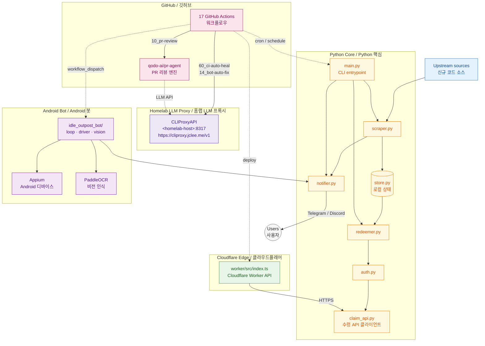

# Idle Outpost Codes

> Promotional-code monitoring, daily-claim CLI, Android automation bot, and Cloudflare Worker API for the Idle Outpost ecosystem — all wrapped in a heavily automated GitHub workflow environment.
>
> Idle Outpost 프로모션 코드 모니터링, 일일 보상 수령 CLI, Android 자동화 봇, Cloudflare Worker API를 하나의 자동화 프로젝트로 묶었습니다.


---

## Overview / 개요

`idle-outpost-codes` is a Python-based automation toolkit that covers the full lifecycle of Idle Outpost promo-code operations: scraping new codes from upstream channels, persisting local state, redeeming rewards through the official claim HTTP API, notifying subscribers via chat platforms, and — optionally — driving an Android device through Appium + PaddleOCR to handle quests, calendar rewards, and ad bonuses hands-free. A companion Cloudflare Worker (under `worker/`) exposes a lightweight edge API, and the repository itself is maintained by **17 GitHub Actions workflows** that handle AI-powered review (qodo-ai/pr-agent), security review, Dependabot auto-merge, PR auto-merge, LLM-driven CI auto-healing, post-merge branch cleanup, release notes, release publishing, and issue triage.

`idle-outpost-codes`는 Idle Outpost 프로모션 코드 운영의 전체 수명 주위를 다루는 Python 자동화 툴킷입니다. 신규 코드를 스크래핑하고, 로컬 상태를 저장하며, 공식 수령 HTTP API를 통해 보상을 수령하고, 채팅 플랫폼으로 구독자에게 알림을 전송하며, 선택적으로 Appium과 PaddleOCR로 Android 디바이스를 자동 제어하여 퀘스트 · 캘린더 보상 · 광고 보너스를 무인 처리합니다. `worker/` 하위의 Cloudflare Worker는 경량 엣지 API를 제공하며, 저장소 자체는 **17개의 GitHub Actions 워크플로우**로 유지됩니다 — AI PR 리뷰(qodo-ai/pr-agent), 보안 리뷰, Dependabot 자동 머지, PR 자동 머지, LLM 기반 CI 자동 복구, 머지 후 브랜치 정리, 릴리스 노트, 릴리스 배포, 이슈 분류까지 전부 자동화되어 있습니다.

---

## Features / 주요 기능

### Core Python automation / 핵심 Python 자동화

| Module | Role / 역할 |
|---|---|
| `main.py` | Unified CLI entrypoint. Wires together scraping, redemption, and notification flows. 스크래핑 · 수령 · 알림 흐름을 통합하는 CLI 엔트리포인트. |
| `scraper.py` | Scrapes and monitors new promotional codes from upstream sources. 신규 프로모션 코드를 스크래핑·모니터링합니다. |
| `redeemer.py` | Drives the redemption flow against the official claim API. 공식 수령 API에 대한 보상 수령 흐름을 구동합니다. |
| `claim_api.py` | Thin HTTP client for the Idle Outpost claim endpoint. Idle Outpost 수령 엔드포인트용 HTTP 클라이언트. |
| `auth.py` | Loads and rotates authentication credentials for the claim API. 수령 API의 인증 자격증명을 로드·갱신합니다. |
| `store.py` | Local persistence layer (codes seen, redeemed, dismissed). 로컬 영속 계층(확인·수령·무시된 코드). |
| `notifier.py` | Sends outbound notifications to chat subscribers (Telegram, Discord, etc.). 채팅 구독자(Telegram, Discord 등)로 알림 전송. |

### Android automation bot (`idle_outpost_bot/`) / Android 자동화 봇

| Module | Role / 역할 |
|---|---|
| `__main__.py` | `python -m idle_outpost_bot` entrypoint. 봇 엔트리포인트. |
| `loop.py` | Long-running main loop that drives quests, calendar, ads, wheel. 퀘스트 · 캘린더 · 광고 · 휠 이벤트를 구동하는 메인 루프. |
| `driver.py` | Appium driver wrapper for Android device control. Android 디바이스 제어를 위한 Appium 드라이버 래퍼. |
| `vision.py` | PaddleOCR-based screen text recognition and template matching. PaddleOCR 기반 화면 텍스트 인식 및 템플릿 매칭. |
| `actions.py` | High-level bot actions (collect, watch ad, spin wheel, etc.). 상위 수준 봇 액션(보상 수령, 광고 시청, 휠 돌리기 등). |
| `discover.py` | UI element discovery and screen-state probing. UI 요소 탐색 및 화면 상태 프로빙. |
| `calibrate.py` / `auto_calibrate.py` | Manual and automatic screen-region calibration. 수동 및 자동 화면 영역 캘리브레이션. |
| `state.py` | Bot runtime state machine (main, calendar, cards, quest, …). 봇 런타임 상태 머신. |
| `safety.py` | Safety guards (rate limits, anti-ban heuristics, idle backoff). 안전 장치(속도 제한, 안티밴 휴리스틱, 유휴 백오프). |
| `notify.py` | Bot-side notification dispatch. 봇 측 알림 전송. |
| `settings.py` / `config_loader.py` | Configuration loading. 설정 로딩. |
| `i18n_ko.properties` | Korean localization strings. 한국어 번역 문자열. |
| `calibration/` | Reference screenshots (`.png`) and OCR coordinate maps (`.ocr.yaml`) used by `vision.py` and `calibrate.py`. `vision.py`와 `calibrate.py`가 사용하는 참조 스크린샷과 OCR 좌표 맵. |

### Cloudflare Worker (`worker/`) / Cloudflare Worker

A minimal TypeScript Worker (powered by [Wrangler](https://developers.cloudflare.com/workers/wrangler/)) that exposes a thin edge API surface for the Python core to consume.
Wrangler로 배포되는 TypeScript Worker로, Python 코어가 소비하는 경량 엣지 API를 제공합니다.

| File | Role / 역할 |
|---|---|
| `worker/src/index.ts` | Worker request handlers and routing. Worker 요청 핸들러 및 라우팅. |
| `worker/wrangler.jsonc` | Wrangler deployment configuration. Wrangler 배포 설정. |
| `worker/package.json` | Node dependencies (`wrangler`, `typescript`, …). Node 의존성. |
| `worker/tsconfig.json` | TypeScript compiler configuration. TypeScript 컴파일러 설정. |

### Companion docs (`idle_outpost_bot/*.md`) / 동반 문서

`AD_REWARDS.md`, `API_RESEARCH.md`, `AUTOMATION_TARGETS.md`, `CALIBRATION_FULL.md`, `JADX_FULL_INVENTORY.md` — long-form research notes maintained alongside the bot (ad reward internals, reverse-engineered API surface, automation targets, calibration recipes, full JADX-decompiled inventory).
봇과 함께 유지되는 장문 연구 노트(광고 보상 내부, 리버스 엔지니어링된 API 표면, 자동화 대상, 캘리브레이션 레시피, JADX 디컴파일 인벤토리).

---

## Architecture / 아키텍처



Key flows / 주요 흐름:

1. **Scrape → Store → Notify** — `scraper.py` fetches new codes, `store.py` deduplicates, `notifier.py` fans out to subscribers.
2. **Store → Redeem** — `redeemer.py` consumes unseen codes, authenticates via `auth.py`, calls `claim_api.py`.
3. **Edge API** — `worker/` proxies authenticated traffic and exposes cached metadata for low-latency consumers.
4. **Bot loop** — `idle_outpost_bot.loop` drives the device, with `vision.py` (PaddleOCR) and `calibration/` templates as ground truth, then routes earnings back through `notifier.py`.
5. **Automation layer** — 17 workflows orchestrate everything, with `qodo-ai/pr-agent` and the home-hosted `CLIProxyAPI` (served at `https://cliproxy.jclee.me/v1`) acting as the LLM backends for review, auto-fix, and CI healing.

---

## Automation Inventory / 자동화 인벤토리

### GitHub Actions Workflows (17) / GitHub Actions 워크플로우 (17)

All files live under `.github/workflows/` with the **real on-disk names** (numeric prefix preserved).
모든 파일은 `.github/workflows/` 하위에 실제 디스크 이름(숫자 접두사 유지)으로 존재합니다.

| # | File / 파일 | Trigger / 트리거 | Purpose / 목적 |
|---|---|---|---|
| 01 | `01_branch-to-pr.yml` | push to non-default branch | Converts branch pushes into draft pull requests automatically. 브랜치 푸시를 자동으로 PR로 변환합니다. |
| 02 | `02_issue-to-branch.yml` | issue opened / labeled | Creates a working branch for an issue so work can start. 이슈에서 작업 브랜치를 생성합니다. |
| 10 | `10_pr-review.yml` | pull_request | AI-powered PR review via [qodo-ai/pr-agent](https://github.com/qodo-ai/pr-agent). [qodo-ai/pr-agent](https://github.com/qodo-ai/pr-agent)를 통한 AI PR 리뷰. |
| 11 | `11_security-pr-review.yml` | pull_request | Security-focused PR review (SAST-aware, secret-aware). 보안 중심 PR 리뷰(SAST·시크릿 인식). |
| 12 | `12_dependabot-auto-merge.yml` | Dependabot PR | Auto-merges Dependabot patch/minor PRs after CI. Dependabot patch/minor PR을 CI 통과 후 자동 머지합니다. |
| 13 | `13_pr-auto-merge.yml` | pull_request labeled | Auto-merges PRs that meet the `automerge` policy. `automerge` 정책을 충족하는 PR을 자동 머지합니다. |
| 14 | `14_bot-auto-fix.yml` | pull_request | LLM-driven fix suggestions applied as PR commits. LLM 기반 수정 제안을 PR 커밋으로 적용합니다. |
| 15 | `15_merged-pr-cleanup.yml` | pull_request closed | Deletes the head branch after a PR is merged. PR 머지 후 헤드 브랜치를 삭제합니다. |
| 19 | `19_issue-backfill.yml` | schedule / dispatch | Backfills issues from external trackers or labels. 외부 트래커/라벨에서 이슈를 백필합니다. |
| 24 | `24_release-notes.yml` | release / tag | Generates release notes from merged PRs. 머지된 PR로부터 릴리스 노트를 생성합니다. |
| 25 | `25_release-publish.yml` | release published | Publishes artifacts and announces the release. 아티팩트를 게시하고 릴리스를 알립니다. |
| 29 | `29_downstream-health-check.yml` | schedule | Pings downstream repos/services for health. 다운스트림 저장소/서비스의 상태를 확인합니다. |
| 37 | `37_ci-failure-issues.yml` | workflow_run (failure) | Opens an issue when CI fails repeatedly. CI가 반복 실패하면 이슈를 엽니다. |
| 60 | `60_ci-auto-heal.yml` | workflow_run (failure) | Uses the home-hosted LLM proxy (`cliproxy.jclee.me/v1`) to propose CI fixes. 홈호스팅 LLM 프록시(`cliproxy.jclee.me/v1`)를 사용해 CI 수정안을 제안합니다. |
| 91 | `91_issue-classification.yml` | issue opened | Classifies and labels incoming issues (bug / feat / chore / …). 들어오는 이슈를 분류하고 라벨을 부여합니다. |
| — | `ci.yml` | push / pull_request | Main CI pipeline (ruff, basedpyright, pytest). 메인 CI 파이프라인(ruff, basedpyright, pytest). |
| — | `worker-deploy.yml` | push (worker/**) / dispatch | Builds and deploys the Cloudflare Worker via Wrangler. Wrangler로 Cloudflare Worker를 빌드·배포합니다. |

### Go Automation Tools (0) / Go 자동화 도구 (0)

This repository ships **zero Go-based automation tools**. Every piece of automation lives in one of three places:
이 저장소는 Go 기반 자동화 도구를 제공하지 않습니다. 모든 자동화 로직은 다음 세 곳에 존재합니다.

- **Python** — `scraper.py`, `redeemer.py`, `claim_api.py`, `auth.py`, `store.py`, `notifier.py`, `main.py`, and the `idle_outpost_bot/` package.
- **TypeScript** — `worker/src/index.ts`.
- **YAML** — the 17 workflow files under `.github/workflows/`.

---

## Quick Start / 빠른 시작

### 1. Clone & install / 클론 및 설치

```bash
git clone https://github.com/<owner>/idle-outpost-codes.git
cd idle-outpost-codes

# Core dependencies only (scraper / redeemer / notifier)
uv sync

# Add the optional Android bot dependencies (Appium, PaddleOCR, …)
uv sync --extra bot
```

`uv.lock` is committed so the resolved dependency graph is reproducible.
`uv.lock`이 커밋되어 있으므로 의존성 그래프가 재현 가능합니다.

### 2. Configure secrets / 시크릿 설정

Create a `.env` file (or set repository secrets for CI):
`.env` 파일을 만들거나 CI용 리포지토리 시크릿을 설정하세요.

```dotenv
# Required / 필수
IDLE_OUTPOST_AUTH_TOKEN=...

# Optional / 선택
TELEGRAM_BOT_TOKEN=...
TELEGRAM_CHAT_ID=...
DISCORD_WEBHOOK_URL=...

# Android bot / Android 봇 (optional / 선택)
APPIUM_SERVER_URL=http://127.0.0.1:4723
ANDROID_DEVICE_UDID=...
```

### 3. Run / 실행

```bash
# One-shot scrape + notify
uv run python main.py scrape --notify

# Redeem unseen codes
uv run python main.py redeem

# Long-running watch loop (cron-friendly)
uv run python main.py watch

# Android bot (requires `--extra bot`)
uv run python -m idle_outpost_bot run
```

---

## Local Development / 로컬 개발

### Layout / 디렉터리 구조

```
.
├── CONTRIBUTING.md
├── LICENSE
├── README.md
├── auth.py
├── claim_api.py
├── main.py
├── notifier.py
├── pyproject.toml
├── redeemer.py
├── scraper.py
├── store.py
├── uv.lock
├── video1.png
├── worker/                          # Cloudflare Worker (TypeScript)
│   ├── README.md
│   ├── package.json
│   ├── package-lock.json
│   ├── tsconfig.json
│   ├── wrangler.jsonc
│   └── src/
│       └── index.ts
└── idle_outpost_bot/                # Android automation bot (Python)
    ├── AD_REWARDS.md
    ├── API_RESEARCH.md
    ├── AUTOMATION_TARGETS.md
    ├── CALIBRATION_FULL.md
    ├── JADX_FULL_INVENTORY.md
    ├── README.md
    ├── __init__.py
    ├── __main__.py
    ├── actions.py
    ├── auto_calibrate.py
    ├── calibrate.py
    ├── config_loader.py
    ├── discover.py
    ├── driver.py
    ├── i18n_ko.properties
    ├── loop.py
    ├── notify.py
    ├── safety.py
    ├── settings.py
    ├── state.py
    ├── vision.py
    └── calibration/                 # OCR templates + reference screenshots
        ├── after_cards.ocr.yaml
        ├── after_cards.png
        ├── after_quest.ocr.yaml
        ├── after_quest.png
        ├── after_tasks.ocr.yaml
        ├── after_tasks.png
        ├── back_close.ocr.yaml
        ├── back_close.png
        ├── back_from_cards.ocr.yaml
        ├── back_from_cards.png
        ├── calendar.ocr.yaml
        ├── calendar.png
        ├── calendar.yaml
        ├── cards.ocr.yaml
        ├── cards.png
        ├── check_screen.ocr.yaml
        ├── check_screen.png
        ├── clean_main.ocr.yaml
        ├── clean_main.png
        ├── closed2.ocr.yaml
        ├── closed2.png
        ├── closed_check.ocr.yaml
        ├── closed_check.png
        ├── fresh_main.ocr.yaml
        ├── fresh_main.png
        ├── game_ready.ocr.yaml
        ├── game_ready.png
        ├── inbox.ocr.yaml
        ├── inbox.png
        ├── main.png
        ├── main_screen.ocr.yaml
        ├── main_screen.png
        ├── main_screen.yaml
        ├── mainscreen_check.ocr.yaml
        ├── mainscreen_check.png
        ├── p2_ad_tv.png
        ├── p2_enter_fight.png
        ├── p2_enter_trade.png
        ├── p2_event_banner.png
        ├── p2_pass.png
        ├── p2_right_event.png
        ├── p2_trophy.png
        ├── probe_ad_tv.png
        ├── probe_calendar.png
        ├── probe_cards.png
        ├── probe_inbox.png
        ├── probe_quest_board.png
        ├── probe_tasks.png
        ├── probe_wheel.png
        ├── quest_board.ocr.yaml
        ├── quest_board.png
        ├── restart_check.ocr.yaml
        ├── restart_check.png
        ├── swipe_test.ocr.yaml
        └── swipe_test.png
```

### Python environment / Python 환경

```bash
uv sync --extra bot        # install core + bot extras
uv run ruff check .        # lint (configured in pyproject.toml, line-length=100, target=py311)
uv run basedpyright        # type-check (configured via venvPath / venv in pyproject.toml)
uv run pytest              # tests, if any
```

### Worker / Worker 개발

```bash
cd worker
npm install                # install wrangler + typescript
npm run dev                # local wrangler dev server
npm run deploy             # deploy to Cloudflare (also triggered by worker-deploy.yml)
```

### Calibration / 캘리브레이션

The `idle_outpost_bot/calibration/` directory is the source of truth for OCR templates and screen-region coordinates. To re-calibrate after an app update:
`idle_outpost_bot/calibration/` 디렉터리는 OCR 템플릿과 화면 영역 좌표의 진실 공급원입니다. 앱 업데이트 후 재캘리브레이션하려면:

```bash
# Capture a new screen and store it under calibration/
uv run python -m idle_outpost_bot calibrate --screen main_screen

# Or run the auto-calibrator
uv run python -m idle_outpost_bot auto_calibrate
```

See `idle_outpost_bot/CALIBRATION_FULL.md` for the full recipe.
전체 절차는 `idle_outpost_bot/CALIBRATION_FULL.md`를 참조하세요.

---

## Commands Reference / 명령어 레퍼런스

### `main.py` — Python core / Python 핵심

| Command / 명령 | Description / 설명 |
|---|---|
| `python main.py scrape` | Fetch latest codes from configured sources. 설정된 소스에서 최신 코드를 가져옵니다. |
| `python main.py scrape --notify` | Scrape and push results to subscribers. 스크래핑 후 구독자에게 알림을 보냅니다. |
| `python main.py redeem` | Redeem all unseen codes via `claim_api.py`. `claim_api.py`를 통해 미수령 코드를 모두 수령합니다. |
| `python main.py watch` | Long-running scrape+redeem+notify loop (cron-friendly). 스크래핑·수령·알림을 반복하는 장기 실행 루프. |
| `python main.py status` | Print store contents (seen / redeemed / dismissed). 저장소 상태 출력(확인·수령·무시). |

### `idle_outpost_bot` — Android bot / Android 봇

| Command / 명령 | Description / 설명 |
|---|---|
| `python -m idle_outpost_bot run` | Start the main bot loop on a connected device. 연결된 디바이스에서 메인 봇 루프를 시작합니다. |
| `python -m idle_outpost_bot discover` | Probe UI elements and dump the screen-state tree. UI 요소를 탐색하고 화면 상태 트리를 덤프합니다. |
| `python -m idle_outpost_bot calibrate` | Interactive manual calibration helper. 대화형 수동 캘리브레이션 도구. |
| `python -m idle_outpost_bot auto_calibrate` | Automatic calibration sweep over `calibration/` reference screens. `calibration/` 참조 화면에 대한 자동 캘리브레이션 스윕. |

### `worker/` — Cloudflare Worker

| Command / 명령 | Description / 설명 |
|---|---|
| `npm run dev` | Local Wrangler dev server. 로컬 Wrangler 개발 서버. |
| `npm run deploy` | Deploy to Cloudflare. Cloudflare에 배포합니다. |
| `npm run tail` | Tail live Worker logs. Worker 로그 실시간 확인. |

---

## Contributing / 기여 가이드

Contributions are welcome — but please be aware that this repository is heavily automated. Most day-to-day work flows through GitHub Actions, so the contribution loop looks like this:
기여를 환영합니다 — 다만 이 저장소는 대폭 자동화되어 있다는 점을 유의하세요. 일상 작업 대부분은 GitHub Actions를 통해 흐르므로, 기여 루프는 다음과 같습니다.

### Workflow / 작업 흐름

1. **Open or pick an issue** — `91_issue-classification.yml` will auto-label it. Use `02_issue-to-branch.yml` to scaffold a branch.
   **이슈를 열거나 선택** — `91_issue-classification.yml`이 자동 라벨링합니다. `02_issue-to-branch.yml`로 브랜치를 스캐폴드하세요.
2. **Push to your branch** — `01_branch-to-pr.yml` will open a draft PR for you.
   **브랜치에 푸시** — `01_branch-to-pr.yml`이 자동으로 초안 PR을 엽니다.
3. **Wait for review** — `10_pr-review.yml` (qodo-ai/pr-agent) and `11_security-pr-review.yml` will leave inline comments. Address them.
   **리뷰 대기** — `10_pr-review.yml`(qodo-ai/pr-agent)과 `11_security-pr-review.yml`이 인라인 코멘트를 남깁니다. 수정해 주세요.
4. **Optional LLM-driven fixes** — `14_bot-auto-fix.yml` may push suggested commits powered by the home-hosted `cliproxy.jclee.me/v1` proxy.
   **선택적 LLM 기반 수정** — `14_bot-auto-fix.yml`이 홈호스팅 `cliproxy.jclee.me/v1` 프록시로 제안 커밋을 푸시할 수 있습니다.
5. **CI must pass** — `ci.yml` runs `ruff` and `basedpyright` (see `pyproject.toml`). If it fails, `37_ci-failure-issues.yml` may open an issue and `60_ci-auto-heal.yml` may propose a fix.
   **CI 통과 필수** — `ci.yml`이 `ruff`와 `basedpyright`를 실행합니다(`pyproject.toml` 참조). 실패 시 `37_ci-failure-issues.yml`이 이슈를 열고, `60_ci-auto-heal.yml`이 수정안을 제안할 수 있습니다.
6. **Label `automerge`** — `13_pr-auto-merge.yml` takes it from there. `12_dependabot-auto-merge.yml` handles the same for Dependabot PRs.
   **`automerge` 라벨 부착** — `13_pr-auto-merge.yml`이 이어서 처리합니다. Dependabot PR은 `12_dependabot-auto-merge.yml`이 처리합니다.
7. **Post-merge cleanup** — `15_merged-pr-cleanup.yml` deletes the head branch.
   **머지 후 정리** — `15_merged-pr-cleanup.yml`이 헤드 브랜치를 삭제합니다.
8. **Releases** — Tag a commit; `24_release-notes.yml` generates notes and `25_release-publish.yml` ships the release.
   **릴리스** — 커밋에 태그를 부여하면 `24_release-notes.yml`이 노트를 생성하고 `25_release-publish.yml`이 릴리스를 게시합니다.

### Style / 스타일

- Python 3.11+, `ruff` line-length 100 (see `[tool.ruff]` in `pyproject.toml`).
- Type-checked with `basedpyright` (configured via `[tool.basedpyright]`).
- TypeScript: follow `worker/tsconfig.json` defaults; keep the Worker surface minimal.
- Calibration YAML files are versioned and committed; never edit `.png` references without re-running `auto_calibrate`.
- 캘리브레이션 YAML 파일은 버전 관리되며 커밋됩니다. `auto_calibrate`를 다시 실행하지 않은 상태에서 `.png` 참조를 변경하지 마세요.

### Downstream health / 다운스트림 상태

`29_downstream-health-check.yml` periodically pings any downstream repos or services this project depends on. If you depend on a new external service, declare it in that workflow so health regressions are caught early.
`29_downstream-health-check.yml`은 이 프로젝트가 의존하는 다운스트림 저장소/서비스를 주기적으로 확인합니다. 새로운 외부 서비스에 의존하게 되면 그 워크플로우에 선언해 두세요 — 상태 회귀를 조기에 포착할 수 있습니다.

### Public endpoints / 공개 엔드포인트

This project is wired to use the following public endpoints for its automation layer:
이 프로젝트는 자동화 계층에서 다음 공개 엔드포인트를 사용하도록 구성되어 있습니다.

- `https://cliproxy.jclee.me/v1` — home-hosted LLM proxy used by `60_ci-auto-heal.yml`, `14_bot-auto-fix.yml`, and qodo-ai/pr-agent.
  `60_ci-auto-heal.yml`, `14_bot-auto-fix.yml`, qodo-ai/pr-agent가 사용하는 홈호스팅 LLM 프록시.
- `https://bot.jclee.me` — public-facing bot webhook surface (backed by `worker/`).
  사용자 대면 봇 웹훅 표면(`worker/`로 백엔드 처리).

For local development, point both endpoints at `<homelab-host>:8317` instead.
로컬 개발 시에는 두 엔드포인트를 `<homelab-host>:8317`로 지정하세요.