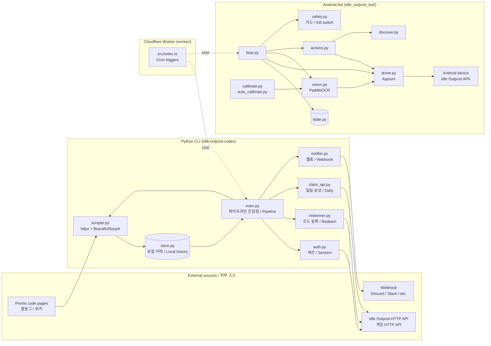

# Idle Outpost Codes

> **프로모 코드 모니터링 · 일일 보상 클레임 · 안드로이드 자동화 봇**
> **Promo code monitor · daily-reward claim CLI · Android automation bot**

모바일 게임 *Idle Outpost*를 위한 통합 자동화 키트입니다. 새 프로모션 코드를 수집하고, 게임의 공식 HTTP API로 코드를 등록(Redeem)하며, 일일 보상을 자동으로 수령하고, 선택적으로 안드로이드 디바이스에서 비전 기반 봇을 구동합니다. 추가로 Cloudflare Worker로 엣지 스케줄링을 구성할 수 있습니다.

A monorepo of automation tools for the mobile game *Idle Outpost*. It scrapes the web for new promotional codes, redeems them against the official game HTTP API, claims daily rewards on a schedule, and — optionally — drives an Android device running the game with a vision-based automation bot built on Appium and PaddleOCR. An optional Cloudflare Worker can schedule work from the edge.

---

## Overview / 개요

**EN** — The repository contains three Python components that can be used independently or wired together into a single pipeline. `scraper.py` discovers new promo codes on the public web; `redeemer.py` and `claim_api.py` talk to the game's HTTP API through a session created by `auth.py`; `store.py` persists scraped, redeemed, and claimed events so each stage is idempotent and restart-safe; `notifier.py` pushes results to external webhooks. A separate `idle_outpost_bot/` package drives the game UI on an Android device through Appium, locating on-screen text with PaddleOCR and applying runtime guards from `safety.py`. Each component is usable on its own, but they share `store.py` and `notifier.py`, so they form a single end-to-end pipeline when composed through `main.py`.

**KR** — 이 저장소는 세 가지 핵심 컴포넌트로 구성된 파이썬 자동화 키트입니다. `scraper.py`는 웹에서 새 프로모션 코드를 수집하고, `redeemer.py`와 `claim_api.py`는 `auth.py`에서 만든 세션을 통해 게임 HTTP API와 통신합니다. `store.py`는 스크랩·등록·수령 이벤트를 영속화하여 각 단계가 멱등(idempotent)하고 재시작 안전하도록 보장하며, `notifier.py`는 결과를 외부 웹훅으로 전달합니다. 별도 패키지 `idle_outpost_bot/`은 Appium으로 안드로이드 디바이스의 게임 UI를 구동하고, PaddleOCR로 화면 텍스트를 인식하며, `safety.py`의 런타임 가드를 적용합니다. 각 컴포넌트는 독립적으로 사용할 수 있고, `store.py`와 `notifier.py`를 공유하므로 `main.py`를 통해 하나의 파이프라인으로 구성됩니다.

---

## Features / 기능

| Area | Capability |
|------|-----------|
| Promo-code monitor / 프로모 코드 수집 | `scraper.py` fetches sources with `httpx` and parses them with `BeautifulSoup4`. |
| Authentication / 인증 | `auth.py` manages login and session against the game API. |
| Redemption / 코드 등록 | `redeemer.py` submits collected codes through the official API. |
| Daily claim / 일일 보상 | `claim_api.py` invokes the daily-reward endpoint and records the result. |
| Persistence / 영속화 | `store.py` keeps a local history of scraped, redeemed, and claimed events. |
| Notifications / 알림 | `notifier.py` pushes results to external services (e.g. webhooks). |
| Pipeline entry / 파이프라인 진입점 | `main.py` orchestrates the Python stages. |
| Android bot / 안드로이드 봇 | `idle_outpost_bot/` drives the game via Appium and locates UI text with PaddleOCR. |
| Bot safety / 봇 안전장치 | `safety.py` enforces cooldowns, stop conditions, and a kill switch. |
| Bot state / 봇 상태 | `state.py` and `loop.py` keep a persistent, restart-safe automation loop. |
| Bot vision / 봇 비전 | `vision.py` matches on-screen text via PaddleOCR with calibration profiles. |
| Bot calibration / 봇 보정 | `calibrate.py` and `auto_calibrate.py` generate `calibration/*.ocr.yaml` profiles from probe PNGs. |
| Bot discovery / 봇 발견 | `discover.py` and `actions.py` enumerate and invoke in-game interactions. |
| Localization / 다국어 | `idle_outpost_bot/i18n_ko.properties` provides Korean UI strings. |
| Edge scheduling / 엣지 스케줄링 | `worker/` is a Cloudflare Worker (TypeScript) that can trigger work on a cron. |

---

## Architecture / 아키텍처

The Python CLI is a small DAG of single-responsibility modules around a shared local store. The Android bot is a self-contained package that reuses the same store and notifier. The Cloudflare Worker is a separate runtime that schedules calls into the Python pipeline or the bot.



**EN** — `main.py` is the orchestrator: it pulls new codes from `scraper.py`, submits them through `redeemer.py` after authenticating with `auth.py`, calls the daily endpoint through `claim_api.py`, and emits events through `notifier.py`. Every stage reads and writes `store.py` so reruns are safe. The bot package is a separate loop that drives a real device through Appium, uses PaddleOCR to read UI strings, and consults `safety.py` before any high-risk tap. The Worker is a thin TypeScript runtime that fires cron triggers and forwards them either into the Python pipeline or directly into the bot loop.

**KR** — `main.py`는 오케스트레이터입니다. `scraper.py`로 새 코드를 수집하고, `auth.py`로 인증한 뒤 `redeemer.py`로 등록하며, `claim_api.py`로 일일 보상을 수령하고, 모든 이벤트를 `notifier.py`로 전달합니다. 각 단계는 `store.py`에 읽고 쓰므로 재실행이 안전합니다. 봇 패키지는 Appium으로 실제 디바이스를 구동하고, PaddleOCR로 UI 문자열을 인식하며, 위험한 동작 전에는 `safety.py`의 가드를 확인합니다. Worker는 가벼운 TypeScript 런타임으로, cron 트리거를 발사하여 파이썬 파이프라인이나 봇 루프로 전달합니다.

---

## Repository Layout / 저장소 구조

```text
.
├── CONTRIBUTING.md              # Contribution guide
├── LICENSE                      # License file
├── README.md                    # This file
├── auth.py                      # Game HTTP API session
├── claim_api.py                 # Daily-reward claim
├── main.py                      # Python pipeline entry point
├── notifier.py                  # Webhook notifications
├── pyproject.toml               # Project metadata and dependencies
├── redeemer.py                  # Promo-code redemption
├── scraper.py                   # Web scraper for codes
├── store.py                     # Local persistent history
├── uv.lock                      # uv lockfile (Python)
├── video1.png                   # Demo image
├── worker/                      # Cloudflare Worker (TypeScript)
│   ├── README.md
│   ├── package.json
│   ├── package-lock.json
│   ├── tsconfig.json
│   ├── wrangler.jsonc           # Cloudflare Worker config
│   └── src/
│       └── index.ts             # Scheduled handler
└── idle_outpost_bot/            # Android automation bot
    ├── README.md
    ├── AD_REWARDS.md
    ├── API_RESEARCH.md
    ├── AUTOMATION_TARGETS.md
    ├── CALIBRATION_FULL.md
    ├── JADX_FULL_INVENTORY.md
    ├── __init__.py
    ├── __main__.py              # Bot entry point (`python -m idle_outpost_bot`)
    ├── actions.py               # High-level in-game actions
    ├── auto_calibrate.py        # Automated calibration runner
    ├── calibrate.py             # Calibration helper
    ├── config_loader.py         # Bot configuration loader
    ├── discover.py              # UI element discovery
    ├── driver.py                # Appium driver setup
    ├── i18n_ko.properties       # Korean UI strings
    ├── loop.py                  # Persistent automation loop
    ├── notify.py                # Bot-side notifications
    ├── safety.py                # Runtime guards / kill switch
    ├── settings.py              # Bot settings
    ├── state.py                 # Bot state persistence
    ├── vision.py                # PaddleOCR-based vision
    └── calibration/             # OCR profiles and probe images
        ├── *.ocr.yaml           # Per-screen OCR calibration
        ├── *.yaml               # Per-screen structural config
        ├── *.png                # Reference and probe screenshots
        └── p2_*.png             # Page-2 / event-banner probes
```

---

## Quick Start / 빠른 시작

**EN** — The project is managed with [`uv`](https://github.com/astral-sh/uv) (a `uv.lock` is committed). Create a virtual environment, install the core dependencies, and run the pipeline entry point.

**KR** — 이 프로젝트는 [`uv`](https://github.com/astral-sh/uv)로 관리됩니다(`uv.lock`이 커밋되어 있습니다). 가상 환경을 만들고 코어 의존성을 설치한 뒤 파이프라인 진입점을 실행하세요.

```bash
# Clone and enter the repository
git clone <repository-url> idle-outpost-codes
cd idle-outpost-codes

# Create a virtual environment and install core dependencies
uv venv
uv sync

# Optional: install Android bot dependencies (heavy, includes PaddleOCR)
uv sync --extra bot

# Run the main pipeline
uv run python main.py
```

The bot can be invoked as a module:

```bash
uv run python -m idle_outpost_bot
```

The Worker is a separate Node.js project:

```bash
cd worker
npm install
npx wrangler dev      # local development
npx wrangler deploy   # deploy to Cloudflare
```

> The Worker directory contains its own `README.md` with deployment details.

---

## Configuration / 설정

**EN** — Configuration is loaded from environment variables and small per-screen YAML files. The Python CLI uses `python-dotenv`, so a `.env` file at the project root is read automatically. The bot reads its own YAML and properties files from `idle_outpost_bot/` and `idle_outpost_bot/calibration/`.

**KR** — 설정은 환경 변수와 화면별 YAML 파일에서 로드됩니다. 파이썬 CLI는 `python-dotenv`를 사용하므로 프로젝트 루트의 `.env` 파일을 자동으로 읽습니다. 봇은 `idle_outpost_bot/` 및 `idle_outpost_bot/calibration/`의 YAML 및 properties 파일을 사용합니다.

### Environment variables / 환경 변수

Create a `.env` file at the repository root:

```bash
# Game API / 게임 API
GAME_API_BASE=https://api.idle-outpost.example
GAME_LOGIN_ENDPOINT=/auth/login
GAME_REDEEM_ENDPOINT=/redeem
GAME_DAILY_ENDPOINT=/daily

# Auth credentials / 인증 정보
GAME_USERNAME=your_username
GAME_PASSWORD=your_password

# Notifications / 알림
WEBHOOK_URL=https://hooks.example.com/your-webhook
WEBHOOK_TIMEOUT_SECONDS=10

# Storage / 저장소
STORE_PATH=./data/store.json

# Scraper / 스크래퍼
SCRAPER_USER_AGENT=idle-outpost-codes/0.1 (+https://example.com)
SCRAPER_TIMEOUT_SECONDS=15
SCRAPER_SOURCES=https://example.com/codes,https://example.com/news
```

### Bot configuration / 봇 설정

- `idle_outpost_bot/settings.py` — numeric thresholds (cooldowns, retry counts, screen-match tolerances).
- `idle_outpost_bot/config_loader.py` — loads YAML and `i18n_ko.properties`.
- `idle_outpost_bot/calibration/*.ocr.yaml` — per-screen OCR calibration profiles (text anchors, regions, confidence).
- `idle_outpost_bot/calibration/*.yaml` — per-screen structural configuration (UI flow, expected states).
- `idle_outpost_bot/i18n_ko.properties` — Korean UI strings used by `vision.py` to localize OCR matches.

### Worker configuration / Worker 설정

- `worker/wrangler.jsonc` — Cloudflare Worker bindings, cron triggers, and KV/secret references.
- Secrets are configured through `wrangler secret put` and should include the webhook URL and any API tokens the Worker calls.

---

## Commands Reference / 명령어 레퍼런스

### Python CLI / 파이썬 CLI

| Command | Purpose |
|---------|---------|
| `uv run python main.py` | Run the full pipeline (scrape → redeem → daily claim → notify). |
| `uv run python scraper.py` | Scrape promo code sources only. |
| `uv run python auth.py` | Authenticate against the game API and print the session. |
| `uv run python redeemer.py` | Redeem all pending codes from the store. |
| `uv run python claim_api.py` | Trigger the daily-reward claim. |
| `uv run python notifier.py` | Flush pending notifications from the store. |

### Android bot / 안드로이드 봇

| Command | Purpose |
|---------|---------|
| `uv run python -m idle_outpost_bot` | Start the persistent automation loop. |
| `uv run python -m idle_outpost_bot.calibrate` | Run interactive calibration against a connected device. |
| `uv run python -m idle_outpost_bot.auto_calibrate` | Run automated calibration from probe PNGs. |

### Cloudflare Worker / Cloudflare Worker

| Command | Purpose |
|---------|---------|
| `npm install` (in `worker/`) | Install Worker dependencies. |
| `npx wrangler dev` | Run the Worker locally. |
| `npx wrangler deploy` | Deploy the Worker to Cloudflare. |
| `npx wrangler tail` | Stream the Worker's logs. |

---

## Local Development / 로컬 개발

**EN** — Follow this workflow when contributing:

1. Fork and clone the repository, then create a topic branch.
2. Run `uv venv && uv sync --extra bot` to set up the full development environment.
3. Copy `.env.example` (if present) to `.env` and fill in real values for local testing.
4. For Python changes, run the affected stage directly (e.g. `uv run python scraper.py`).
5. For bot changes, connect a real device or emulator running the game, ensure `adb devices` lists it, then run `uv run python -m idle_outpost_bot` with the bot extra installed.
6. For Worker changes, use `npx wrangler dev` and verify the cron trigger fires as expected.
7. Before opening a PR, run linting and type checking (see below).

**KR** — 기여할 때 권장하는 워크플로우입니다:

1. 저장소를 포크·클론하고 토픽 브랜치를 만듭니다.
2. `uv venv && uv sync --extra bot`으로 전체 개발 환경을 구성합니다.
3. `.env.example`(있으면)을 `.env`로 복사하고 로컬 테스트 값을 채웁니다.
4. 파이썬 변경은 영향받는 단계를 직접 실행합니다(예: `uv run python scraper.py`).
5. 봇 변경은 게임이 설치된 실기기 또는 에뮬레이터를 연결하고 `adb devices`에 표시되는지 확인한 뒤 봇 extra와 함께 `uv run python -m idle_outpost_bot`을 실행합니다.
6. Worker 변경은 `npx wrangler dev`로 로컬에서 검증하고 cron 트리거 동작을 확인합니다.
7. PR을 열기 전에 린트와 타입 검사를 실행합니다(아래 참조).

---

## Android Bot & Calibration / 안드로이드 봇과 보정

**EN** — The bot package is designed for unattended operation on a device that is already logged into the game. The loop is restart-safe through `state.py`, guarded by `safety.py` (cooldowns, daily caps, kill switch), and uses `vision.py` plus `calibration/*.ocr.yaml` to find on-screen text in the correct language. Calibration is data-driven: probe screenshots in `calibration/p2_*.png`, `probe_*.png`, and the per-screen reference PNGs are matched against live captures to produce the YAML profiles consumed by `vision.py`. `discover.py` enumerates UI elements dynamically, and `actions.py` composes them into higher-level operations (open calendar, claim daily, accept reward, navigate screens).

**KR** — 봇 패키지는 게임에 이미 로그인된 디바이스에서 무인 운영을 전제로 설계되었습니다. 루프는 `state.py`로 재시작 안전하며, `safety.py`(쿨다운, 일일 한도, 킬 스위치)로 보호되고, `vision.py`와 `calibration/*.ocr.yaml`로 화면 텍스트를 올바른 언어로 인식합니다. 보정은 데이터 기반입니다. `calibration/`의 `p2_*.png`, `probe_*.png`, 화면별 참조 PNG가 실 캡처와 매칭되어 `vision.py`가 소비하는 YAML 프로파일을 생성합니다. `discover.py`가 UI 요소를 동적으로 탐색하고, `actions.py`는 이를 상위 작업(달력 열기, 일일 수령, 보상 수락, 화면 이동)으로 조합합니다.

Documentation in the bot directory:

- `idle_outpost_bot/README.md` — Bot-specific overview.
- `idle_outpost_bot/AD_REWARDS.md` — Notes on ad-reward flows.
- `idle_outpost_bot/AUTOMATION_TARGETS.md` — Catalog of automatable screens.
- `idle_outpost_bot/CALIBRATION_FULL.md` — Detailed calibration procedure.
- `idle_outpost_bot/JADX_FULL_INVENTORY.md` — Static-analysis inventory from the APK.
- `idle_outpost_bot/API_RESEARCH.md` — API surface notes.

---

## Testing & Quality / 테스트와 품질

**EN** — This repository does not ship a dedicated `tests/` suite. Quality is enforced through configuration shipped in `pyproject.toml`:

- **Linting:** `ruff` is configured with `line-length = 100` and `target-version = "py311"`. Run `uv run ruff check .`.
- **Type checking:** `basedpyright` is configured against the project virtualenv. Run `uv run basedpyright .`.
- **Worker:** TypeScript is type-checked via `tsc` (`worker/tsconfig.json`). Run `npx tsc --noEmit` inside `worker/`.

If you add formal tests, prefer `pytest` and place them under `tests/` mirroring the module layout (e.g. `tests/test_scraper.py`).

**KR** — 이 저장소에는 별도의 `tests/` 디렉터리가 포함되어 있지 않습니다. 품질은 `pyproject.toml`에 포함된 설정을 통해 보장됩니다:

- **린팅:** `ruff`가 `line-length = 100`, `target-version = "py311"`로 설정되어 있습니다. `uv run ruff check .`을 실행하세요.
- **타입 검사:** `basedpyright`가 프로젝트 가상환경을 대상으로 설정되어 있습니다. `uv run basedpyright .`을 실행하세요.
- **Worker:** TypeScript는 `tsc`로 타입 검사됩니다(`worker/tsconfig.json`). `worker/`에서 `npx tsc --noEmit`을 실행하세요.

테스트를 추가한다면 `pytest`를 사용하고 `tests/` 아래에 모듈 구조를 미러링해 두는 것을 권장합니다(예: `tests/test_scraper.py`).

---

## Contributing / 기여

**EN** — See [`CONTRIBUTING.md`](./CONTRIBUTING.md) for the contribution policy, coding conventions, and review process. Bug reports, code contributions, and additional code sources for the scraper are welcome.

**KR** — 기여 정책, 코딩 규칙, 리뷰 절차는 [`CONTRIBUTING.md`](./CONTRIBUTING.md)를 참조하세요. 버그 리포트, 코드 기여, 스크래퍼용 코드 소스 추가를 환영합니다.

---

## License / 라이선스

**EN** — Released under the terms described in [`LICENSE`](./LICENSE).

**KR** — [`LICENSE`](./LICENSE)에 명시된 조건에 따라 배포됩니다.