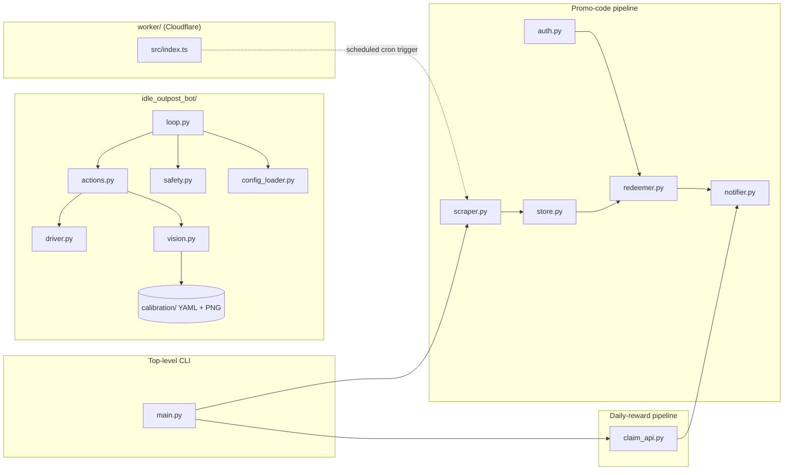

# Idle Outpost Codes

> **프로모 코드 모니터링 · 일일 보상 클레임 · 안드로이드 자동화 봇**
> **Promo code monitor · daily-reward claim CLI · Android automation bot**

A monorepo that bundles three integrated tools for the mobile game *Idle Outpost*, plus an optional Cloudflare Worker for edge scheduling.

---

## Overview / 개요

**EN** — `idle-outpost-codes` is an automation toolkit for *Idle Outpost*. It scrapes the web for new promotional codes, redeems them against the game's official HTTP API, claims daily rewards on a schedule, and — optionally — drives an Android device running the game with a vision-based automation bot built on Appium and PaddleOCR. Each component is usable on its own, but they share a local `store.py` and a `notifier.py` webhook helper so they can form a single end-to-end pipeline.

**KR** — `idle-outpost-codes`는 *Idle Outpost* 게임을 위한 자동화 도구 모음입니다. 웹에서 새로운 프로모션 코드를 스크랩하고, 게임 공식 HTTP API로 코드를 등록(Redeem)하며, 일일 보상을 자동 수령하고, 추가로 안드로이드 디바이스에서 비전 기반 자동화 봇(Appium + PaddleOCR)을 구동할 수 있습니다. 각 컴포넌트는 독립적으로 사용할 수 있도록 설계되었으며, 로컬 저장소(`store.py`)와 웹훅 알림(`notifier.py`)을 공유하여 하나의 파이프라인으로 동작합니다.

---

## Features / 기능

| Area | Capability |
|------|-----------|
| Promo-code monitor | `scraper.py` fetches code sources with `httpx`, parses them with `BeautifulSoup4`, and persists results. |
| Authentication | `auth.py` handles login/session against the game API. |
| Redemption | `redeemer.py` submits collected codes through the official API. |
| Daily claim | `claim_api.py` calls the daily-reward endpoint and records the result. |
| Persistence | `store.py` keeps a local history of scraped, redeemed, and claimed events. |
| Notifications | `notifier.py` pushes results to external services (e.g. webhooks). |
| Android bot | `idle_outpost_bot/` drives the game via Appium and locates UI text with PaddleOCR. |
| Bot safety | `safety.py` enforces runtime guards (cooldowns, stop conditions, kill switch). |
| Bot state | `state.py` and `loop.py` keep a persistent, restart-safe automation loop. |
| Calibration | OCR templates and YAML descriptors in `idle_outpost_bot/calibration/` make new screens easy to add. |
| Self-discovery | `discover.py` and `auto_calibrate.py` reduce manual setup when the game UI changes. |
| Edge scheduling | `worker/` is a Cloudflare Worker that can fire the CLI on a cron trigger. |

---

## Architecture / 아키텍처



**Read this as three pipelines, plus an edge trigger:**

- **Promo-code pipeline** — `scraper.py` collects candidates, `auth.py` signs in, `redeemer.py` submits each code, and the result is written to `store.py` and forwarded by `notifier.py`.
- **Daily-reward pipeline** — `claim_api.py` performs a one-shot call to the daily-reward endpoint and reuses the same `store.py` and `notifier.py` plumbing.
- **Android bot** — `loop.py` runs a long-lived automation cycle. It loads configuration from `config_loader.py`, consults `safety.py` for runtime guards, and dispatches high-level intents to `actions.py`, which uses `driver.py` (Appium) and `vision.py` (PaddleOCR + calibration assets) to interact with the game.
- **Cloudflare Worker** — `worker/src/index.ts` is a small TypeScript handler that can be configured with a `cron` trigger to invoke the scraper from the edge.

---

## Repository Layout / 디렉터리 구조

```
.
├── README.md                 # this file
├── CONTRIBUTING.md           # contribution guidelines
├── LICENSE                   # project license
├── pyproject.toml            # Python project + tool config (ruff, basedpyright)
├── uv.lock                   # uv lockfile for reproducible installs
├── main.py                   # top-level CLI entry point
├── scraper.py                # promo-code scraper
├── auth.py                   # API authentication / session
├── redeemer.py               # code redemption client
├── claim_api.py              # daily-reward client
├── store.py                  # local persistence layer
├── notifier.py               # webhook / notification helper
├── video1.png                # demo screenshot
│
├── worker/                   # Cloudflare Worker (TypeScript)
│   ├── README.md
│   ├── package.json
│   ├── package-lock.json
│   ├── tsconfig.json
│   ├── wrangler.jsonc
│   └── src/
│       └── index.ts
│
└── idle_outpost_bot/         # Android automation bot package
    ├── README.md
    ├── AD_REWARDS.md
    ├── API_RESEARCH.md
    ├── AUTOMATION_TARGETS.md
    ├── CALIBRATION_FULL.md
    ├── JADX_FULL_INVENTORY.md
    ├── i18n_ko.properties
    ├── __init__.py
    ├── __main__.py           # `python -m idle_outpost_bot`
    ├── loop.py
    ├── actions.py
    ├── driver.py
    ├── vision.py
    ├── safety.py
    ├── state.py
    ├── settings.py
    ├── config_loader.py
    ├── calibrate.py
    ├── auto_calibrate.py
    ├── discover.py
    ├── notify.py
    └── calibration/          # OCR templates and descriptors
        ├── *.png
        └── *.yaml
```

---

## Quick Start / 빠른 시작

### 1. Clone and install the Python toolkit / 저장소 복제 및 Python 의존성 설치

The project uses [`uv`](https://docs.astral.sh/uv/) (a `uv.lock` is provided), but standard `pip` works as well. Python **3.11+** is required.

```bash
git clone <your-fork-url> idle-outpost-codes
cd idle-outpost-codes

# Option A — uv (recommended)
uv sync
uv run python main.py --help

# Option B — pip + venv
python -m venv .venv
source .venv/bin/activate
pip install -e ".[bot]"
```

Install the `bot` extra only if you plan to run the Android automation:

```bash
uv sync --extra bot      # or:  pip install -e ".[bot]"
```

The `bot` extra pulls in `Appium-Python-Client`, `selenium`, `paddleocr`, `paddlepaddle`, `Pillow`, `numpy`, and `pyyaml`.

### 2. Configure environment variables / 환경 변수 설정

Create a `.env` file in the repository root (it is intentionally not committed). See the **Configuration** section below for the full list of keys.

### 3. Run the CLI / CLI 실행

```bash
# Scrape promo codes from configured sources
uv run python main.py scrape

# Redeem any new codes
uv run python main.py redeem

# Claim today's daily reward
uv run python main.py daily
```

The exact subcommands depend on how `main.py` wires the modules; consult `python main.py --help` for the authoritative list.

### 4. (Optional) Run the Android bot / 안드로이드 봇 실행

Requirements:

- An Android device or emulator connected via ADB.
- An Appium server running locally (default endpoint is `http://127.0.0.1:4723` — set `APPIUM_URL` to override).
- The *Idle Outpost* game installed and visible on the device.

```bash
uv run python -m idle_outpost_bot
```

The bot will load `idle_outpost_bot/settings.py`, apply `safety.py` guards, and begin its persistent loop.

### 5. (Optional) Deploy the Cloudflare Worker / Cloudflare Worker 배포

```bash
cd worker
npm install
npx wrangler deploy
```

Configure the schedule and downstream URL in `worker/wrangler.jsonc` and `worker/src/index.ts`.

---

## Configuration / 설정

The toolkit is driven by a combination of a `.env` file, YAML calibration descriptors, and the Cloudflare `wrangler.jsonc`.

### `.env` (top-level Python CLI)

Create a `.env` in the repository root. The exact keys are consumed by `auth.py`, `redeemer.py`, `claim_api.py`, and `notifier.py`:

| Key | Used by | Purpose |
|-----|---------|---------|
| `GAME_API_BASE_URL` | `auth.py`, `redeemer.py`, `claim_api.py` | Base URL of the game HTTP API. |
| `GAME_USERNAME` | `auth.py` | Login identifier. |
| `GAME_PASSWORD` | `auth.py` | Login secret. |
| `STORE_PATH` | `store.py` | Local file used for history (defaults to `./.data/store.json`). |
| `WEBHOOK_URL` | `notifier.py` | Optional outbound webhook for notifications. |
| `SCRAPE_SOURCES` | `scraper.py` | Comma-separated list of source URLs to scrape. |

### Bot settings / 봇 설정

`idle_outpost_bot/settings.py` reads:

| Key | Purpose |
|-----|---------|
| `APPIUM_URL` | Appium server URL (placeholder: `http://<appium-host>:<port>`). |
| `ANDROID_DEVICE_NAME` | Target device capability for Appium. |
| `ANDROID_APP_PACKAGE` | Package name of *Idle Outpost*. |
| `ANDROID_APP_ACTIVITY` | Launch activity of *Idle Outpost*. |
| `BOT_LOCALE` | Locale used to pick calibration assets (e.g. `ko`, `en`). |
| `BOT_DRY_RUN` | When `true`, the bot logs intended actions without tapping. |

### Calibration assets / 보정 자산

`idle_outpost_bot/calibration/*.yaml` describes each screen (text anchors, swipe targets, expected OCR results). The matching `*.png` is a reference image. `calibrate.py` and `auto_calibrate.py` regenerate these assets when the game UI changes.

### Worker / Worker 설정

`worker/wrangler.jsonc` controls:

- The Cloudflare account and project binding.
- The `triggers.crons` schedule.
- Environment variables/secrets (e.g. a downstream URL or shared secret).

---

## Commands Reference / 명령어 레퍼런스

| Command | Description |
|---------|-------------|
| `python main.py scrape` | Run `scraper.py` to collect new promo codes and write them to `store.py`. |
| `python main.py redeem` | Run `redeemer.py` against all unredeemed codes. |
| `python main.py daily` | Run `claim_api.py` to claim the daily reward. |
| `python -m idle_outpost_bot` | Start the long-running Android automation loop. |
| `python -m idle_outpost_bot.calibrate` | Interactive screen calibration helper. |
| `python -m idle_outpost_bot.auto_calibrate` | Headless / batch calibration against the connected device. |
| `cd worker && npx wrangler dev` | Run the Cloudflare Worker locally. |
| `cd worker && npx wrangler deploy` | Publish the Worker to Cloudflare. |
| `uv run ruff check .` | Lint Python sources (configured in `pyproject.toml`). |
| `uv run basedpyright` | Type-check Python sources (configured in `pyproject.toml`). |

---

## Local Development / 로컬 개발

- **Python version:** 3.11+ (matches `requires-python` in `pyproject.toml`).
- **Lockfile:** `uv.lock` is the source of truth for Python dependencies. Regenerate with `uv lock` rather than hand-editing.
- **Linting:** `ruff` is configured with `line-length = 100` and `target-version = "py311"`.
- **Type-checking:** `basedpyright` points at the local `.venv`.
- **Bot development:** keep the device screen on and the game foregrounded. `safety.py` is intentionally conservative — when in doubt, do not bypass its checks in development.
- **Worker development:** `wrangler dev` runs the Worker in a local simulator. Use `wrangler tail` to stream logs.

---

## Testing / 테스트

This repository does not ship a dedicated test suite by default. For local verification:

- Run `python main.py scrape --dry-run` (if available) to validate the scraping pipeline.
- Run `python -m idle_outpost_bot` against a personal account in dry-run mode (`BOT_DRY_RUN=true`) to validate the bot.
- Use `worker/` `wrangler dev` to validate the scheduled trigger locally.

When adding tests, prefer `pytest` and place them under a `tests/` directory at the repository root.

---

## Contributing / 기여

Contributions are welcome. Please read [`CONTRIBUTING.md`](./CONTRIBUTING.md) first. The short version:

1. Fork the repository and create a feature branch.
2. Keep changes focused; one feature or fix per pull request.
3. Run `ruff check` and `basedpyright` before opening the PR.
4. If you add a new screen to the bot, include the YAML descriptor and a reference PNG in `idle_outpost_bot/calibration/`.
5. Describe the change clearly in the PR body, including any new configuration keys.

---

## License / 라이선스

This project is released under the terms described in [`LICENSE`](./LICENSE).

---

###TASK_COMPLETED###