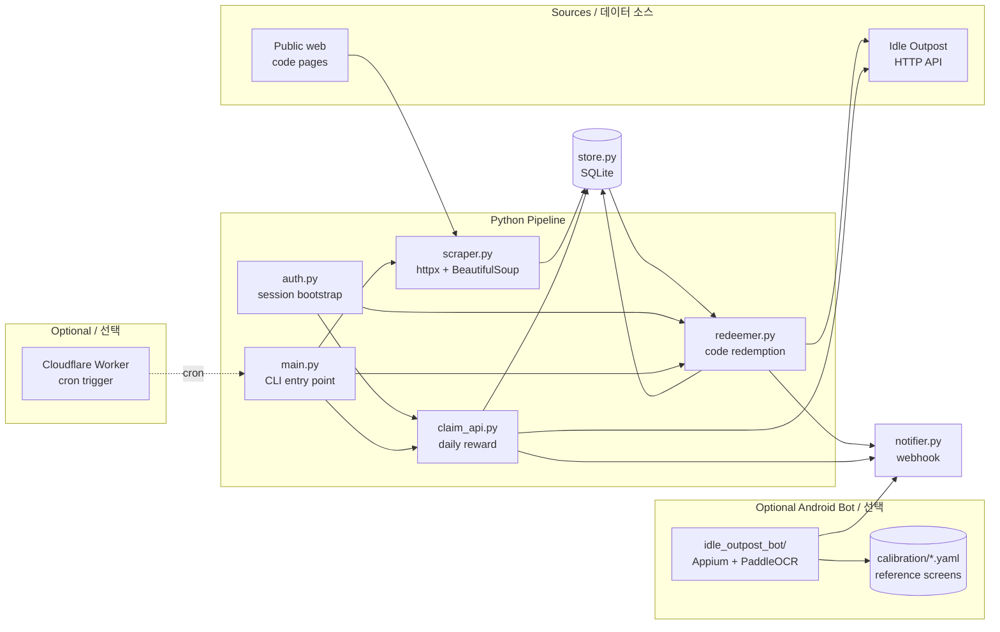

# Idle Outpost Codes

> **프로모 코드 모니터링 · 일일 보상 클레임 · 안드로이드 자동화 봇**
> **Promo code monitor · daily-reward claim CLI · Android automation bot**

*Idle Outpost* 모바일 게임을 위한 통합 자동화 키트입니다. 공개 웹에서 새 프로모션 코드를 수집하고, 게임의 공식 HTTP API로 코드를 등록(Redeem)하며, 일일 보상을 자동 수령하고, 선택적으로 안드로이드 디바이스에서 비전 기반 봇을 구동합니다. Cloudflare Worker를 통한 엣지 스케줄링도 지원합니다.

A monorepo of automation tools for the mobile game *Idle Outpost*. It scrapes the public web for new promotional codes, redeems them against the official game HTTP API, claims daily rewards on a schedule, and — optionally — drives an Android device running the game with a vision-based bot built on Appium and PaddleOCR. A Cloudflare Worker can schedule work from the edge.

---

## Table of Contents / 목차

- [Overview / 개요](#overview--개요)
- [Features / 주요 기능](#features--주요-기능)
- [Architecture / 아키텍처](#architecture--아키텍처)
- [Repository Layout / 저장소 구조](#repository-layout--저장소-구조)
- [Quick Start / 빠른 시작](#quick-start--빠른-시작)
- [Configuration / 설정](#configuration--설정)
- [Commands Reference / 명령어 레퍼런스](#commands-reference--명령어-레퍼런스)
- [Python Pipeline / 파이썬 파이프라인](#python-pipeline--파이썬-파이프라인)
- [Android Bot / 안드로이드 봇](#android-bot--안드로이드-봇)
- [Cloudflare Worker](#cloudflare-worker)
- [Local Development / 로컬 개발](#local-development--로컬-개발)
- [Testing / 테스트](#testing--테스트)
- [Contributing / 기여](#contributing--기여)
- [Troubleshooting / 문제 해결](#troubleshooting--문제-해결)
- [Disclaimer / 면책](#disclaimer--면책)
- [License / 라이선스](#license--라이선스)

---

## Overview / 개요

**EN** — The repository contains three loosely coupled Python pipelines plus an Android UI bot and an optional Cloudflare Worker. They share a single persistence layer (`store.py`) and a single outbound notifier (`notifier.py`), so each stage is idempotent and restart-safe.

- **Promo monitor** — `scraper.py` discovers new codes from configured web sources via `httpx` + BeautifulSoup and deduplicates them through `store.py`.
- **Code redeemer** — `redeemer.py`, with a session bootstrapped by `auth.py`, POSTs each un-redeemed code to the official game API.
- **Daily reward claim** — `claim_api.py` triggers the daily reward endpoint once per UTC day.
- **Notifier** — `notifier.py` posts human-readable status messages to a configured webhook (e.g. Discord, Slack, generic webhook).
- **Entry point** — `main.py` wires the pieces into a single CLI that can run any stage on demand.
- **Android bot (optional)** — `idle_outpost_bot/` is a separate package with its own driver, OCR vision, calibration assets, and action loop. It is *not* required for the web/API pipeline.
- **Cloudflare Worker (optional)** — `worker/` triggers the daily job from the edge via a cron trigger.

**KR** — 이 저장소는 세 개의 느슨하게 결합된 파이썬 파이프라인과 안드로이드 UI 봇, 그리고 선택 가능한 Cloudflare Worker로 구성됩니다. 모든 단계는 단일 영속 계층(`store.py`)과 단일 송신 notifier(`notifier.py`)를 공유하므로 멱등(idempotent)이며 재시작 안전합니다.

- **프로모 모니터** — `scraper.py`가 설정된 웹 소스에서 `httpx` + BeautifulSoup로 새 코드를 수집하고 `store.py`로 중복을 제거합니다.
- **코드 등록기** — `redeemer.py`는 `auth.py`로 부트스트랩된 세션으로 등록되지 않은 코드를 공식 게임 API에 POST 합니다.
- **일일 보상 클레임** — `claim_api.py`는 UTC 기준 하루에 한 번 일일 보상 엔드포인트를 호출합니다.
- **Notifier** — `notifier.py`는 사람이 읽을 수 있는 상태 메시지를 설정된 웹훅(Discord, Slack, 범용 웹훅 등)으로 보냅니다.
- **엔트리 포인트** — `main.py`는 위 모든 단계를 하나의 CLI로 묶어 요청 시 실행합니다.
- **안드로이드 봇(선택)** — `idle_outpost_bot/`은 자체 드라이버, OCR 비전, 캘리브레이션 자산, 액션 루프를 가진 별도 패키지입니다. 웹/API 파이프라인에는 필요하지 않습니다.
- **Cloudflare Worker(선택)** — `worker/`는 cron 트리거를 통해 엣지에서 일일 작업을 트리거합니다.

---

## Features / 주요 기능

**EN**

- 🔍 **Web scraping for promo codes** — pluggable source list, HTML parsing with BeautifulSoup, stable hashing for dedupe.
- 🔐 **Authenticated HTTP client** — login, refresh, and per-request session handling in `auth.py`.
- 🎁 **Code redemption** — batch-redeems every pending code, marks each `success` / `expired` / `already-used` / `error` in the store.
- 📅 **Daily reward claim** — once-per-UTC-day guard, idempotent.
- 🗃 **SQLite-backed store** — single source of truth for codes, claims, and run history.
- 🔔 **Pluggable notifications** — Discord / Slack / generic webhook via env-driven config.
- 📱 **Android bot (optional)** — Appium + PaddleOCR, YAML-driven calibration, screen-state machine, Korean (`i18n_ko.properties`) localization.
- ☁️ **Edge scheduling (optional)** — Cloudflare Worker triggers the CLI from a cron schedule.

**KR**

- 🔍 **프로모 코드 웹 스크래핑** — 플러그 가능한 소스 목록, BeautifulSoup 기반 HTML 파싱, 안정적 해시로 중복 제거.
- 🔐 **인증 HTTP 클라이언트** — `auth.py`에서 로그인·갱신·요청별 세션 처리.
- 🎁 **코드 등록** — 보류 중인 모든 코드를 일괄 등록하고 각 결과를 `success` / `expired` / `already-used` / `error`로 기록.
- 📅 **일일 보상 클레임** — UTC 기준 하루 한 번 가드, 멱등성 보장.
- 🗃 **SQLite 기반 저장소** — 코드·클레임·실행 기록의 단일 진실 공급원.
- 🔔 **플러그 가능한 알림** — 환경변수로 Discord / Slack / 범용 웹훅 지원.
- 📱 **안드로이드 봇(선택)** — Appium + PaddleOCR, YAML 기반 캘리브레이션, 화면 상태 머신, 한국어(`i18n_ko.properties`) 로컬라이제이션.
- ☁️ **엣지 스케줄링(선택)** — Cloudflare Worker가 cron 스케줄로 CLI를 트리거.

---

## Architecture / 아키텍처

**EN** — Two independent subsystems share the same store and notifier. The Python pipeline talks only to HTTP endpoints (the official game API + public code sources). The Android bot talks only to a connected device through Appium. The Worker is a thin cron-driven trigger.

**KR** — 두 개의 독립적인 서브시스템이 동일한 store와 notifier를 공유합니다. 파이썬 파이프라인은 HTTP 엔드포인트(공식 게임 API + 공개 코드 소스)와만 통신합니다. 안드로이드 봇은 Appium을 통해 연결된 디바이스와만 통신합니다. Worker는 cron 기반의 얇은 트리거입니다.



---

## Repository Layout / 저장소 구조

```
.
├── auth.py                    # HTTP session bootstrap (login/refresh)
├── claim_api.py               # Daily reward endpoint client
├── main.py                    # CLI entry point wiring the pipeline
├── notifier.py                # Outbound webhook notifier
├── redeemer.py                # Code redemption pipeline
├── scraper.py                 # Web scraping for promo codes
├── store.py                   # SQLite persistence layer
├── pyproject.toml             # Project metadata + dependencies
├── uv.lock                    # Reproducible lockfile (uv)
│
├── worker/                    # Cloudflare Worker (TypeScript)
│   ├── src/index.ts
│   ├── wrangler.jsonc
│   ├── tsconfig.json
│   └── package.json
│
└── idle_outpost_bot/          # Optional Android UI bot
    ├── __main__.py            # `python -m idle_outpost_bot`
    ├── actions.py             # Game-level actions (tap, swipe, wait)
    ├── driver.py              # Appium driver setup
    ├── loop.py                # State-machine loop
    ├── vision.py              # PaddleOCR + template matching
    ├── safety.py              # Anti-ban / safety heuristics
    ├── settings.py            # User-tunable bot settings
    ├── state.py               # In-memory + persisted bot state
    ├── notify.py              # Bot-specific notifier
    ├── calibrate.py           # Manual calibration helper
    ├── auto_calibrate.py      # Automated calibration
    ├── discover.py            # On-screen element discovery
    ├── config_loader.py       # YAML config loader
    ├── i18n_ko.properties     # Korean localization strings
    └── calibration/           # OCR templates + reference screenshots
        ├── main.png
        ├── main_screen.yaml
        ├── *.ocr.yaml         # Per-screen OCR reference data
        └── *.png              # Reference screenshots
```

---

## Quick Start / 빠른 시작

### Prerequisites / 사전 요구사항

**EN**

- Python **3.11+**
- [uv](https://docs.astral.sh/uv/) (recommended) or `pip`
- A game account that can authenticate against the official HTTP API
- For the Android bot: a connected Android device (USB or Wi-Fi ADB), Appium server, and the game installed
- For the Worker: a Cloudflare account + `wrangler` CLI

**KR**

- 파이썬 **3.11 이상**
- [uv](https://docs.astral.sh/uv/) (권장) 또는 `pip`
- 공식 HTTP API에 인증 가능한 게임 계정
- 안드로이드 봇용: 연결된 안드로이드 디바이스(USB 또는 Wi-Fi ADB), Appium 서버, 게임 설치
- Worker용: Cloudflare 계정과 `wrangler` CLI

### Install / 설치

```bash
# Clone
git clone <your-fork-url> idle-outpost-codes
cd idle-outpost-codes

# Core pipeline (Python 3.11+, uv recommended)
uv sync

# Or with pip:
python -m venv .venv
source .venv/bin/activate
pip install -e .

# Android bot (optional, adds Appium + PaddleOCR + Selenium)
uv sync --extra bot
# or:
pip install -e ".[bot]"
```

### Configure / 설정

Create a `.env` file at the repository root:

```env
# Game API credentials / 게임 API 자격증명
IDLE_OUTPOST_BASE_URL=https://api.example.invalid
IDLE_OUTPOST_USERNAME=your_username
IDLE_OUTPOST_PASSWORD=your_password

# Notifier (generic webhook) / 웹훅
NOTIFY_WEBHOOK_URL=https://hooks.example.invalid/xxx
NOTIFY_USERNAME=Idle-Outpost-Bot

# Optional: persistent DB path / DB 경로 (선택)
STORE_DB_PATH=./data/store.sqlite3
```

### Run / 실행

```bash
# Scrape for new codes / 새 코드 스크래핑
python main.py scrape

# Redeem every pending code / 보류 중인 모든 코드 등록
python main.py redeem

# Claim the daily reward / 일일 보상 클레임
python main.py claim

# Full pipeline: scrape → redeem → claim
python main.py run
```

---

## Configuration / 설정

**EN** — All runtime configuration is environment-driven. `python-dotenv` is loaded automatically when a `.env` file is present.

| Variable | Purpose | Required |
| --- | --- | --- |
| `IDLE_OUTPOST_BASE_URL` | Base URL of the official game HTTP API | ✅ |
| `IDLE_OUTPOST_USERNAME` | Account username / login ID | ✅ |
| `IDLE_OUTPOST_PASSWORD` | Account password | ✅ |
| `NOTIFY_WEBHOOK_URL` | Outbound webhook for status messages | ⛔ optional |
| `NOTIFY_USERNAME` | Display name for notifier messages | ⛔ optional |
| `STORE_DB_PATH` | SQLite file path (defaults to `./data/store.sqlite3`) | ⛔ optional |
| `HTTP_TIMEOUT_SECONDS` | Per-request timeout for `httpx` | ⛔ optional |
| `LOG_LEVEL` | `DEBUG` / `INFO` / `WARNING` / `ERROR` | ⛔ optional |

**KR** — 모든 런타임 설정은 환경변수 기반입니다. `.env` 파일이 있으면 `python-dotenv`가 자동으로 로드합니다.

| 변수 | 용도 | 필수 |
| --- | --- | --- |
| `IDLE_OUTPOST_BASE_URL` | 공식 게임 HTTP API의 베이스 URL | ✅ |
| `IDLE_OUTPOST_USERNAME` | 계정 사용자명 / 로그인 ID | ✅ |
| `IDLE_OUTPOST_PASSWORD` | 계정 비밀번호 | ✅ |
| `NOTIFY_WEBHOOK_URL` | 상태 메시지용 송신 웹훅 | ⛔ 선택 |
| `NOTIFY_USERNAME` | 알림 표시 이름 | ⛔ 선택 |
| `STORE_DB_PATH` | SQLite 파일 경로(기본 `./data/store.sqlite3`) | ⛔ 선택 |
| `HTTP_TIMEOUT_SECONDS` | `httpx` 요청별 타임아웃 | ⛔ 선택 |
| `LOG_LEVEL` | `DEBUG` / `INFO` / `WARNING` / `ERROR` | ⛔ 선택 |

The Android bot reads additional settings from `idle_outpost_bot/settings.py` and screen-specific OCR data from `idle_outpost_bot/calibration/*.ocr.yaml`. See [Android Bot / 안드로이드 봇](#android-bot--안드로이드-봇) for details.

---

## Commands Reference / 명령어 레퍼런스

### `python main.py …`

| Subcommand | Description / 설명 |
| --- | --- |
| `python main.py scrape` | Scrape configured web sources for new promo codes and insert into the store. / 설정된 웹 소스에서 새 프로모 코드를 스크래핑하여 저장소에 삽입. |
| `python main.py redeem` | Redeem every pending code against the game API. / 보류 중인 모든 코드를 게임 API에 등록. |
| `python main.py claim` | Trigger the daily reward endpoint (once per UTC day). / 일일 보상 엔드포인트 호출(UTC 기준 하루 한 번). |
| `python main.py run` | Run `scrape → redeem → claim` sequentially. / `scrape → redeem → claim` 순차 실행. |
| `python main.py status` | Print store summary (codes seen, redeemed, errors, last claim). / 저장소 요약 출력(수집·등록·오류·마지막 클레임). |

### `python -m idle_outpost_bot …`

| Subcommand | Description / 설명 |
| --- | --- |
| `python -m idle_outpost_bot` | Start the Android bot loop (default). / 안드로이드 봇 루프 시작(기본). |
| `python -m idle_outpost_bot calibrate` | Run the manual calibration wizard. / 수동 캘리브레이션 마법사 실행. |
| `python -m idle_outpost_bot auto-calibrate` | Run automated calibration from reference screens. / 참조 화면으로 자동 캘리브레이션 실행. |
| `python -m idle_outpost_bot discover` | Probe on-screen elements and dump candidate bounding boxes. / 화면 요소를 탐색하여 후보 바운딩 박스 출력. |

### Worker (`worker/`)

| Command | Description / 설명 |
| --- | --- |
| `npx wrangler dev` | Run the Worker locally. / Worker를 로컬에서 실행. |
| `npx wrangler deploy` | Deploy to Cloudflare. / Cloudflare에 배포. |
| `npx wrangler tail` | Tail live Worker logs. / Worker 로그 실시간 확인. |

---

## Python Pipeline / 파이썬 파이프라인

### `scraper.py`

**EN** — Reads the configured source list, fetches each URL with `httpx`, parses the HTML with BeautifulSoup, extracts candidate codes (regex-validated), hashes them, and inserts unseen codes into the store. The scraper is read-only with respect to the game API.

**KR** — 설정된 소스 목록을 읽고 `httpx`로 각 URL을 가져온 뒤 BeautifulSoup으로 HTML을 파싱하고, 정규식으로 검증된 후보 코드를 추출·해시하여 미등록 코드를 저장소에 삽입합니다. 게임 API에 대해서는 읽기 전용입니다.

### `auth.py`

**EN** — Boots and refreshes an authenticated `httpx` session. On 401 it transparently re-logs-in. Caches tokens in memory (and optionally in the store) to avoid hammering the auth endpoint.

**KR** — 인증된 `httpx` 세션을 부트스트랩하고 갱신합니다. 401 응답 시 투명하게 재로그인합니다. 토큰은 메모리(및 선택적으로 저장소)에 캐시되어 인증 엔드포인트 과다 호출을 방지합니다.

### `redeemer.py`

**EN** — Pulls every code with state `new` from the store, calls the redemption endpoint for each, and updates the row to `success` / `expired` / `already-used` / `error` based on the response.

**KR** — 저장소에서 상태가 `new`인 모든 코드를 가져와 각각 등록 엔드포인트를 호출하고, 응답에 따라 행을 `success` / `expired` / `already-used` / `error`로 갱신합니다.

### `claim_api.py`

**EN** — Calls the daily-reward endpoint. The store remembers the last successful claim date in UTC; calls within the same UTC day are no-ops.

**KR** — 일일 보상 엔드포인트를 호출합니다. 저장소는 마지막 성공 클레임 날짜를 UTC로 기억하며, 같은 UTC 날짜 내 호출은 무시됩니다.

### `store.py`

**EN** — Thin SQLite wrapper. Owns the schema for `codes`, `claims`, and `run_history`. All writes are wrapped in transactions and use `INSERT … ON CONFLICT` for idempotency.

**KR** — 얇은 SQLite 래퍼입니다. `codes`, `claims`, `run_history`의 스키마를 소유합니다. 모든 쓰기는 트랜잭션으로 감싸고 멱등성을 위해 `INSERT … ON CONFLICT`를 사용합니다.

### `notifier.py`

**EN** — Sends a single POST per event to `NOTIFY_WEBHOOK_URL`. Designed to be Discord/Slack-compatible; failures here never abort the pipeline.

**KR** — 이벤트당 한 번 POST를 `NOTIFY_WEBHOOK_URL`로 보냅니다. Discord/Slack 호환으로 설계되었으며 여기서의 실패는 파이프라인을 중단시키지 않습니다.

### `main.py`

**EN** — The CLI orchestrator. Parses subcommands, instantiates a single `auth` session, and passes it down to the requested stage. Always exits non-zero on a fatal error so cron/Worker triggers fail loud.

**KR** — CLI 오케스트레이터입니다. 서브커맨드를 파싱하고 단일 `auth` 세션을 인스턴스화해 요청된 단계로 전달합니다. 치명적 오류 시 항상 0이 아닌 코드로 종료되어 cron/Worker 트리거가 명확히 실패합니다.

---

## Android Bot / 안드로이드 봇

**EN** — The `idle_outpost_bot/` package is a self-contained, optional component. It does **not** share a runtime with the Python pipeline — it just produces notifications into the same webhook.

Highlights:

- **Driver** (`driver.py`) — boots an Appium session against a connected Android device.
- **Vision** (`vision.py`) — PaddleOCR + template matching against the reference PNGs in `calibration/`.
- **Calibration** (`calibration/*.ocr.yaml`) — per-screen OCR anchors and match regions. Edit these when the game UI changes.
- **Actions** (`actions.py`) — primitive taps, swipes, waits, with safety throttling (`safety.py`).
- **Loop** (`loop.py`) — finite-state machine over named screens (`main`, `inbox`, `calendar`, `cards`, `wheel`, `quests`, …) defined in `calibration/`.
- **Discovery** (`discover.py`, `auto_calibrate.py`) — heuristic helpers for finding new anchors after a UI update.
- **Localization** (`i18n_ko.properties`) — Korean strings used by OCR post-processing.
- **Notifications** (`notify.py`) — reuses the same webhook as `notifier.py`.

To run:

```bash
# 1. Start Appium server (default port 4723)
appium

# 2. Connect a device
adb devices

# 3. (Optional) Re-calibrate against current game build
python -m idle_outpost_bot calibrate
# or
python -m idle_outpost_bot auto-calibrate

# 4. Run the loop
python -m idle_outpost_bot
```

See [`idle_outpost_bot/README.md`](idle_outpost_bot/README.md), [`idle_outpost_bot/AD_REWARDS.md`](idle_outpost_bot/AD_REWARDS.md), [`idle_outpost_bot/AUTOMATION_TARGETS.md`](idle_outpost_bot/AUTOMATION_TARGETS.md), [`idle_outpost_bot/CALIBRATION_FULL.md`](idle_outpost_bot/CALIBRATION_FULL.md), and [`idle_outpost_bot/JADX_FULL_INVENTORY.md`](idle_outpost_bot/JADX_FULL_INVENTORY.md) for in-depth bot documentation.

**KR** — `idle_outpost_bot/` 패키지는 독립적인 선택형 컴포넌트입니다. 파이썬 파이프라인과 런타임을 공유하지 않으며, 동일한 웹훅으로 알림을 보낼 뿐입니다.

핵심 요소:

- **Driver**(`driver.py`) — 연결된 안드로이드 디바이스에 대한 Appium 세션 부팅.
- **Vision**(`vision.py`) — `calibration/`의 참조 PNG에 대한 PaddleOCR + 템플릿 매칭.
- **Calibration**(`calibration/*.ocr.yaml`) — 화면별 OCR 앵커 및 매칭 영역. 게임 UI 변경 시 수정.
- **Actions**(`actions.py`) — 탭·스와이프·대기 등의 프리미티브. `safety.py`로 스로틀링.
- **Loop**(`loop.py`) — `calibration/`에 정의된 명명된 화면(`main`, `inbox`, `calendar`, `cards`, `wheel`, `quests`, …)에 대한 유한 상태 머신.
- **Discovery**(`discover.py`, `auto_calibrate.py`) — UI 업데이트 후 새 앵커를 찾는 휴리스틱 도우미.
- **Localization**(`i18n_ko.properties`) — OCR 후처리에 사용되는 한국어 문자열.
- **Notifications**(`notify.py`) — `notifier.py`와 동일한 웹훅 재사용.

실행:

```bash
# 1. Appium 서버 시작 (기본 포트 4723)
appium

# 2. 디바이스 연결
adb devices

# 3. (선택) 현재 게임 빌드에 대해 캘리브레이션 재실행
python -m idle_outpost_bot calibrate
# 또는
python -m idle_outpost_bot auto-calibrate

# 4. 루프 실행
python -m idle_outpost_bot
```

자세한 내용은 `idle_outpost_bot/` 디렉터리의 README, AD_REWARDS, AUTOMATION_TARGETS, CALIBRATION_FULL, JADX_FULL_INVENTORY 문서를 참조하세요.

---

## Cloudflare Worker

**EN** — `worker/` is a thin cron-triggered Worker that POSTs to a public URL that triggers `python main.py run` (e.g. a self-hosted webhook bridge, a tunneled endpoint, or a queue).

Local development:

```bash
cd worker
npm install
npx wrangler dev
```

Configuration lives in `worker/wrangler.jsonc`. Schedule the cron with the standard Cloudflare `triggers.crons` field. See [`worker/README.md`](worker/README.md) for deployment details.

**KR** — `worker/`는 cron으로 트리거되어 공개 URL(예: 자체 호스팅 웹훅 브리지, 터널 엔드포인트, 큐)에 POST하여 `python main.py run`을 실행시키는 얇은 Worker입니다.

로컬 개발:

```bash
cd worker
npm install
npx wrangler dev
```

설정은 `worker/wrangler.jsonc`에 있습니다. cron은 표준 Cloudflare `triggers.crons` 필드로 설정하세요. 배포 자세한 내용은 [`worker/README.md`](worker/README.md)를 참조하세요.

---

## Local Development / 로컬 개발

**EN**

```bash
# Lint / 린트
uv run ruff check .
uv run ruff format .

# Type-check / 타입 체크
uv run basedpyright

# Install in editable mode with all extras
uv sync --extra bot
```

Useful environment toggles during development:

- `LOG_LEVEL=DEBUG` for verbose logs.
- `STORE_DB_PATH=:memory:` to use an in-memory SQLite (great for tests).
- `DRY_RUN=1` (if implemented in your local fork) to short-circuit outbound HTTP.

**KR**

```bash
# 린트
uv run ruff check .
uv run ruff format .

# 타입 체크
uv run basedpyright

# 모든 extras 포함 editable 설치
uv sync --extra bot
```

개발 중 유용한 환경 토글:

- `LOG_LEVEL=DEBUG`로 상세 로그.
- `STORE_DB_PATH=:memory:`로 인메모리 SQLite 사용(테스트에 유용).
- `DRY_RUN=1`(로컬 포크에 구현된 경우) 송신 HTTP를 단락 처리.

---

## Testing / 테스트

**EN** — Test layout follows standard `pytest` discovery. Suggested locations:

```
tests/
├── test_scraper.py
├── test_redeemer.py
├── test_claim_api.py
├── test_store.py
└── test_notifier.py
```

Run them with:

```bash
uv run pytest -q
```

For the Android bot, end-to-end tests require a connected device and Appium server. Use `python -m idle_outpost_bot discover` for offline sanity checks of calibration assets.

**KR** — 테스트 레이아웃은 표준 `pytest` 검색을 따릅니다. 권장 위치:

```
tests/
├── test_scraper.py
├── test_redeemer.py
├── test_claim_api.py
├── test_store.py
└── test_notifier.py
```

실행:

```bash
uv run pytest -q
```

안드로이드 봇의 E2E 테스트는 연결된 디바이스와 Appium 서버가 필요합니다. 캘리브레이션 자산의 오프라인 sanity check는 `python -m idle_outpost_bot discover`를 사용하세요.

---

## Contributing / 기여

**EN** — See [`CONTRIBUTING.md`](CONTRIBUTING.md) for the full guide. The short version:

1. Fork & create a feature branch.
2. Run `uv run ruff check . && uv run ruff format .` before committing.
3. Add or update tests under `tests/`.
4. Update calibration assets under `idle_outpost_bot/calibration/` when the game UI changes — *do not* silently mask failures in `vision.py`.
5. Open a PR with a clear description, linked issue, and a sample run log.

**KR** — 자세한 안내는 [`CONTRIBUTING.md`](CONTRIBUTING.md)를 참조하세요. 간단 요약:

1. 포크 후 기능 브랜치를 생성합니다.
2. 커밋 전 `uv run ruff check . && uv run ruff format .` 실행.
3. `tests/` 아래에 테스트를 추가하거나 갱신합니다.
4. 게임 UI 변경 시 `idle_outpost_bot/calibration/`의 캘리브레이션 자산을 갱신하세요. `vision.py`에서 실패를 조용히 가리지 마세요.
5. 명확한 설명·연결된 이슈·샘플 실행 로그와 함께 PR을 엽니다.

---

## Troubleshooting / 문제 해결

**EN**

| Symptom | Likely cause | Fix |
| --- | --- | --- |
| `401 Unauthorized` on redeem | Expired session token | `auth.py` should auto-refresh; verify env credentials are correct. |
| Codes never reach `success` | API URL/region mismatch | Confirm `IDLE_OUTPOST_BASE_URL` and account region. |
| `notifier` never sends | Bad webhook URL or rate-limited endpoint | Check `NOTIFY_WEBHOOK_URL`; notifier failures are non-fatal by design. |
| Bot stuck on `main_screen` | Stale calibration after a UI update | Re-run `python -m idle_outpost_bot auto-calibrate`. |
| Worker returns 200 but nothing happens | The Worker posts to a bridge URL that isn't reachable | Confirm the bridge is up and `CRON_TARGET_URL` is set. |
| `paddleocr` install fails | Missing system libs | Install OpenBLAS / protobuf system packages per PaddleOCR docs. |

**KR**

| 증상 | 추정 원인 | 해결 |
| --- | --- | --- |
| 등록 시 `401 Unauthorized` | 세션 토큰 만료 | `auth.py`가 자동 갱신해야 함; 환경변수 자격증명 확인. |
| 코드가 `success`에 도달하지 않음 | API URL/리전 불일치 | `IDLE_OUTPOST_BASE_URL`과 계정 리전 확인. |
| `notifier`가 전송되지 않음 | 잘못된 웹훅 URL 또는 레이트 리밋 | `NOTIFY_WEBHOOK_URL` 확인; 알림 실패는 설계상 치명적이지 않음. |
| 봇이 `main_screen`에서 멈춤 | UI 업데이트로 인한 캘리브레이션 노후화 | `python -m idle_outpost_bot auto-calibrate` 재실행. |
| Worker가 200을 반환하지만 아무 일도 일어나지 않음 | Worker가 도달 불가능한 브리지 URL에 POST함 | 브리지 가동 상태 및 `CRON_TARGET_URL` 설정 확인. |
| `paddleocr` 설치 실패 | 시스템 라이브러리 누락 | PaddleOCR 문서에 따라 OpenBLAS / protobuf 시스템 패키지 설치. |

---

## Disclaimer / 면책

**EN** — This project is an unofficial, community-built automation kit for the mobile game *Idle Outpost*. It interacts only with public web pages and the official HTTP endpoints exposed by the game. Use of automation tools may violate the game's Terms of Service; **you are solely responsible for your account**. The authors disclaim all liability for bans, lost progress, or any other consequences arising from use of this software.

**KR** — 본 프로젝트는 모바일 게임 *Idle Outpost*를 위한 비공식 커뮤니티 자동화 키트입니다. 공개 웹 페이지와 게임이 제공하는 공식 HTTP 엔드포인트만을 사용합니다. 자동화 도구 사용은 게임 이용약관을 위반할 수 있으며, **계정에 대한 책임은 전적으로 사용자에게 있습니다**. 본 소프트웨어 사용으로 발생하는 계정 정지, 진행도 손실 등 모든 결과에 대해 작성자는 일체의 책임을 지지 않습니다.

---

## License / 라이선스

**EN** — Released under the terms of [`LICENSE`](LICENSE). By using this software you agree to those terms.

**KR** — [`LICENSE`](LICENSE)의 조건에 따라 배포됩니다. 본 소프트웨어를 사용함으로써 해당 조건에 동의하는 것으로 간주됩니다.