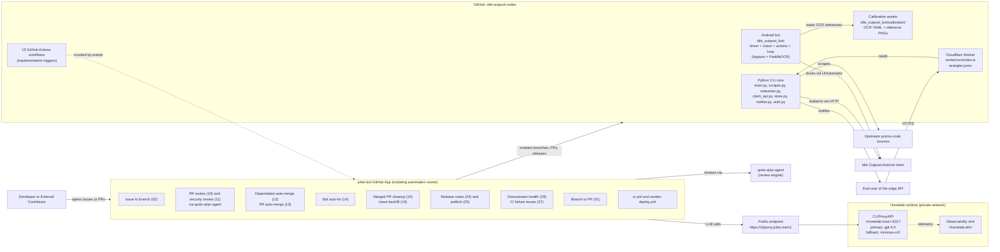

# Idle Outpost Codes

> Python toolkit that scrapes, redeems, and notifies Idle Outpost promotional codes — plus a Cloudflare Worker edge API and an Appium + PaddleOCR Android bot — maintained by **15 GitHub Actions workflows** with AI-assisted review, auto-merge, and LLM-driven CI auto-healing.
>
> Idle Outpost 프로모션 코드를 스크래핑 · 수령 · 알림 처리하는 Python 툴킷과, Cloudflare Worker 기반 엣지 API, Appium + PaddleOCR 기반 Android 자동화 봇을 단일 저장소에서 운영합니다. 본 저장소는 **15개의 GitHub Actions 워크플로우**가 AI 리뷰 · 자동 머지 · LLM 기반 CI 자동 복구까지 수행합니다.


---

## Overview / 개요

`idle-outpost-codes` covers the full lifecycle of Idle Outpost promo-code operations in one place. The repository is intentionally tripartite: a Python CLI core for headless scraping and redemption, a TypeScript Cloudflare Worker exposing the public HTTP surface, and an Android automation bot that drives the in-game claim flow on a real device.

- **Scrape** new codes from upstream web sources (`scraper.py` + BeautifulSoup4).
- **Persist** local state (`store.py`) so re-runs are idempotent and previously seen codes are not retried.
- **Redeem** codes through the official claim HTTP API (`redeemer.py` + `claim_api.py`) with authentication handled by `auth.py`.
- **Notify** users across configured channels (`notifier.py`).
- **Serve** the edge API and webhook surface through the `worker/` Cloudflare Worker deployed to `https://bot.jclee.me`.
- **Automate** the in-game claim loop on a real Android device via `idle_outpost_bot/` (Appium + PaddleOCR + computer-vision calibration).

> 본 저장소는 헤드리스 스크래핑 · 수령을 위한 Python CLI 코어, 공개 HTTP 표면을 노출하는 TypeScript Cloudflare Worker, 그리고 실기기에서 인게임 수령 루프를 구동하는 Android 자동화 봇의 세 가지로 의도적으로 구성되어 있습니다.

---

## Features / 주요 기능

### Python CLI core / Python CLI 코어
- `scraper.py` — HTML scraping of upstream promo-code sources with BeautifulSoup4.
- `store.py` — local persistent state with dedup guarantees.
- `redeemer.py` + `claim_api.py` — typed HTTP client for the official claim API.
- `auth.py` — session/token lifecycle for the claim endpoint.
- `notifier.py` — multi-channel delivery (extensible sink interface).
- `main.py` — Typer-style CLI orchestrator (`scrape`, `claim`, `notify`, `run`).
- `uv.lock` + `pyproject.toml` — fully reproducible environment via `uv`.

### Cloudflare Worker / Cloudflare Worker
- `worker/src/index.ts` — request routing, signing, and rate-limit edge logic.
- `worker/wrangler.jsonc` — declarative Workers / KV bindings.
- `worker-deploy.yml` — production deploy on tagged releases.

### Android automation bot / Android 자동화 봇 (`idle_outpost_bot/`)
- `driver.py` — Appium-Python-Client session against a UIAutomator2 backend.
- `vision.py` — PaddleOCR screen reading with reference-template matching.
- `actions.py` — high-level game actions (open inbox, open calendar, claim cards, etc.).
- `loop.py` — long-running orchestration loop with idempotent per-day state.
- `state.py` + `settings.py` + `safety.py` + `config_loader.py` — durable runtime state, configuration, and human-override safety.
- `discover.py` — ADB-based device discovery and capability probing.
- `calibrate.py` + `auto_calibrate.py` — interactive and headless calibration against `calibration/*.png` reference images.
- `calibration/` — per-screen OCR YAMLs + reference PNGs (main screen, cards, calendar, quest board, inbox, …).
- `i18n_ko.properties` — Korean in-game text dictionary for OCR post-processing.
- Research artifacts: `AD_REWARDS.md`, `API_RESEARCH.md`, `AUTOMATION_TARGETS.md`, `CALIBRATION_FULL.md`, `JADX_FULL_INVENTORY.md`.

### GitHub-native automation / GitHub 자동화
- 15 production workflows orchestrated by the **jclee-bot** GitHub App (see the dedicated section below).
- AI-assisted code review, security review, auto-merge, and LLM-driven CI auto-healing.
- Worker deploys and release pipelines bound to semantic-version tags.

---

## Architecture / 아키텍처



### Data and trust boundaries / 데이터 · 신뢰 경계

- The Cloudflare Worker is the **only** public ingress. The Python CLI and the Android bot stay on the homelab network.
- CLIProxyAPI is the **single LLM gateway**. All `jclee-bot` model calls traverse `https://cliproxy.jclee.me/v1`; the worker never reaches the upstream model vendor directly.
- The Android bot never receives secrets. It talks to the game client through UIAutomator and reads screen state through PaddleOCR — no privileged game-side integrations.

---

## jclee-bot Automation Surfaces / jclee-bot 자동화 영역

All mutating GitHub-side automation in this repository is owned by the **jclee-bot** GitHub App. The 15 workflow files in `.github/workflows/` are the *event triggers*; the actual automation contract lives in jclee-bot. Workflows are deliberately not enumerated as a table — they are implementation details of the surfaces below.

### Behavior catalog / 동작 카탈로그

1. **Issue → Branch** (`02_issue-to-branch.yml`)
   On labeled issues, jclee-bot opens a working branch and seeds it with an issue-derived scaffold. New issues arriving in this repository are processed automatically: `jclee-bot에의해자동화됨`.

2. **Branch → PR** (`01_branch-to-pr.yml`)
   When a working branch is pushed, jclee-bot opens a PR linked back to the originating issue.

3. **PR Review** (`10_pr-review.yml`)
   LLM-assisted code review per push. Primary model: **gpt-5.5**. Fallback: **minimax-m3 via CLIProxyAPI** at `https://cliproxy.jclee.me/v1`.

4. **Security PR Review** (`11_security-pr-review.yml`)
   Dedicated security-focused pass on the same PR surface, with stricter ruleset and SARIF-style annotations.

5. **Dependabot Auto-Merge** (`12_dependabot-auto-merge.yml`)
   Auto-merge for Dependabot PRs that pass CI and review gates.

6. **PR Auto-Merge** (`13_pr-auto-merge.yml`)
   Auto-merge for PRs that meet branch-protection and review criteria.

7. **Bot Auto-Fix** (`14_bot-auto-fix.yml`)
   LLM-driven CI self-heal: failing CI jobs are handed to jclee-bot which opens a follow-up PR with the minimum surgical fix. Uses the same gpt-5.5 / minimax-m3 model routing.

8. **Merged PR Cleanup** (`15_merged-pr-cleanup.yml`)
   Deletes merged head branches and closes out related tracking issues.

9. **Issue Backfill** (`19_issue-backfill.yml`)
   Periodically reconciles missing metadata (labels, milestones, project fields).

10. **Release Notes** (`24_release-notes.yml`)
    Aggregates merged PRs and conventional commits into a draft release on tag.

11. **Release Publish** (`25_release-publish.yml`)
    Cuts a GitHub Release, attaches artifacts, and triggers `worker-deploy.yml`.

12. **Downstream Health Check** (`29_downstream-health-check.yml`)
    Pings the deployed Worker at `https://bot.jclee.me` after release; opens a CI-failure issue on regression.

13. **CI Failure → Issue** (`37_ci-failure-issues.yml`)
    On persistent `ci.yml` red, jclee-bot opens or reopens a tracking issue. New and reopened issues in this surface carry the marker `jclee-bot에의해자동화됨`.

14. **CI** (`ci.yml`)
    Test matrix for the Python CLI and the bot's pure-Python helpers; gates every PR.

15. **Worker Deploy** (`worker-deploy.yml`)
    Publishes the `worker/` bundle on tagged releases via `wrangler deploy`.

### Model routing / 모델 라우팅

| Concern / 항목 | Primary | Fallback |
| --- | --- | --- |
| PR review / 보안 리뷰 | `gpt-5.5` | `minimax-m3` via `https://cliproxy.jclee.me/v1` |
| Auto-fix / 자기 복구 | `gpt-5.5` | `minimax-m3` via `https://cliproxy.jclee.me/v1` |
| Release notes drafting | `gpt-5.5` | `minimax-m3` via `https://cliproxy.jclee.me/v1` |

The homelab host running CLIProxyAPI is referenced only as `<homelab-host>:8317` in this repository; the public ingress is exclusively `https://cliproxy.jclee.me/v1`. No RFC1918 address, container number, or LXC ID is hardcoded in this README by design.

---

## Go Tools / Go 도구

This repository ships **zero Go automation tools**. All automation is either Python (CLI core, bot) or TypeScript (Cloudflare Worker). When Go tooling is added, it will be enumerated here; until then the section is intentionally empty rather than omitted.

> 본 저장소에는 Go 기반 자동화 도구가 없습니다. 모든 자동화는 Python (CLI 코어, 봇) 또는 TypeScript (Cloudflare Worker)로 구현되어 있습니다.

---

## Quick Start / 빠른 시작

### Prerequisites / 사전 요구사항
- Python **3.11+**
- [`uv`](https://github.com/astral-sh/uv) for reproducible installs
- Node.js **20+** and [`wrangler`](https://developers.cloudflare.com/workers/wrangler/) for the Worker
- An Android device or emulator with USB debugging for the bot
- A configured `.env` (see `idle_outpost_bot/settings.py` for the expected keys)

### Install / 설치

```bash
# 1. Clone and enter the repo
git clone https://github.com/<owner>/idle-outpost-codes.git
cd idle-outpost-codes

# 2. Python environment + CLI core
uv sync

# 3. Bot extras (heavy: includes PaddleOCR + PaddlePaddle)
uv sync --extra bot

# 4. Worker dependencies
cd worker
npm ci
cd ..
```

### Run the CLI / CLI 실행

```bash
# Scrape latest codes and update the local store
uv run python main.py scrape

# Redeem all unseen codes against the official claim API
uv run python main.py claim

# Send pending notifications
uv run python main.py notify

# End-to-end: scrape -> claim -> notify
uv run python main.py run
```

### Run the Worker locally / Worker 로컬 실행

```bash
cd worker
npx wrangler dev
# Worker is now reachable at http://127.0.0.1:8787
```

### Run the Android bot / Android 봇 실행

```bash
# Calibrate against the reference PNGs in idle_outpost_bot/calibration/
uv run python -m idle_outpost_bot calibrate

# Headless auto-calibration (one-shot, no prompts)
uv run python -m idle_outpost_bot auto_calibrate

# Start the long-running claim loop against the connected device
uv run python -m idle_outpost_bot
```

---

## Local Development / 로컬 개발

### Layout / 디렉터리 구조

```
.
├── CONTRIBUTING.md
├── LICENSE
├── README.md
├── auth.py
├── claim_api.py
├── main.py
├── notifier.py
├── pyproject.toml
├── redeemer.py
├── scraper.py
├── store.py
├── uv.lock
├── video1.png
├── worker/
│   ├── README.md
│   ├── package.json
│   ├── package-lock.json
│   ├── tsconfig.json
│   ├── wrangler.jsonc
│   └── src/
│       └── index.ts
└── idle_outpost_bot/
    ├── AD_REWARDS.md
    ├── API_RESEARCH.md
    ├── AUTOMATION_TARGETS.md
    ├── CALIBRATION_FULL.md
    ├── JADX_FULL_INVENTORY.md
    ├── README.md
    ├── __init__.py
    ├── __main__.py
    ├── actions.py
    ├── auto_calibrate.py
    ├── calibrate.py
    ├── config_loader.py
    ├── discover.py
    ├── driver.py
    ├── i18n_ko.properties
    ├── loop.py
    ├── notify.py
    ├── safety.py
    ├── settings.py
    ├── state.py
    ├── vision.py
    └── calibration/
        ├── *.ocr.yaml / *.yaml
        └── *.png
```

### Linting and type checks / 린트 · 타입 체크

```bash
# Lint (configured in pyproject.toml)
uv run ruff check .

# Type check (basedpyright)
uv run basedpyright
```

### Adding a new calibration screen / 새 보정 화면 추가

1. Capture a clean reference PNG of the target screen and drop it in `idle_outpost_bot/calibration/`.
2. Add a companion `*.ocr.yaml` describing the expected OCR anchors and tolerances.
3. Extend `idle_outpost_bot/loop.py` with the new high-level action in `actions.py`.
4. Re-run `python -m idle_outpost_bot auto_calibrate` and verify the deterministic check screen matches.

### Worker iteration / Worker 반복 개발

- Edit `worker/src/index.ts`.
- `npx wrangler dev` to iterate locally against the Wrangler dev server.
- The production deploy is bound to `worker-deploy.yml`; do not invoke `wrangler deploy` from a developer machine.

---

## Commands Reference / 명령어 레퍼런스

### Python CLI (`main.py`) / Python CLI

| Command | Purpose |
| --- | --- |
| `python main.py scrape` | Pull latest codes from upstream sources, dedupe via `store.py`. |
| `python main.py claim` | Redeem unseen codes through the official claim API. |
| `python main.py notify` | Deliver queued notifications to configured channels. |
| `python main.py run` | Convenience: `scrape` → `claim` → `notify`. |

### Android bot (`idle_outpost_bot`) / Android 봇

| Command | Purpose |
| --- | --- |
| `python -m idle_outpost_bot` | Start the long-running claim loop on the connected device. |
| `python -m idle_outpost_bot calibrate` | Interactive calibration against `calibration/*.png`. |
| `python -m idle_outpost_bot auto_calibrate` | Headless auto-calibration. |
| `python -m idle_outpost_bot discover` | Enumerate ADB devices and dump capabilities. |

### Cloudflare Worker / Cloudflare Worker

| Command | Purpose |
| --- | --- |
| `npm ci` (inside `worker/`) | Install Worker dependencies deterministically. |
| `npx wrangler dev` | Local dev server. |
| `npx wrangler deploy` | Production deploy (typically invoked by `worker-deploy.yml`). |

### Repository hygiene / 저장소 위생

| Command | Purpose |
| --- | --- |
| `uv run ruff check .` | Lint Python sources. |
| `uv run basedpyright` | Static type check. |
| `uv lock` | Refresh `uv.lock` after dependency edits. |

---

## Contribution Guide / 기여 가이드

### Branch and issue flow / 브랜치 · 이슈 흐름

1. **Open an issue first.** jclee-bot will create a working branch automatically — the resulting issue will carry the marker `jclee-bot에의해자동화됨` once the bot has processed it.
2. **Push to the auto-created branch.** jclee-bot will open a PR via `01_branch-to-pr.yml`.
3. **Wait for review.** PR review (`10_pr-review.yml`) and security review (`11_security-pr-review.yml`) run on every push. Address review threads directly on the PR.
4. **Merge.** Once checks and reviews pass, jclee-bot will auto-merge per `13_pr-auto-merge.yml` (or `12_dependabot-auto-merge.yml` for Dependabot PRs).
5. **Cleanup.** Merged head branches are removed by `15_merged-pr-cleanup.yml`. The originating issue is closed by the same workflow.

### Coding conventions / 코딩 규칙

- Python targets **3.11+** and is configured for `ruff` (line length 100) and `basedpyright` strictness — see `pyproject.toml`.
- TypeScript follows the `tsconfig.json` shipped under `worker/`.
- The Android bot's screen labels are mirrored in `i18n_ko.properties`. Add new strings there when introducing a new Korean in-game term.

### Safety and reviewability / 안전성 · 리뷰 가능성

- The Android bot's `safety.py` and `settings.py` are the only sources of truth for human-override behavior. Any change to those modules requires an explicit approval from a maintainer; jclee-bot's auto-merge is disabled for those paths.
- Calibration assets in `idle_outpost_bot/calibration/` are versioned because every bot run reads against them. Treat edits as breaking changes and document them in the PR description.
- Cloudflare Worker changes that affect the public edge surface (`https://bot.jclee.me`) require a tagged release to ship — direct `wrangler deploy` from a developer machine is not supported.

### Reporting problems / 문제 보고

- For CI red that does not auto-recover, watch for the `jclee-bot에의해자동화됨` issue opened by `37_ci-failure-issues.yml` and reply there.
- For LLM-routing regressions (gpt-5.5 unavailable, minimax-m3 fallback engaged), open an issue labeled `llm-routing` so `29_downstream-health-check.yml` can re-verify once the homelab CLIProxyAPI is healthy again.

---

## License / 라이선스

See [`LICENSE`](./LICENSE) for details.