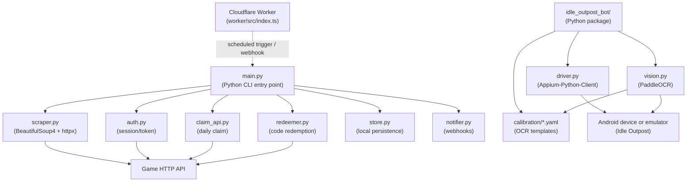

# Idle Outpost Codes

> **프로모 코드 모니터링 · 일일 보상 클레임 · 안드로이드 자동화 봇**
> **Promo code monitor · daily-reward claim CLI · Android automation bot**

A monorepo that bundles three integrated tools for the mobile game *Idle Outpost*:

1. A **promo-code monitor and redeemer** CLI written in Python.
2. A **daily-reward claim** CLI that talks to the game's HTTP API.
3. An **Android automation bot** that drives the game UI through Appium and PaddleOCR.

An optional **Cloudflare Worker** in the `worker/` directory can be deployed to run scheduled triggers (e.g. cron-style scraping).

---

## Overview / 개요

**EN** — `idle-outpost-codes` is an automation toolkit for *Idle Outpost*. It scrapes the web for new promotional codes, redeems them against the game's official API, claims daily rewards, and — optionally — drives an Android device running the game with a vision-based automation bot. The toolkit is designed so that each component can be used independently, but they share storage and notification utilities to form a complete pipeline.

**KR** — `idle-outpost-codes`는 *Idle Outpost* 게임을 위한 자동화 도구 모음입니다. 웹에서 새로운 프로모션 코드를 스크랩하고, 게임 공식 API로 코드를 등록(Redeem)하며, 매일 보상을 수령하고, 추가로 안드로이드 디바이스에서 비전 기반 자동화 봇으로 게임을 조작할 수 있습니다. 각 구성 요소는 독립적으로 사용할 수 있도록 설계되었으며, 저장소와 알림 유틸리티를 공유하여 완전한 파이프라인을 구성합니다.

---

## Features / 기능

| Area | Capability |
|------|-----------|
| Promo-code monitor | Fetch code sources with `httpx`, parse with `BeautifulSoup4`, persist results locally. |
| Redemption | Authenticate against the game API and submit codes via `redeemer.py`. |
| Daily claim | Call the daily-reward endpoint through `claim_api.py`. |
| Notifications | Push results to external services (e.g. webhooks) via `notifier.py`. |
| Android bot | Drive the game with Appium, locate UI text with PaddleOCR, run a persistent action loop. |
| Calibration | Reusable OCR templates and YAML configs in `idle_outpost_bot/calibration/` make new screens easy to support. |
| Scheduled jobs | Deploy the bundled Cloudflare Worker for cron-style execution. |
| i18n | Korean strings shipped via `i18n_ko.properties`. |
| Persistence | Local store via `store.py` keeps a record of scraped and redeemed codes. |

---

## Architecture / 아키텍처



### Components / 구성 요소

#### Root Python CLI

| Module | Role |
|--------|------|
| `main.py` | Entry point that orchestrates scraping, claiming, redeeming, and notification. |
| `scraper.py` | Fetches and parses promo-code sources. |
| `auth.py` | Authenticates against the game API. |
| `claim_api.py` | Calls the daily-reward claim endpoint. |
| `redeemer.py` | Submits promo codes to the redemption endpoint. |
| `store.py` | Local persistence (e.g. claimed codes, run history). |
| `notifier.py` | Dispatches outbound notifications. |

#### Android bot — `idle_outpost_bot/`

| Module | Role |
|--------|------|
| `__main__.py` | Bot entry point. |
| `driver.py` | Appium-Python-Client wrapper. |
| `vision.py` | Image matching and PaddleOCR text recognition. |
| `actions.py` | High-level game actions composed from `driver` and `vision`. |
| `loop.py` | Main automation loop. |
| `calibrate.py`, `auto_calibrate.py` | Manual and automatic OCR calibration tools. |
| `config_loader.py`, `settings.py`, `state.py` | Configuration and runtime state. |
| `safety.py` | Safety checks (watchdog, anti-stuck, idle detection). |
| `discover.py` | UI-element discovery helpers. |
| `notify.py` | Bot-side notifications. |
| `i18n_ko.properties` | Korean UI strings. |
| `calibration/` | Per-screen YAML configs paired with reference PNGs. |

Additional reference documents in the same directory: `AD_REWARDS.md`, `API_RESEARCH.md`, `AUTOMATION_TARGETS.md`, `CALIBRATION_FULL.md`, `JADX_FULL_INVENTORY.md`. See `idle_outpost_bot/README.md` for in-depth setup.

#### Cloudflare Worker — `worker/`

| File | Role |
|------|------|
| `src/index.ts` | TypeScript source for the scheduled Worker. |
| `wrangler.jsonc` | Wrangler configuration (cron triggers, bindings, environment). |
| `package.json`, `package-lock.json`, `tsconfig.json` | Node.js toolchain. |

See `worker/README.md` for the full deployment guide.

---

## Repository Structure / 저장소 구조

```
.
├── main.py                       # CLI entry point
├── auth.py                       # Game API authentication
├── claim_api.py                  # Daily-reward claim
├── redeemer.py                   # Promo-code redemption
├── scraper.py                    # Promo-code scraping
├── store.py                      # Local persistence
├── notifier.py                   # Outbound notifications
├── pyproject.toml                # Python project metadata + dependencies
├── uv.lock                       # uv lockfile
├── video1.png                    # Demo / screenshot
├── CONTRIBUTING.md
├── LICENSE
├── worker/                       # Optional Cloudflare Worker
│   ├── README.md
│   ├── package.json
│   ├── package-lock.json
│   ├── tsconfig.json
│   ├── wrangler.jsonc
│   └── src/
│       └── index.ts
└── idle_outpost_bot/             # Android automation package
    ├── README.md
    ├── __init__.py
    ├── __main__.py
    ├── actions.py
    ├── auto_calibrate.py
    ├── calibrate.py
    ├── config_loader.py
    ├── discover.py
    ├── driver.py
    ├── i18n_ko.properties
    ├── loop.py
    ├── notify.py
    ├── safety.py
    ├── settings.py
    ├── state.py
    ├── vision.py
    ├── AD_REWARDS.md
    ├── API_RESEARCH.md
    ├── AUTOMATION_TARGETS.md
    ├── CALIBRATION_FULL.md
    ├── JADX_FULL_INVENTORY.md
    └── calibration/
        ├── *.ocr.yaml            # OCR templates per screen
        └── *.png                 # Reference screenshots
```

---

## Quick Start / 빠른 시작

### Prerequisites / 사전 준비

- **Python 3.11+** — `pyproject.toml` declares `requires-python = ">=3.11"`.
- A virtual environment tool such as [`uv`](https://github.com/astral-sh/uv) (a `uv.lock` is shipped) or the built-in `venv`.
- For the Android bot, the `[bot]` extras pull in `Appium-Python-Client`, `selenium`, `paddleocr`, `paddlepaddle`, `Pillow`, `numpy`, and `pyyaml`.
- For the optional Worker, Node.js and [Wrangler](https://developers.cloudflare.com/workers/wrangler/) are required.
- An Android device or emulator with the *Idle Outpost* client installed (bot only).
- A running Appium server reachable by the bot (bot only).

### Install / 설치

```bash
# Clone the repository
git clone <your-fork-url> idle-outpost-codes
cd idle-outpost-codes

# Create a virtual environment
python3.11 -m venv .venv
source .venv/bin/activate

# Install the base CLI
pip install -e .

# Or, if you use uv
uv sync

# Optional: install the Android bot extras
pip install -e ".[bot]"
```

### Run the CLI / CLI 실행

```bash
# Show the CLI's top-level options
python main.py --help
```

The exact subcommands are defined in `main.py`; pass `--help` to see the live command list.

### Run the bot / 봇 실행

```bash
python -m idle_outpost_bot
```

The bot reads calibration YAMLs from `idle_outpost_bot/calibration/` and starts the automation loop described in `loop.py`. See `idle_outpost_bot/README.md` for in-depth setup, including Appium server configuration.

### Deploy the Worker / Worker 배포

```bash
cd worker
npm install
npx wrangler dev      # local development
npx wrangler deploy   # deploy to Cloudflare
```

See `worker/README.md` for the full deployment guide.

---

## Configuration / 설정

Configuration is layered across several files. **EN** — settings can be overridden per environment; secrets should never be committed. **KR** — 설정은 환경별로 덮어쓸 수 있으며, 시크릿은 절대 커밋해서는 안 됩니다.

| File | Purpose |
|------|---------|
| `pyproject.toml` | Python dependencies, tool settings (Ruff, basedpyright). |
| `.env` (created by you) | Secrets consumed via `python-dotenv` in `auth.py`, `notifier.py`, etc. |
| `idle_outpost_bot/settings.py` | Bot defaults (device, server endpoint, timeouts, retry policy). |
| `idle_outpost_bot/calibration/*.ocr.yaml` | Per-screen OCR anchors, swipe vectors, and thresholds. |
| `worker/wrangler.jsonc` | Cron schedules, bindings, environment variables for the Worker. |

Create a `.env` file in the repository root with the secrets required by the API clients:

```dotenv
# Example — replace with real values
GAME_API_BASE=https://api.example.com
GAME_USERNAME=your_username
GAME_PASSWORD=your_password
NOTIFIER_WEBHOOK_URL=https://hooks.example.com/idle-outpost
```

---

## Commands Reference / 명령어

The CLI surface is defined in `main.py`. Use `python main.py --help` for the canonical list. The table below lists the **expected** entry points based on the module layout.

| Command | Description |
|---------|-------------|
| `python main.py` | Run the default orchestration pass (scrape → claim → redeem → notify). |
| `python main.py --help` | List all subcommands and flags. |
| `python -m idle_outpost_bot` | Start the Android bot's main loop. |
| `python -m idle_outpost_bot.calibrate` | Run the manual calibration tool. |
| `python -m idle_outpost_bot.auto_calibrate` | Run auto-calibration across known screens. |
| `cd worker && npx wrangler dev` | Run the Worker locally. |
| `cd worker && npx wrangler deploy` | Deploy the Worker to Cloudflare. |
| `cd worker && npx wrangler tail` | Stream Worker logs. |

### Python tooling

| Command | Description |
|---------|-------------|
| `uv sync` | Install dependencies from `uv.lock`. |
| `uv lock` | Refresh `uv.lock` after dependency changes. |
| `ruff check .` | Lint the codebase. |
| `ruff format .` | Auto-format the codebase. |
| `basedpyright` | Run the type checker (configured in `pyproject.toml`). |

---

## Local Development / 로컬 개발

**EN** — the project uses `uv` for dependency management, Ruff for linting/formatting, and basedpyright for static type checking. All three are configured in `pyproject.toml`.

**KR** — 본 프로젝트는 의존성 관리에 `uv`, 린팅/포맷팅에 Ruff, 정적 타입 검사에 basedpyright를 사용합니다. 세 도구 모두 `pyproject.toml`에 설정되어 있습니다.

- **Calibration workflow** — drop a new `<screen>.png` into `idle_outpost_bot/calibration/`, then author a matching `<screen>.ocr.yaml`. The discovery layer in `discover.py` and the loader in `config_loader.py` will pick it up automatically. Reference screen flows are described in `idle_outpost_bot/CALIBRATION_FULL.md`.
- **Adding a new promo-code source** — extend `scraper.py` and update `main.py` if the new source requires its own subcommand. Add a parser test under `tests/` (see the Testing section).
- **Korean strings** — update `i18n_ko.properties` whenever a new user-facing label is added to the bot.

---

## Testing / 테스트

**EN** — the repository does not ship a test suite by default. The recommended setup is `pytest` with `pytest-asyncio` and `pytest-httpx` (or `httpx.MockTransport`) to stub outbound calls in `scraper.py`, `auth.py`, `claim_api.py`, and `redeemer.py`.

**KR** — 본 저장소는 기본적으로 테스트 스위트를 포함하지 않습니다. 권장 설정은 `pytest` + `pytest-asyncio` + `pytest-httpx`(또는 `httpx.MockTransport`)로, `scraper.py`, `auth.py`, `claim_api.py`, `redeemer.py`의 외부 호출을 스텁 처리합니다.

```bash
pip install pytest pytest-asyncio pytest-httpx
pytest
```

Suggested layout:

```
tests/
├── test_scraper.py
├── test_auth.py
├── test_claim_api.py
├── test_redeemer.py
├── test_store.py
└── idle_outpost_bot/
    ├── test_vision.py
    └── test_actions.py
```

---

## Contribution Guide / 기여 가이드

**EN**

- Read `CONTRIBUTING.md` before opening a pull request.
- Keep changes focused: a CLI change should not modify bot code unless required, and vice versa.
- Add or update calibration YAMLs whenever a screen flow changes; include the matching reference PNG.
- Run `ruff check .`, `ruff format .`, and `basedpyright` locally before pushing.
- For new dependencies, update both `pyproject.toml` and `uv.lock` (`uv lock`).
- Reference design notes (`API_RESEARCH.md`, `AUTOMATION_TARGETS.md`, `JADX_FULL_INVENTORY.md`) when proposing architectural changes.

**KR**

- 풀 리퀘스트를 열기 전에 `CONTRIBUTING.md`를 먼저 읽어 주세요.
- 변경 범위는 최소화해 주세요. CLI 변경이 봇 코드 수정을 필요로 하지 않는다면 분리해 주세요 (반대 방향도 동일).
- 화면 흐름이 바뀌면 해당 캘리브레이션 YAML을 갱신하고, 매칭되는 참조 PNG를 함께 추가해 주세요.
- 푸시 전 로컬에서 `ruff check .`, `ruff format .`, `basedpyright`를 실행해 주세요.
- 새 의존성을 추가하는 경우 `pyproject.toml`과 `uv.lock`(`uv lock`)을 함께 갱신해 주세요.
- 아키텍처 변경 제안 시 설계 노트(`API_RESEARCH.md`, `AUTOMATION_TARGETS.md`, `JADX_FULL_INVENTORY.md`)를 함께 참고해 주세요.

---

## License / 라이선스

This project is released under the terms described in `LICENSE`. **EN** — see the `LICENSE` file for the full text. **KR** — 전문은 `LICENSE` 파일을 참고해 주세요.