# Idle Outpost Codes

> **EN** — A single repository that runs the entire Idle Outpost promo-code lifecycle: a Python CLI core that scrapes and redeems codes, a TypeScript Cloudflare Worker that exposes the public HTTP surface, and an Appium + PaddleOCR Android bot that drives the in-game claim flow. Day-to-day maintenance is owned by **jclee-bot**, an LLM-driven automation surface (current primary model: `gpt-5.5`, fallback: `minimax-m3` via CLIProxyAPI) reached through **15 GitHub Actions workflow files** that act as triggers, not the source of truth.
>
> **KR** — Idle Outpost 프로모션 코드의 전체 라이프사이클을 단일 저장소에서 운영하는 프로젝트입니다. 코드를 스크래핑·수령하는 Python CLI 코어, 공개 HTTP 인터페이스를 제공하는 TypeScript Cloudflare Worker, 인게임 수령 흐름을 자동 구동하는 Appium + PaddleOCR 기반 Android 봇으로 구성됩니다. 일상적인 유지·보수는 **jclee-bot**(현재 1차 모델: `gpt-5.5`, 폴백: CLIProxyAPI 경유 `minimax-m3`)이 담당하며, **GitHub Actions 워크플로우 파일 15개**는 트리거 역할만 수행합니다.

---

## Badges / 배지


> Status badges for individual workflow runs are intentionally not embedded — workflow files are triggers, not the automation source of truth (see *jclee-bot automation surfaces*).

---

## Overview / 개요

`idle-outpost-codes` is intentionally tripartite. Each layer has a single responsibility and a single deployment target:

| Layer | Language | Runtime | Responsibility |
|---|---|---|---|
| **CLI core** | Python 3.11+ | uv / local venv | Headless scraping, deduplication, authentication, redemption, notification |
| **Edge API** | TypeScript | Cloudflare Workers (Wrangler) | Public HTTPS surface at `https://cliproxy.jclee.me/v1`, request signing, rate limiting |
| **Android bot** | Python + Appium | Homelab runner | In-game claim flow: calendar, quest board, cards, swipe gestures, OCR-driven state machine |

The repository also embeds its own development automation. Mutating work — opening branches from issues, reviewing PRs, auto-merging trusted PRs, auto-healing CI failures, drafting release notes, cutting releases — is performed by **jclee-bot**, an LLM-driven automation identity reachable at `bot.jclee.me`. GitHub Actions workflow files exist only to trigger jclee-bot; they are not the automation surface itself.

---

## Features / 주요 기능

### Promo-code lifecycle / 프로모션 코드 라이프사이클
- **Scraping** (`scraper.py`, `claim_api.py`) — pulls candidate codes from configured public sources using `httpx` and `beautifulsoup4`.
- **Persistence** (`store.py`) — SQLite-backed local store with strict deduplication and audit history.
- **Authentication** (`auth.py`) — credential resolution, token refresh, request signing.
- **Redemption** (`redeemer.py`) — calls the upstream Idle Outpost claim endpoint and records outcomes.
- **Notification** (`notifier.py`) — outbound alerts and status fan-out through the Worker edge.
- **CLI entry point** (`main.py`) — subcommands for `scrape`, `claim`, `list`, `verify`, `notify`.

### Cloudflare Worker edge / Cloudflare Worker 엣지
- `worker/src/index.ts` exposes the public HTTPS surface, terminating and forwarding traffic to the Python core's endpoints.
- Configured via `worker/wrangler.jsonc`; deployed through the `worker-deploy` GitHub Actions trigger.
- Public base URL: `https://cliproxy.jclee.me/v1`.

### Android automation bot / Android 자동화 봇 (`idle_outpost_bot/`)
- **Driver** (`driver.py`) — Appium-Python-Client session, gesture primitives, screen capture.
- **Vision** (`vision.py`) — PaddleOCR-driven screen reading; consumes calibration templates from `calibration/*.ocr.yaml` and `calibration/*.png`.
- **Loop** (`loop.py`, `actions.py`) — state machine covering main screen, calendar, quest board, cards, wheel, inbox, TV ads, and the post-claim back stack.
- **Safety** (`safety.py`, `settings.py`, `state.py`) — kill-switch, run-budget enforcement, screen-state assertions.
- **Calibration** (`auto_calibrate.py`, `calibrate.py`, `discover.py`) — discovers new screen variants and emits OCR templates.
- **i18n** (`i18n_ko.properties`) — Korean string pack for OCR hints and log lines.
- **Target inventory** — `AD_REWARDS.md`, `API_RESEARCH.md`, `AUTOMATION_TARGETS.md`, `CALIBRATION_FULL.md`, `JADX_FULL_INVENTORY.md` document the in-game screens the bot drives.

### LLM-driven GitHub automation / LLM 기반 GitHub 자동화
- AI-assisted PR review and security PR review.
- Dependabot PR auto-merge for trusted patch/minor bumps.
- General PR auto-merge for PRs that pass the review and CI gates.
- LLM-driven auto-fix on CI failure (workflow `14_bot-auto-fix.yml`).
- Issue-driven branch and PR creation (workflows `01_branch-to-pr.yml`, `02_issue-to-branch.yml`).
- Auto-generated release notes and releases (workflows `24_release-notes.yml`, `25_release-publish.yml`).
- Downstream health checks (workflow `29_downstream-health-check.yml`).
- Auto-opened issues for persistent CI failures (workflow `37_ci-failure-issues.yml`).
- Post-merge cleanup (workflow `15_merged-pr-cleanup.yml`).
- Issue backfill (workflow `19_issue-backfill.yml`).

---

## Architecture / 아키텍처

The diagram below is the source of truth. Workflow files are deliberately shown as a single grouped node because they are triggers, not surfaces — all mutating work flows through jclee-bot.

```mermaid
flowchart LR
    subgraph SRC["Promo code sources / 소스"]
        WEB["Public web & social feeds"]
        GAME["In-game claim UI<br/>(Android device)"]
    end

    subgraph CORE["Python CLI core / Python 코어"]
        SCRAPER["scraper.py"]
        STORE["store.py"]
        AUTH["auth.py"]
        REDEEMER["redeemer.py"]
        NOTIFIER["notifier.py"]
        MAIN["main.py<br/>CLI entry point"]
    end

    subgraph EDGE["Cloudflare Worker edge / 엣지"]
        WORKER["worker/src/index.ts<br/>https://cliproxy.jclee.me/v1"]
    end

    subgraph HOMELAB["Homelab runtime / 홈랩"]
        PROXY["&lt;homelab-host&gt;<br/>CLIProxyAPI listener"]
        ANDROID["&lt;homelab-elk&gt;<br/>Android runner + ADB"]
    end

    subgraph BOT["idle_outpost_bot/ - Android automation"]
        DRIVER["driver.py + Appium"]
        VISION["vision.py + PaddleOCR"]
        LOOP["loop.py + actions.py"]
        CALIB["calibration/<br/>OCR templates"]
    end

    subgraph GH["GitHub automation surface / 자동화 영역"]
        ISSUES["Issues &amp; PRs"]
        JCBOT["jclee-bot<br/>(LLM-driven)<br/>gpt-5.5 primary<br/>minimax-m3 fallback"]
        WF["15 GitHub Actions<br/>workflow files<br/>(triggers only)"]
    end

    WEB --> SCRAPER
    SCRAPER --> STORE
    STORE --> AUTH
    AUTH --> REDEEMER
    REDEEMER --> NOTIFIER
    NOTIFIER --> MAIN
    MAIN -->|HTTPS POST| WORKER
    WORKER -->|public traffic| PROXY
    PROXY -->|authenticated| REDEEMER

    GAME --> ANDROID
    ANDROID --> DRIVER
    DRIVER --> VISION
    VISION --> CALIB
    VISION --> LOOP
    LOOP -->|screen state| DRIVER

    ISSUES -->|issue automation marker:<br/>jclee-bot에의해자동화됨| JCBOT
    JCBOT -->|mutates branches &amp; PRs| CORE
    JCBOT -->|mutates worker code| WORKER
    JCBOT -->|auto-merge &amp; auto-fix| ISSUES
    WF -->|invokes| JCBOT
    WF -->|builds| CORE
    WF -->|deploys via Wrangler| WORKER
    WF -->|schedules| ANDROID
```



---

## jclee-bot automation surfaces / jclee-bot 자동화 영역

jclee-bot is the single mutating identity in this repository. The 15 GitHub Actions workflow files exist only to invoke it on specific events; they never mutate the repository on their own. When jclee-bot performs automated work on an issue, the issue is labeled `jclee-bot에의해자동화됨` so humans can filter automated activity out of their queue.

### Surfaces owned by jclee-bot / jclee-bot이 소유한 자동화 영역

- **Issue triage and backfill** — newly opened issues are auto-triaged, labeled, and (when appropriate) converted into branches and PRs. Automated issue activity carries the marker `jclee-bot에의해자동화됨`.
- **PR review** — every non-Dependabot PR receives an AI-assisted review using a [qodo-ai/pr-agent](https://github.com/qodo-ai/pr-agent) style reviewer, with a separate security-focused pass for code that touches authentication, networking, or persistence.
- **Dependabot auto-merge** — patch and minor Dependabot PRs that pass CI and review are auto-merged.
- **General PR auto-merge** — PRs that pass review, CI, and any required checks are auto-merged.
- **CI auto-healing** — failing CI runs are diagnosed by jclee-bot; when a fix is straightforward, a follow-up PR is opened with the patch. If the failure persists, jclee-bot opens a tracked issue labeled `jclee-bot에의해자동화됨`.
- **Release automation** — release notes are drafted from the merged-PR set and releases are cut and published without human intervention when the auto-merge policy is satisfied.
- **Post-merge cleanup** — merged feature branches and their associated scratch refs are pruned.
- **Downstream health** — periodic checks verify that the Worker edge and the Android bot runner remain reachable; degradations are surfaced as issues.

### Models / 모델

- Primary: `gpt-5.5` (default for review, auto-fix, and release drafting).
- Fallback: `minimax-m3` reached through CLIProxyAPI at `https://cliproxy.jclee.me/v1` when the primary is unavailable.
- Operational status: reachable at `bot.jclee.me`.

### Human escape hatches / 사람 개입 경로

- Adding the `no-bot` label to a PR or issue suspends all jclee-bot activity on that item.
- Reviewers with write access may dismiss an automated review and re-request human review.
- Auto-merge is opt-out per PR; Dependabot exclusions are honored.

---

## Go tools / Go 도구

This repository does not contain any Go-based automation tools. **0 Go tools** are registered. All automation is performed by the LLM-backed jclee-bot reached through GitHub Actions triggers; no `cmd/`, `internal/`, or `go.mod` artifacts exist in this tree, and none are planned. If a future Go helper is added it will be registered in this section as a first-class tool, not as a workflow file.

---

## Quick start / 빠른 시작

### 1. Clone and bootstrap / 클론 및 부트스트랩

```bash
git clone <this-repository-url> idle-outpost-codes
cd idle-outpost-codes
uv sync --extra bot
cp .env.example .env  # fill in credentials, see "Local development"
```

### 2. Run the CLI / CLI 실행

```bash
# Scrape candidate codes from configured sources
uv run python main.py scrape

# List known codes with status
uv run python main.py list

# Redeem a specific code
uv run python main.py claim <CODE>

# Verify a code without redeeming
uv run python main.py verify <CODE>
```

### 3. Deploy the Worker / Worker 배포

```bash
cd worker
npm ci
npx wrangler deploy
# Public surface: https://cliproxy.jclee.me/v1
```

### 4. Run the Android bot / Android 봇 실행

```bash
# Requires a reachable Android device or emulator on the homelab runner
uv run python -m idle_outpost_bot --config idle_outpost_bot/settings.yaml
```

---

## Local development / 로컬 개발

### Prerequisites / 사전 요구사항

- Python ≥ 3.11 (managed by `uv`, see `uv.lock`).
- Node.js ≥ 20 and Wrangler for the Worker.
- An Android device or emulator reachable from `<homelab-host>` for the bot.
- Appium server, PaddleOCR runtime, and PaddlePaddle installed (provided by the `bot` extra).
- A reachable CLIProxyAPI instance at `https://cliproxy.jclee.me/v1` if you want jclee-bot fallbacks to work locally.

### Environment / 환경 변수

The Python core reads configuration from environment variables (loaded via `python-dotenv`). The most important keys:

| Variable | Purpose |
|---|---|
| `IDLE_OUTPOST_AUTH_TOKEN` | Bearer token for the upstream claim API |
| `IDLE_OUTPOST_NOTIFY_WEBHOOK` | Webhook URL for `notifier.py` |
| `IDLE_OUTPOST_DB_PATH` | Override the default SQLite path used by `store.py` |
| `APPIUM_SERVER_URL` | Appium endpoint consumed by `driver.py` (default: `http://<homelab-host>:4723`) |
| `ANDROID_DEVICE_UDID` | Target device for the bot runner |
| `CLIPROXY_BASE_URL` | LLM fallback endpoint (default: `https://cliproxy.jclee.me/v1`) |

### Lint and type-check / 린트와 타입 체크

```bash
uv run ruff check .
uv run basedpyright
```

### Calibration workflow / 캘리브레이션

When the in-game UI drifts, refresh the OCR templates:

```bash
uv run python -m idle_outpost_bot.auto_calibrate \
    --screen calendar \
    --out idle_outpost_bot/calibration/calendar.ocr.yaml
```

Capture new reference images into `idle_outpost_bot/calibration/` and commit alongside the YAML template.

---

## Commands reference / 명령어 레퍼런스

### Python CLI / Python CLI

| Command | Description |
|---|---|
| `uv run python main.py scrape` | Pull candidate codes from all configured sources |
| `uv run python main.py list` | List known codes with their last-known status |
| `uv run python main.py claim <CODE>` | Redeem a single code |
| `uv run python main.py verify <CODE>` | Check a code's validity without redeeming |
| `uv run python main.py notify` | Re-send notifications for the latest run |
| `uv run python -m idle_outpost_bot` | Run the Android bot loop |
| `uv run python -m idle_outpost_bot.calibrate` | Interactive calibration session |
| `uv run python -m idle_outpost_bot.auto_calibrate` | Headless auto-calibration |

### Worker / Worker

| Command | Description |
|---|---|
| `cd worker && npm ci` | Install Worker dependencies |
| `cd worker && npx wrangler dev` | Run the Worker locally |
| `cd worker && npx wrangler deploy` | Deploy the Worker to Cloudflare |
| `cd worker && npx wrangler tail` | Stream live Worker logs |

### Repository hygiene / 저장소 관리

| Command | Description |
|---|---|
| `uv run ruff check .` | Lint with Ruff (line length 100, target py311) |
| `uv run basedpyright` | Type-check with basedpyright (`.venv` aware) |
| `uv lock` | Refresh `uv.lock` |

---

## Repository structure / 저장소 구조

```
.
├── CONTRIBUTING.md
├── LICENSE
├── README.md
├── pyproject.toml
├── uv.lock
├── video1.png
│
├── auth.py                 # credential resolution, request signing
├── claim_api.py            # upstream claim HTTP client
├── main.py                 # CLI entry point
├── notifier.py             # outbound notifications
├── redeemer.py             # redemption orchestration
├── scraper.py              # source scraping
├── store.py                # SQLite-backed persistence
│
├── worker/                 # Cloudflare Worker edge API
│   ├── README.md
│   ├── package.json
│   ├── package-lock.json
│   ├── tsconfig.json
│   ├── wrangler.jsonc
│   └── src/
│       └── index.ts
│
└── idle_outpost_bot/       # Android automation bot
    ├── README.md
    ├── AD_REWARDS.md
    ├── API_RESEARCH.md
    ├── AUTOMATION_TARGETS.md
    ├── CALIBRATION_FULL.md
    ├── JADX_FULL_INVENTORY.md
    ├── __init__.py
    ├── __main__.py
    ├── actions.py
    ├── auto_calibrate.py
    ├── calibrate.py
    ├── config_loader.py
    ├── discover.py
    ├── driver.py
    ├── i18n_ko.properties
    ├── loop.py
    ├── notify.py
    ├── safety.py
    ├── settings.py
    ├── state.py
    ├── vision.py
    └── calibration/         # OCR templates + reference screenshots
        ├── after_cards.ocr.yaml
        ├── after_cards.png
        ├── …                # many screen variants
        └── swipe_test.ocr.yaml
```

> The 15 GitHub Actions workflow files are intentionally not listed in the tree — they are implementation triggers, not part of the repository's logical structure.

---

## Contribution guide / 기여 가이드

### Reporting issues / 이슈 신고

- Open an issue with a clear reproduction, the relevant CLI subcommand, and a Worker request id when applicable.
- Issues opened by jclee-bot are labeled `jclee-bot에의해자동화됨`; please do not mass-close or mass-reopen them — they are the canonical automation record.

### Sending PRs / PR 보내기

- Branch from `main`, keep changes focused, and prefer small PRs.
- PRs are auto-reviewed by jclee-bot. Address review comments directly in the PR; do not open follow-up issues for in-PR review threads.
- Add the `no-bot` label if you want to suspend all jclee-bot activity on the PR (for example, when you need a human-only security review).
- Dependabot PRs are auto-merged when patch/minor and CI is green. Add `no-bot` to opt out.

### Working with jclee-bot / jclee-bot과 협업

- jclee-bot opens branches and PRs from issues. If you want to take over, comment `/takeover` on the PR; jclee-bot will stop mutating it.
- Release notes and releases are produced by jclee-bot. If you need to cut a manual release, add the `manual-release` label to disable the next auto-release on `main`.
- The `no-bot` label is the canonical off switch for any single item.

### Coding standards / 코딩 표준

- Python: Ruff with the configuration in `pyproject.toml` (`line-length = 100`, `target-version = "py311"`). Type-check with basedpyright.
- TypeScript: strict mode, ESLint with the Worker defaults.
- All automation behavior must remain observable through jclee-bot logs; do not bypass jclee-bot by hand-rolling workflow logic that mutates the repository.

### License / 라이선스

See `LICENSE`.