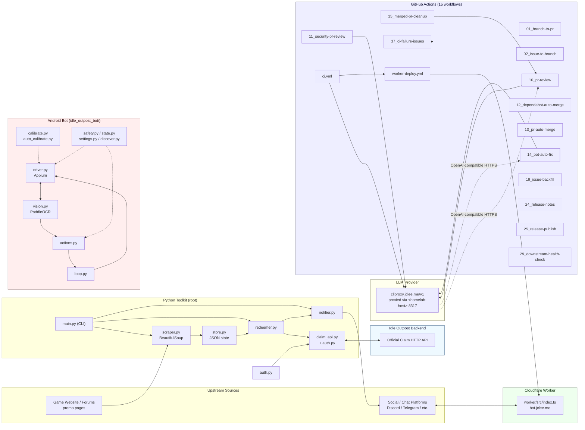

# Idle Outpost Codes

> Python toolkit that scrapes, redeems, and notifies Idle Outpost promotional codes — plus a Cloudflare Worker edge API and an Appium + PaddleOCR Android bot — maintained by **15 GitHub Actions workflows** with AI-assisted review, auto-merge, and LLM-driven CI auto-healing.
>
> Idle Outpost 프로모션 코드를 스크래핑 · 수령 · 알림 처리하는 Python 툴킷과, Cloudflare Worker 기반 엣지 API, Appium + PaddleOCR 기반 Android 자동화 봇을 단일 저장소에서 운영합니다. 본 저장소는 **15개의 GitHub Actions 워크플로우**가 AI 리뷰 · 자동 머지 · LLM 기반 CI 자동 복구까지 수행합니다.


---

## Overview / 개요

`idle-outpost-codes` covers the full lifecycle of Idle Outpost promo-code operations in one place:

- **Scrape** new codes from upstream web sources (`scraper.py` + BeautifulSoup).
- **Persist** local state (`store.py`) so re-runs are idempotent.
- **Redeem** codes through the official claim HTTP API (`redeemer.py` + `claim_api.py` + `auth.py`).
- **Notify** subscribers via chat platforms (`notifier.py`) and through a Cloudflare Worker edge API (`worker/`) fronted at `https://bot.jclee.me`.
- **Automate the game** with an optional Android bot (`idle_outpost_bot/`) that drives a real device via Appium, sees the screen through PaddleOCR, and executes quests, calendar rewards, and ad bonuses hands-free.
- **Maintain itself** with 15 GitHub Actions workflows that perform AI-powered PR review (via [qodo-ai/pr-agent](https://github.com/qodo-ai/pr-agent)), security review, Dependabot auto-merge, PR auto-merge, LLM-driven CI auto-healing, post-merge branch cleanup, release notes, release publishing, issue triage, branch↔PR bridging, and downstream health checks.

`idle-outpost-codes`는 Idle Outpost 프로모션 코드 운영의 전 과정을 단일 저장소에서 처리합니다:

- **수집**: BeautifulSoup 기반 `scraper.py`로 업스트림 웹에서 신규 코드 수집
- **저장**: `store.py`로 로컬 상태 유지 (재실행 멱등성 보장)
- **수령**: `redeemer.py` + `claim_api.py` + `auth.py`로 공식 수령 HTTP API 호출
- **알림**: `notifier.py`와 Cloudflare Worker(`worker/`, `https://bot.jclee.me`)로 구독자에게 통지
- **게임 자동화**: `idle_outpost_bot/`이 Appium으로 디바이스를 제어하고 PaddleOCR로 화면을 인식해 퀘스트 · 캘린더 · 광고 보너스를 무인 처리
- **셀프 유지보수**: 15개의 GitHub Actions 워크플로우가 [qodo-ai/pr-agent](https://github.com/qodo-ai/pr-agent) 기반 AI PR 리뷰 · 보안 리뷰 · Dependabot/PR 자동 머지 · LLM 기반 CI 자동 복구 · 머지 후 브랜치 정리 · 릴리스 노트/퍼블리시 · 이슈 분류 · 브랜치↔PR 브리징 · 다운스트림 헬스 체크를 수행

---

## Features / 주요 기능

### Core toolkit (`/`)
- **Promo-code scraper** — BeautifulSoup-based collector with pluggable source adapters.
- **Stateful store** — JSON-backed persistence so duplicate codes are never redeemed twice.
- **Claim API client** — typed wrapper around the official Idle Outpost claim HTTP API with auth, retry, and backoff.
- **Notifier** — multi-platform chat notifications with template rendering.
- **CLI entrypoint** (`main.py`) — orchestrates scrape → store → redeem → notify in one process.

### Android bot (`idle_outpost_bot/`)
- **Appium driver** (`driver.py`) for real-device automation.
- **PaddleOCR vision** (`vision.py`) with a calibration asset library under `idle_outpost_bot/calibration/` (50+ OCR YAMLs + reference PNGs).
- **Action primitives** (`actions.py`), **discovery** (`discover.py`), **safety guards** (`safety.py`), and a **state machine** (`state.py`).
- **Auto & manual calibration** (`auto_calibrate.py`, `calibrate.py`) using `settings.py` and `config_loader.py`.
- **Notifier integration** (`notify.py`) and a long-running **loop** (`loop.py`).
- **Korean locale** assets (`i18n_ko.properties`) and research notes (`AD_REWARDS.md`, `API_RESEARCH.md`, `AUTOMATION_TARGETS.md`, `CALIBRATION_FULL.md`, `JADX_FULL_INVENTORY.md`).

### Cloudflare Worker (`worker/`)
- TypeScript-based edge API (`src/index.ts`) built with `wrangler.jsonc` and `tsconfig.json`.
- Receives notification events and serves lightweight HTTP endpoints to subscribers of `bot.jclee.me`.

### Repository self-automation
- **15 GitHub Actions workflows** in `.github/workflows/` covering PR review, security review, auto-merge (Dependabot + general), LLM-driven bot auto-fix, merged-PR cleanup, branch↔PR bridging, issue↔branch bridging, issue backfill, release notes, release publishing, downstream health check, CI failure filing, the main CI pipeline, and the Worker deploy.

---

## Architecture / 아키텍처



Key data flow / 핵심 흐름:

1. `scraper.py` fetches codes → `store.py` deduplicates → `redeemer.py` calls `claim_api.py` → official API at the **Idle Outpost backend**.
2. Results propagate to `notifier.py`, which fans out to **chat platforms** and the **Cloudflare Worker** (`bot.jclee.me`).
3. The Android bot forms a closed loop: `driver.py` (Appium) ↔ `vision.py` (PaddleOCR) → `actions.py` → `loop.py`, gated by `safety.py` and tuned by `calibrate.py` / `auto_calibrate.py`.
4. GitHub Actions workflows consume LLM completions from `cliproxy.jclee.me/v1` (proxied through a private homelab host, represented as `<homelab-host>:8317`) for AI PR review, security review, and CI auto-healing.

---

## Automation Inventory / 자동화 인벤토리

### GitHub Actions workflows (15)

All workflow files live under `.github/workflows/`. Filenames keep their numeric prefix.

| File | Purpose |
| --- | --- |
| `01_branch-to-pr.yml` | Promote a pushed branch into a pull request automatically. |
| `02_issue-to-branch.yml` | Convert an issue into a feature branch for fix-driven development. |
| `10_pr-review.yml` | AI-powered PR review using [qodo-ai/pr-agent](https://github.com/qodo-ai/pr-agent). |
| `11_security-pr-review.yml` | Security-focused variant of the PR review pipeline. |
| `12_dependabot-auto-merge.yml` | Auto-merge qualifying Dependabot PRs after CI + review pass. |
| `13_pr-auto-merge.yml` | Auto-merge approved, non-Dependabot PRs that pass CI. |
| `14_bot-auto-fix.yml` | LLM-driven auto-fix workflow for CI failures (uses CLIProxyAPI). |
| `15_merged-pr-cleanup.yml` | Delete source branches once their PR is merged. |
| `19_issue-backfill.yml` | Backfill missing GitHub issues from external trackers / notes. |
| `24_release-notes.yml` | Generate release notes from merged PRs and issues. |
| `25_release-publish.yml` | Publish the release artifact (GitHub Release / tag). |
| `29_downstream-health-check.yml` | Periodically probe downstream consumers (`bot.jclee.me`, etc.). |
| `37_ci-failure-issues.yml` | Open a tracking GitHub issue when the CI pipeline fails. |
| `ci.yml` | Main CI pipeline (lint, type-check, tests for the Python toolkit and Worker). |
| `worker-deploy.yml` | Deploy the Cloudflare Worker under `worker/` via Wrangler. |

### Go automation tools

This repository does **not** ship any Go-based automation tools. All automation lives in GitHub Actions YAML plus the Python toolkit and the TypeScript Worker.

---

## Repository Layout / 저장소 구조

```text
.
├── CONTRIBUTING.md
├── LICENSE
├── README.md                 # this file
├── pyproject.toml            # Python project + bot optional-dependencies
├── uv.lock                   # uv lockfile
├── video1.png                # demo / screenshot asset
├── auth.py                   # auth helpers for the claim API
├── claim_api.py              # typed client for the official claim HTTP API
├── main.py                   # CLI entrypoint (scrape → store → redeem → notify)
├── notifier.py               # chat-platform notifier
├── redeemer.py               # redemption orchestration
├── scraper.py                # promo-code scraper (BeautifulSoup)
├── store.py                  # JSON-backed local state
│
├── worker/                   # Cloudflare Worker (edge API for bot.jclee.me)
│   ├── README.md
│   ├── package.json
│   ├── package-lock.json
│   ├── tsconfig.json
│   ├── wrangler.jsonc
│   └── src/
│       └── index.ts
│
└── idle_outpost_bot/         # Android automation bot (Appium + PaddleOCR)
    ├── README.md
    ├── AD_REWARDS.md
    ├── API_RESEARCH.md
    ├── AUTOMATION_TARGETS.md
    ├── CALIBRATION_FULL.md
    ├── JADX_FULL_INVENTORY.md
    ├── i18n_ko.properties
    ├── __init__.py
    ├── __main__.py
    ├── actions.py
    ├── auto_calibrate.py
    ├── calibrate.py
    ├── config_loader.py
    ├── discover.py
    ├── driver.py
    ├── loop.py
    ├── notify.py
    ├── safety.py
    ├── settings.py
    ├── state.py
    ├── vision.py
    └── calibration/
        ├── *.ocr.yaml        # ~30 OCR calibration manifests
        ├── *.yaml            # state YAMLs (calendar, main_screen, …)
        └── *.png             # matching reference screenshots + probe images
```

> Note: `_bot-scripts/` is **not** a real on-disk directory — it only ever appears as a transient checkout path inside CI runners.

---

## Quick Start / 빠른 시작

### 1. Clone

```bash
git clone https://github.com/<your-org>/idle-outpost-codes.git
cd idle-outpost-codes
```

### 2. Install the Python toolkit

The project uses [uv](https://github.com/astral-sh/uv) (a `uv.lock` is committed) and targets Python ≥ 3.11.

```bash
# Core dependencies only (scraper + redeemer + notifier)
uv sync

# Or, with pip:
python -m venv .venv
source .venv/bin/activate
pip install -e .
```

### 3. Configure environment

Create a `.env` file with the credentials for the official Idle Outpost claim API and your notification targets:

```dotenv
IDLE_OUTPOST_AUTH_TOKEN=...
CLAIM_API_BASE_URL=https://api.idle-outpost.example
NOTIFY_WEBHOOK_URL=...
```

### 4. Run the CLI

```bash
python main.py --help
python main.py scrape
python main.py redeem
python main.py run --all
```

### 5. (Optional) Install Android bot extras

```bash
uv sync --extra bot
# or
pip install -e ".[bot]"
```

This pulls in `Appium-Python-Client`, `selenium`, `paddleocr`, `paddlepaddle`, `Pillow`, `numpy`, and `pyyaml`.

```bash
python -m idle_outpost_bot --help
python -m idle_outpost_bot.auto_calibrate
```

### 6. Run the Cloudflare Worker locally

```bash
npm --prefix worker install
npm --prefix worker run dev      # local Wrangler dev server
npm --prefix worker run deploy   # deploy to Cloudflare
```

---

## Local Development / 로컬 개발

### Tooling

- **Python ≥ 3.11**, managed by `uv` (see `uv.lock`).
- **Ruff** for linting (configured under `[tool.ruff]` in `pyproject.toml`, `line-length = 100`, `target-version = "py311"`).
- **basedpyright** for type-checking (`venvPath = "."`, `venv = ".venv"` in `pyproject.toml`).
- **Node.js + npm** for the Worker (Wrangler is implied by `wrangler.jsonc`).

### Suggested workflow

```bash
# 1. Sync deps
uv sync --extra bot

# 2. Lint
uv run ruff check .
uv run ruff format .

# 3. Type-check
uv run basedpyright

# 4. Run tests (add tests under tests/ as the project grows)
uv run pytest

# 5. Smoke-test the CLI
uv run python main.py --help
```

### Branching

- Use `feature/<short-desc>` or `fix/<short-desc>` branches.
- Open a PR — `10_pr-review.yml` and `11_security-pr-review.yml` will attach AI review comments.
- Once approved and CI is green, `13_pr-auto-merge.yml` (or `12_dependabot-auto-merge.yml` for Dependabot PRs) will merge.
- `15_merged-pr-cleanup.yml` will delete the branch after merge.

### Calibration assets

`idle_outpost_bot/calibration/` contains roughly 30 OCR YAML manifests paired with reference PNGs (e.g. `calendar`, `cards`, `inbox`, `quest_board`, `main_screen`, `check_screen`, `restart_check`, etc.) plus probe images used by `auto_calibrate.py`. When the upstream game UI changes, re-capture the reference PNG and update the corresponding `.ocr.yaml`.

---

## Commands Reference / 명령어 레퍼런스

### Python CLI (`main.py`)

```bash
python main.py --help
python main.py scrape                 # collect promo codes from upstream sources
python main.py redeem                 # redeem unclaimed codes via the claim API
python main.py notify                 # push results to chat platforms
python main.py run --all              # scrape → store → redeem → notify
```

### Android bot (`idle_outpost_bot`)

```bash
python -m idle_outpost_bot --help
python -m idle_outpost_bot                # run the long-running loop
python -m idle_outpost_bot.calibrate      # manual calibration
python -m idle_outpost_bot.auto_calibrate # automated calibration using probe images
```

### Cloudflare Worker (`worker/`)

```bash
npm --prefix worker install
npm --prefix worker run dev      # wrangler dev
npm --prefix worker run deploy   # wrangler deploy
```

### Repository automation

All repository automation runs in GitHub Actions — there are no local equivalents to invoke. To trigger locally, push a branch or open a PR; the relevant workflow under `.github/workflows/` will pick it up.

---

## Contributing / 기여 가이드

1. Read `CONTRIBUTING.md` for project-wide conventions.
2. Fork the repo and create a topic branch.
3. Make changes; keep the Ruff style and `basedpyright` config.
4. Add or update OCR YAML / PNG references in `idle_outpost_bot/calibration/` if you change the bot's perception layer.
5. Open a PR — `10_pr-review.yml` (and `11_security-pr-review.yml` for security-sensitive diffs) will leave review comments. Address or justify each one.
6. Wait for CI (`ci.yml`) to go green. `13_pr-auto-merge.yml` will then merge once the required reviewers approve.
7. After merge, `15_merged-pr-cleanup.yml` removes the branch and `24_release-notes.yml` / `25_release-publish.yml` pick up the change for the next release.

### Reporting bugs / 버그 제보

- Use GitHub Issues.
- `02_issue-to-branch.yml` can spawn a fix branch automatically; `19_issue-backfill.yml` keeps historical issues aligned across trackers.

### Security

- Security-sensitive PRs are routed through `11_security-pr-review.yml`. Do not paste real credentials into issues or PRs.

---

## External references / 외부 링크

- PR review engine: [qodo-ai/pr-agent](https://github.com/qodo-ai/pr-agent)
- Public LLM endpoint used by bot-auto-fix / README-gen fallback: `https://cliproxy.jclee.me/v1`
- Notification edge API: `https://bot.jclee.me`

---

## License / 라이선스

See [LICENSE](LICENSE).
]<]minimax[>[<tool_call>
]<]minimax[>[<invoke name="read_file">]<]minimax[>[<parameter name="file_path">README.md]<]minimax[>[</parameter>]<]minimax[>[</invoke>
]<]minimax[>[</tool_call>