# Idle Outpost Codes


Idle Outpost promo code monitor, daily claim CLI, Android automation bot, and Cloudflare Worker API.

Idle Outpost 프로모션 코드 모니터링, 일일 보상 수령 CLI, Android 자동화 봇, Cloudflare Worker API를 포함한 자동화 프로젝트입니다.

## Overview / 개요

This repository contains a Python-based automation toolkit for Idle Outpost-related workflows:

- Scraping and monitoring promotional codes
- Redeeming or claiming available rewards
- Persisting discovered state locally
- Sending notifications
- Running an optional Android automation bot with Appium/OCR-based calibration
- Serving a lightweight Worker API under `worker/`
- Maintaining a heavily automated GitHub workflow environment for review, security, documentation, releases, and self-healing CI

이 저장소는 Idle Outpost 관련 작업을 자동화하기 위한 Python 기반 도구 모음입니다.

- 프로모션 코드 스크래핑 및 모니터링
- 사용 가능한 보상 등록 또는 수령
- 발견된 상태의 로컬 저장
- 알림 전송
- Appium/OCR 기반 보정 기능을 사용하는 선택적 Android 자동화 봇
- `worker/` 디렉터리의 경량 Worker API
- 리뷰, 보안, 문서, 릴리스, CI 자동 복구를 위한 GitHub 자동화 구성

## Features / 주요 기능

### Core Python automation / 핵심 Python 자동화

- Promo code scraping via `scraper.py`
- Code redemption flow via `redeemer.py`
- Daily claim/API-related logic via `claim_api.py`
- Authentication helper via `auth.py`
- Notification helper via `notifier.py`
- Persistent local state management via `store.py`
- Main CLI entry point via `main.py`

### Android automation bot / Android 자동화 봇

The `idle_outpost_bot/` package provides optional device automation features.

`idle_outpost_bot/` 패키지는 선택적 디바이스 자동화 기능을 제공합니다.

Key capabilities include:

- Appium/Selenium-based device driver integration
- OCR-assisted screen recognition
- Calibration assets under `idle_outpost_bot/calibration/`
- Safety and state management modules
- Korean i18n properties file: `idle_outpost_bot/i18n_ko.properties`
- Research and operation notes:
  - `idle_outpost_bot/AD_REWARDS.md`
  - `idle_outpost_bot/API_RESEARCH.md`
  - `idle_outpost_bot/AUTOMATION_TARGETS.md`
  - `idle_outpost_bot/CALIBRATION_FULL.md`
  - `idle_outpost_bot/JADX_FULL_INVENTORY.md`

### Cloudflare Worker / Cloudflare Worker

The `worker/` directory contains a TypeScript Cloudflare Worker project.

`worker/` 디렉터리에는 TypeScript 기반 Cloudflare Worker 프로젝트가 포함되어 있습니다.

Important files:

- `worker/src/index.ts`
- `worker/package.json`
- `worker/package-lock.json`
- `worker/tsconfig.json`
- `worker/wrangler.jsonc`
- `worker/README.md`

### Repository automation / 저장소 자동화

This repository includes 29 GitHub Actions workflow files for CI, security, pull request review, documentation, release automation, issue management, downstream checks, and CI auto-healing.

이 저장소에는 CI, 보안, PR 리뷰, 문서, 릴리스, 이슈 관리, 다운스트림 점검, CI 자동 복구를 위한 29개의 GitHub Actions 워크플로가 포함되어 있습니다.

## Architecture / 아키텍처

```mermaid
flowchart TD
    User["User / Operator<br/>사용자"] --> CLI["Python CLI<br/>main.py"]
    CLI --> Auth["Authentication<br/>auth.py"]
    CLI --> Scraper["Promo Code Scraper<br/>scraper.py"]
    CLI --> Redeemer["Redeemer<br/>redeemer.py"]
    CLI --> ClaimAPI["Daily Claim API Logic<br/>claim_api.py"]
    CLI --> Store["Local State Store<br/>store.py"]
    CLI --> Notifier["Notifier<br/>notifier.py"]

    Scraper --> Store
    Redeemer --> Store
    ClaimAPI --> Store
    Notifier --> ExternalNotify["Notification Target<br/>알림 대상"]

    BotUser["Bot Operator<br/>봇 사용자"] --> AndroidBot["Android Automation Bot<br/>idle_outpost_bot"]
    AndroidBot --> Driver["Device Driver<br/>driver.py"]
    AndroidBot --> Vision["Vision and OCR<br/>vision.py"]
    AndroidBot --> Actions["Automation Actions<br/>actions.py"]
    AndroidBot --> Safety["Safety Controls<br/>safety.py"]
    AndroidBot --> BotState["Bot State<br/>state.py"]
    Vision --> Calibration["Calibration Assets<br/>idle_outpost_bot/calibration"]

    WorkerClient["API Client<br/>클라이언트"] --> Worker["Cloudflare Worker<br/>worker/src/index.ts"]
    Worker --> PublicEndpoint["https://cliproxy.jclee.me/v1"]

    GitHub["GitHub Repository"] --> ActionsCI["GitHub Actions<br/>CI, security, docs, releases"]
    ActionsCI --> PRReview["PR Review Automation<br/>10_pr-review.yml"]
    ActionsCI --> Security["Security Automation<br/>05_gitleaks.yml, 06_codeql.yml"]
    ActionsCI --> Docs["Docs Automation<br/>20_readme-gen.yml, 21_docs-sync.yml"]
    ActionsCI --> Release["Release Automation<br/>24_release-notes.yml, 25_release-publish.yml"]
```



## Automation Inventory / 자동화 인벤토리

### GitHub Actions workflows / GitHub Actions 워크플로

The following workflow files exist in `.github/workflows/`.

다음 워크플로 파일들이 `.github/workflows/`에 존재합니다.

| File | Purpose |
|---|---|
| `01_branch-to-pr.yml` | Creates or manages pull requests from branches. |
| `02_issue-to-branch.yml` | Creates branches from issues or issue-driven automation. |
| `03_pr-checks.yml` | Pull request validation checks. |
| `04_actionlint.yml` | Lints GitHub Actions workflow syntax. |
| `05_gitleaks.yml` | Secret scanning with Gitleaks. |
| `06_codeql.yml` | CodeQL security analysis. |
| `07_dependency-review.yml` | Dependency review for pull requests. |
| `08_scorecard.yml` | OpenSSF Scorecard security posture checks. |
| `09_semantic-pr.yml` | Semantic pull request title validation. |
| `10_pr-review.yml` | Automated pull request review. |
| `11_security-pr-review.yml` | Security-focused pull request review. |
| `12_dependabot-auto-merge.yml` | Dependabot auto-merge automation. |
| `13_pr-auto-merge.yml` | Pull request auto-merge automation. |
| `14_bot-auto-fix.yml` | Bot-driven automated fixes. |
| `15_merged-pr-cleanup.yml` | Cleanup after pull requests are merged. |
| `19_issue-backfill.yml` | Issue metadata or content backfill automation. |
| `20_readme-gen.yml` | README generation automation. |
| `21_docs-sync.yml` | Documentation synchronization. |
| `24_release-notes.yml` | Release notes generation. |
| `25_release-publish.yml` | Release publishing automation. |
| `29_downstream-health-check.yml` | Downstream health checks. |
| `37_ci-failure-issues.yml` | Creates or updates issues for CI failures. |
| `42_reusable-docs-sync.yml` | Reusable documentation sync workflow. |
| `44_reusable-pr-checks.yml` | Reusable pull request checks workflow. |
| `45_reusable-gitleaks.yml` | Reusable Gitleaks workflow. |
| `60_ci-auto-heal.yml` | CI self-healing automation. |
| `91_issue-classification.yml` | Issue classification automation. |
| `ci.yml` | Main CI workflow. |
| `worker-deploy.yml` | Cloudflare Worker deployment workflow. |

### Automation-related services and tools / 자동화 관련 서비스 및 도구

| Tool or service | Usage |
|---|---|
| GitHub Actions | CI/CD, security checks, documentation automation, releases, issue automation |
| CodeQL | Static application security testing |
| Gitleaks | Secret detection |
| OpenSSF Scorecard | Repository security posture checks |
| Dependency Review | Pull request dependency risk review |
| Actionlint | GitHub Actions workflow linting |
| Dependabot | Dependency update automation and auto-merge integration |
| Qodo PR Agent | Pull request review support via [qodo-ai/pr-agent](https://github.com/qodo-ai/pr-agent) |
| CLIProxy API | Model/API gateway endpoint at [cliproxy.jclee.me](https://cliproxy.jclee.me) |
| Bot service | Automation endpoint at [bot.jclee.me](https://bot.jclee.me) |
| Cloudflare Workers | TypeScript Worker runtime for the `worker/` project |
| uv | Python dependency and virtual environment management |
| Ruff | Python lint configuration in `pyproject.toml` |
| basedpyright | Python type checking configuration in `pyproject.toml` |
| Appium | Optional Android automation backend |
| Selenium | Optional browser/device automation dependency |
| PaddleOCR / PaddlePaddle | Optional OCR stack for screen recognition |
| Pillow / NumPy / SciPy | Image processing and numeric utilities |
| PyYAML | Calibration/configuration file parsing |
| Beautiful Soup | HTML parsing for scraping |
| httpx | HTTP client |
| python-dotenv | Environment variable loading |

### Go automation tools / Go 자동화 도구

There are no Go automation tools in this repository.

이 저장소에는 Go 자동화 도구가 없습니다.

## Repository Structure / 저장소 구조

```text
/
├── CONTRIBUTING.md
├── LICENSE
├── README.md
├── auth.py
├── claim_api.py
├── main.py
├── notifier.py
├── pyproject.toml
├── redeemer.py
├── scraper.py
├── store.py
├── uv.lock
├── video1.png
├── worker/
│   ├── README.md
│   ├── package-lock.json
│   ├── package.json
│   ├── tsconfig.json
│   ├── wrangler.jsonc
│   └── src/
│       └── index.ts
└── idle_outpost_bot/
    ├── AD_REWARDS.md
    ├── API_RESEARCH.md
    ├── AUTOMATION_TARGETS.md
    ├── CALIBRATION_FULL.md
    ├── JADX_FULL_INVENTORY.md
    ├── README.md
    ├── __init__.py
    ├── __main__.py
    ├── actions.py
    ├── auto_calibrate.py
    ├── calibrate.py
    ├── config_loader.py
    ├── discover.py
    ├── driver.py
    ├── i18n_ko.properties
    ├── loop.py
    ├── notify.py
    ├── safety.py
    ├── settings.py
    ├── state.py
    ├── vision.py
    └── calibration/
        ├── after_cards.ocr.yaml
        ├── after_cards.png
        ├── after_quest.ocr.yaml
        ├── after_quest.png
        ├── after_tasks.ocr.yaml
        ├── after_tasks.png
        ├── back_close.ocr.yaml
        ├── back_close.png
        ├── back_from_cards.ocr.yaml
        ├── back_from_cards.png
        ├── calendar.ocr.yaml
        ├── calendar.png
        ├── calendar.yaml
        ├── cards.ocr.yaml
        ├── cards.png
        ├── check_screen.ocr.yaml
        ├── check_screen.png
        ├── clean_main.ocr.yaml
        ├── clean_main.png
        ├── closed2.ocr.yaml
        ├── closed2.png
        ├── closed_check.ocr.yaml
        ├── closed_check.png
        ├── fresh_main.ocr.yaml
        ├── fresh_main.png
        ├── game_ready.ocr.yaml
        ├── game_ready.png
        ├── inbox.ocr.yaml
        ├── inbox.png
        ├── main.png
        ├── main_screen.ocr.yaml
        ├── main_screen.png
        ├── main_screen.yaml
        ├── mainscreen_check.ocr.yaml
        ├── mainscreen_check.png
        ├── p2_ad_tv.png
        ├── p2_enter_fight.png
        ├── p2_enter_trade.png
        ├── p2_event_banner.png
        ├── p2_pass.png
        ├── p2_right_event.png
        ├── p2_trophy.png
        ├── probe_ad_tv.png
        ├── probe_calendar.png
        ├── probe_cards.png
        ├── probe_inbox.png
        ├── probe_quest_board.png
        ├── probe_tasks.png
        ├── probe_wheel.png
        ├── quest_board.ocr.yaml
        ├── quest_board.png
        ├── restart_check.ocr.yaml
        ├── restart_check.png
        ├── swipe_test.ocr.yaml
        └── swipe_test.png
```

## Quick Start / 빠른 시작

### Prerequisites / 사전 요구 사항

- Python 3.11 or later
- `uv` for Python dependency management
- Node.js and npm for the `worker/` project
- Optional: Appium server and Android device/emulator for `idle_outpost_bot`
- Optional: OCR runtime dependencies for bot features

### Install Python dependencies / Python 의존성 설치

```bash
uv sync
```

Optional bot dependencies:

```bash
uv sync --extra bot
```

### Run the main CLI / 메인 CLI 실행

```bash
uv run python main.py
```

### Run the Android automation bot / Android 자동화 봇 실행

```bash
uv run python -m idle_outpost_bot
```

### Install Worker dependencies / Worker 의존성 설치

```bash
cd worker
npm install
```

### Run Worker locally / Worker 로컬 실행

```bash
cd worker
npm run dev
```

### Deploy Worker / Worker 배포

```bash
cd worker
npm run deploy
```

Deployment is also automated by `worker-deploy.yml`.

배포는 `worker-deploy.yml` 워크플로를 통해서도 자동화됩니다.

## Local Development / 로컬 개발

### Python environment / Python 환경

This project is configured through `pyproject.toml`.

이 프로젝트는 `pyproject.toml`로 구성됩니다.

Project metadata:

- Package name: `idle-outpost-codes`
- Version: `0.1.0`
- Python: `>=3.11`
- Main dependencies:
  - `beautifulsoup4`
  - `httpx`
  - `python-dotenv`
  - `scipy`

Optional bot dependencies:

- `Appium-Python-Client`
- `selenium`
- `paddleocr`
- `paddlepaddle`
- `Pillow`
- `numpy`
- `pyyaml`

### Recommended setup / 권장 설정

```bash
uv sync --extra bot
```

If you do not need Android bot functionality:

```bash
uv sync
```

### Environment variables / 환경 변수

The project uses `python-dotenv`, so local environment variables can be loaded from a `.env` file when supported by the scripts.

프로젝트는 `python-dotenv`를 사용하므로, 스크립트에서 지원하는 경우 `.env` 파일을 통해 로컬 환경 변수를 로드할 수 있습니다.

Recommended practice:

```bash
cp .env.example .env
```

If `.env.example` does not exist, create `.env` manually and keep secrets out of Git.

`.env.example`이 없는 경우 `.env`를 직접 만들고, 비밀 값은 Git에 커밋하지 마세요.

### Linting and type checking / 린트 및 타입 검사

Ruff and basedpyright are configured in `pyproject.toml`.

`pyproject.toml`에는 Ruff와 basedpyright 설정이 포함되어 있습니다.

```bash
uv run ruff check .
uv run basedpyright
```

### Worker development / Worker 개발

```bash
cd worker
npm install
npm run dev
```

Check `worker/package.json` for the exact available npm scripts.

사용 가능한 정확한 npm 스크립트는 `worker/package.json`을 확인하세요.

## Commands Reference / 명령어 참조

### Python commands / Python 명령어

| Command | Description |
|---|---|
| `uv sync` | Install core Python dependencies. |
| `uv sync --extra bot` | Install core and optional Android bot dependencies. |
| `uv run python main.py` | Run the main automation CLI. |
| `uv run python -m idle_outpost_bot` | Run the Android automation bot package entry point. |
| `uv run ruff check .` | Run Ruff lint checks. |
| `uv run basedpyright` | Run basedpyright type checking. |

### Worker commands / Worker 명령어

Run from the `worker/` directory.

`worker/` 디렉터리에서 실행하세요.

| Command | Description |
|---|---|
| `npm install` | Install Worker dependencies. |
| `npm run dev` | Start local Worker development server if defined in `package.json`. |
| `npm run deploy` | Deploy the Worker if defined in `package.json`. |

### GitHub automation commands / GitHub 자동화 관련 작업

Most repository automation is event-driven and runs through GitHub Actions.

대부분의 저장소 자동화는 이벤트 기반이며 GitHub Actions를 통해 실행됩니다.

Common triggers include:

- Pull request opened or updated
- Issue opened or labeled
- Push to branch
- Merge completion
- Scheduled security or health checks
- Release creation or publication
- Worker deployment events

## Security / 보안

Security automation includes:

- Secret scanning with `05_gitleaks.yml`
- Code scanning with `06_codeql.yml`
- Dependency review with `07_dependency-review.yml`
- Repository security posture checks with `08_scorecard.yml`
- Security-focused PR review with `11_security-pr-review.yml`

보안 자동화에는 다음이 포함됩니다.

- `05_gitleaks.yml`를 통한 시크릿 스캔
- `06_codeql.yml`를 통한 코드 스캔
- `07_dependency-review.yml`를 통한 의존성 검토
- `08_scorecard.yml`를 통한 저장소 보안 상태 점검
- `11_security-pr-review.yml`를 통한 보안 중심 PR 리뷰

Do not commit:

- API keys
- Tokens
- Session cookies
- Device credentials
- Internal hostnames that should remain private
- Private network addresses
- Emulator/device secrets

다음 항목은 커밋하지 마세요.

- API 키
- 토큰
- 세션 쿠키
- 디바이스 인증 정보
- 비공개 내부 호스트명
- 사설 네트워크 주소
- 에뮬레이터 또는 디바이스 관련 비밀 값

## Documentation Automation / 문서 자동화

README and documentation workflows include:

- `20_readme-gen.yml`
- `21_docs-sync.yml`
- `42_reusable-docs-sync.yml`

The primary README generation model is `gpt-5.5`, with fallback to `minimax-m3` through CLIProxyAPI.

README 생성의 기본 모델은 `gpt-5.5`이며, CLIProxyAPI를 통해 `minimax-m3`가 대체 모델로 사용됩니다.

Public API endpoint:

- [https://cliproxy.jclee.me/v1](https://cliproxy.jclee.me/v1)

## Contribution Guide / 기여 가이드

Contributions are welcome.

기여를 환영합니다.

Before contributing:

1. Read `CONTRIBUTING.md`.
2. Create a focused branch for your change.
3. Keep changes small and reviewable.
4. Run local checks before opening a pull request.
5. Do not commit secrets or private environment details.
6. Update documentation when behavior changes.
7. Use clear pull request titles compatible with `09_semantic-pr.yml`.

기여 전 확인 사항:

1. `CONTRIBUTING.md`를 읽어 주세요.
2. 변경 사항에 맞는 전용 브랜치를 생성하세요.
3. 변경 범위를 작고 리뷰하기 쉽게 유지하세요.
4. Pull Request를 열기 전에 로컬 검사를 실행하세요.
5. 시크릿 또는 비공개 환경 정보를 커밋하지 마세요.
6. 동작이 변경되면 문서를 함께 업데이트하세요.
7. `09_semantic-pr.yml`와 호환되는 명확한 Pull Request 제목을 사용하세요.

### Suggested development flow / 권장 개발 흐름

```bash
git checkout -b feature/my-change
uv sync --extra bot
uv run ruff check .
uv run basedpyright
git add .
git commit -m "feat: describe my change"
```

Then open a pull request.

이후 Pull Request를 생성하세요.

## License / 라이선스

This project is licensed under the terms in [LICENSE](LICENSE).

이 프로젝트는 [LICENSE](LICENSE)에 명시된 조건에 따라 라이선스가 부여됩니다.