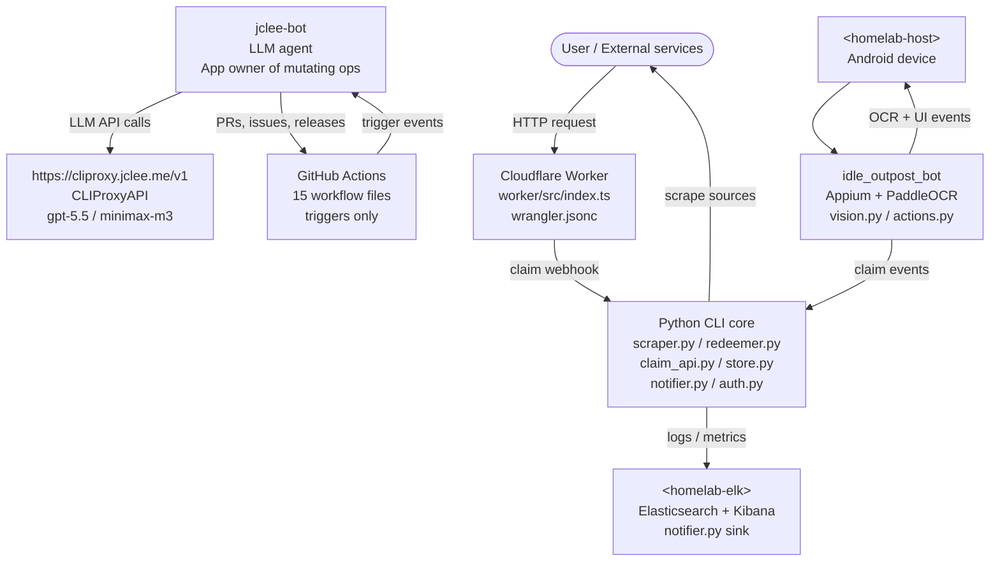

# Idle Outpost Codes

> **EN** — A single repository that runs the entire Idle Outpost promo-code lifecycle: a Python CLI core that scrapes and redeems codes, a TypeScript Cloudflare Worker that exposes the public HTTP surface, and an Appium + PaddleOCR Android bot that drives the in-game claim flow. Day-to-day maintenance is owned by **jclee-bot**, an LLM-driven automation surface (current primary model: `gpt-5.5`, fallback: `minimax-m3` via [CLIProxyAPI](https://cliproxy.jclee.me/v1)) reached through **15 GitHub Actions workflow files** that act as triggers, not the source of truth.
>
> **KR** — Idle Outpost 프로모션 코드의 전체 라이프사이클을 단일 저장소에서 운영하는 프로젝트입니다. 코드를 스크래핑·수령하는 Python CLI 코어, 공개 HTTP 인터페이스를 제공하는 TypeScript Cloudflare Worker, 인게임 수령 흐름을 자동 구동하는 Appium + PaddleOCR 기반 Android 봇으로 구성됩니다. 일상적인 유지·보수는 **jclee-bot**(현재 1차 모델: `gpt-5.5`, 폴백: [CLIProxyAPI](https://cliproxy.jclee.me/v1) 경유 `minimax-m3`)이 담당하며, **GitHub Actions 워크플로우 파일 15개**는 트리거 역할만 수행합니다.

---

## Badges / 배지


> Status badges for individual workflow runs are intentionally not embedded — workflow files are triggers, not the automation source of truth (see *jclee-bot automation surfaces*).

---

## Overview / 개요

`idle-outpost-codes` is intentionally tripartite. Each layer has a single responsibility and a single deployment target, and the layers communicate through well-defined contracts rather than shared state.

### Layers / 계층 구성

| # | Layer | Language | Runtime | Owns |
|---|---|---|---|---|
| 1 | CLI core | Python 3.11+ | `uv` / `pyproject.toml` | scraping, redeeming, persistence, notifications (`scraper.py`, `redeemer.py`, `claim_api.py`, `store.py`, `notifier.py`, `auth.py`, `main.py`) |
| 2 | Edge API | TypeScript | Cloudflare Worker (`worker/wrangler.jsonc`) | public HTTP surface, webhook intake, rate limiting |
| 3 | Android bot | Python 3.11+ | Appium + PaddleOCR + Selenium | in-game claim flow, OCR-driven UI navigation, vision-based safety checks |

The Python bot package in `idle_outpost_bot/` is **optional** and gated behind the `bot` extra in `pyproject.toml`. The CLI core and Worker run independently of it.

---

## Features / 기능

- **Promo code scraping** — discovers new Idle Outpost codes from curated sources via `httpx` + `beautifulsoup4`.
- **Deterministic redeeming** — `redeemer.py` and `claim_api.py` call the in-game claim endpoint with reusable `auth.py` session handling.
- **Local persistence** — `store.py` keeps claim history and de-duplicates previously redeemed codes.
- **Notifications** — `notifier.py` ships events to the homelab ELK stack (`<homelab-elk>`) for search and dashboards.
- **Public HTTP surface** — the Cloudflare Worker (`worker/src/index.ts`) accepts inbound webhooks and exposes a read-only claim status endpoint.
- **Android automation** — `idle_outpost_bot/` drives the game UI with Appium, parses screens with PaddleOCR, and includes an extensive calibration asset library under `idle_outpost_bot/calibration/`.
- **Calibration & autodiscovery** — `calibrate.py` and `auto_calibrate.py` build OCR templates from raw screenshots (`*.png` + `*.ocr.yaml`).
- **Safety gates** — `safety.py` enforces backstop checks (closed-game detection, restart checks, mainscreen verification) before any claim action.
- **LLM-driven maintenance** — see *jclee-bot automation surfaces*.

---

## Architecture / 아키텍처

The system is split across three runtimes that communicate over HTTP. `jclee-bot` and the GitHub Actions workflows sit *outside* the runtime path — they only operate on the repository itself.



> **Note on placeholders.** `<homelab-host>` denotes the homelab machine that runs the Android device and the CLI core; `<homelab-elk>` denotes the homelab Elasticsearch + Kibana stack. The LLM proxy is the public endpoint `https://cliproxy.jclee.me/v1` (CLIProxyAPI).

---

## jclee-bot automation surfaces / jclee-bot 자동화 영역

`jclee-bot` is the **App owner of every mutating operation** in this repository. The 15 GitHub Actions workflow files under `.github/workflows/` are *only* event triggers — they dispatch a context payload to `jclee-bot`, which then decides what to do and performs the mutation through the GitHub API and the CLIProxyAPI LLM endpoint.

### Triggers (workflow files) / 트리거 (워크플로우 파일)

The workflow files listed below are trigger implementations, not the automation source of truth. They exist to wake `jclee-bot` and pass it context.

- `01_branch-to-pr.yml` — branch → pull request
- `02_issue-to-branch.yml` — issue → feature branch
- `10_pr-review.yml` — PR opened/updated → AI review pass
- `11_security-pr-review.yml` — security-sensitive PRs → AI review with stricter ruleset
- `12_dependabot-auto-merge.yml` — Dependabot PRs → auto-merge after checks
- `13_pr-auto-merge.yml` — labeled PRs → auto-merge
- `14_bot-auto-fix.yml` — CI failure / review comment → `jclee-bot` auto-fix attempt
- `15_merged-pr-cleanup.yml` — merged PR → branch cleanup
- `19_issue-backfill.yml` — backfill missing issues from commit history
- `24_release-notes.yml` — tag push → release notes draft
- `25_release-publish.yml` — approved notes → GitHub release publish
- `29_downstream-health-check.yml` — post-release downstream smoke check
- `37_ci-failure-issues.yml` — repeated CI failure → open issue
- `ci.yml` — generic CI
- `worker-deploy.yml` — Worker deploy on `worker/**` changes

### App-owned mutating surfaces / 앱이 소유한 변경 영역

The following surfaces are **owned by the `jclee-bot` App**, not by the workflow files:

- Opening, closing, labeling, and commenting on issues — issue mutations carry the marker **`jclee-bot에의해자동화됨`** so humans can distinguish automated activity from organic activity.
- Opening pull requests, pushing commits to bot branches, requesting reviews, and merging.
- Creating and editing releases.
- Renaming, deleting, and force-pushing bot-owned branches.
- Posting PR review comments and suggesting patches.

The CLI core, the Worker, and the Android bot are **not** part of the `jclee-bot` automation surface — they are runtime code that `jclee-bot` may propose changes to, but never executes directly.

### LLM routing / LLM 라우팅

`jclee-bot` calls `https://cliproxy.jclee.me/v1` (CLIProxyAPI). The current routing policy is:

- **Primary**: `gpt-5.5`
- **Fallback**: `minimax-m3` (only invoked if the primary endpoint returns a non-retryable error)

Fallback is a per-request decision, not a global model swap.

---

## Go automation tools / Go 자동화 도구

This repository currently contains **zero Go automation tools**. All automation that operates on the repository is performed by `jclee-bot` via the GitHub API and by the Python CLI core via the in-game claim API. If Go tooling is added later, it will be listed here.

---

## Quick start / 빠른 시작

### Prerequisites / 사전 요구사항

- Python **3.11+**
- [`uv`](https://github.com/astral-sh/uv) for dependency management
- Node.js 20+ and `wrangler` (only if you intend to run the Worker locally)
- An Android device or emulator with USB debugging (only for the bot)

### 1. Clone and install / 저장소 복제 및 설치

```bash
git clone <this-repo> idle-outpost-codes
cd idle-outpost-codes
uv sync
```

### 2. Configure environment / 환경 변수 설정

Create a `.env` file in the repository root:

```dotenv
# Claim API
IDLE_OUTPOST_AUTH_TOKEN=...
IDLE_OUTPOST_CLAIM_URL=https://example.invalid/claim

# Notifier (homelab ELK)
ELK_URL=https://<homelab-elk>:9200
ELK_INDEX=idle-outpost-codes

# Worker (only if running locally)
WORKER_PORT=8787
```

### 3. Run the CLI core / CLI 코어 실행

```bash
uv run python main.py scrape
uv run python main.py redeem --dry-run
uv run python main.py claim --code NEWCODE
```

### 4. Run the Worker locally / Worker 로컬 실행

```bash
cd worker
npm install
npx wrangler dev
```

### 5. (Optional) Install the bot extras / 봇 추가 의존성 설치

```bash
uv sync --extra bot
uv run python -m idle_outpost_bot --help
```

---

## Local development / 로컬 개발

### Repository layout / 저장소 구조

```text
/
├── CONTRIBUTING.md
├── LICENSE
├── README.md
├── auth.py                 # claim session / cookie handling
├── claim_api.py            # in-game claim endpoint client
├── main.py                 # CLI entrypoint
├── notifier.py             # ELK sink
├── pyproject.toml          # uv-managed project + extras
├── redeemer.py             # redeem orchestration
├── scraper.py              # promo code discovery
├── store.py                # local persistence / dedup
├── uv.lock                 # locked dependency graph
├── video1.png              # documentation asset
├── worker/                 # Cloudflare Worker (public HTTP surface)
│   ├── README.md
│   ├── package-lock.json
│   ├── package.json
│   ├── tsconfig.json
│   ├── wrangler.jsonc
│   └── src/
│       └── index.ts
└── idle_outpost_bot/       # Android automation (optional, `bot` extra)
    ├── AD_REWARDS.md
    ├── API_RESEARCH.md
    ├── AUTOMATION_TARGETS.md
    ├── CALIBRATION_FULL.md
    ├── JADX_FULL_INVENTORY.md
    ├── README.md
    ├── __init__.py
    ├── __main__.py
    ├── actions.py
    ├── auto_calibrate.py
    ├── calibrate.py
    ├── config_loader.py
    ├── discover.py
    ├── driver.py
    ├── i18n_ko.properties
    ├── loop.py
    ├── notify.py
    ├── safety.py
    ├── settings.py
    ├── state.py
    ├── vision.py
    └── calibration/
        ├── main.png
        ├── main_screen.yaml
        ├── calendar.yaml
        ├── *.ocr.yaml
        └── *.png
```

### Linting and type checking / 린트 및 타입 검사

```bash
uv run ruff check .
uv run basedpyright
```

### Adding a new promo source / 새 코드 소스 추가

1. Implement the fetcher in `scraper.py` (or a new module imported from `scraper.py`).
2. Add the source URL to the source list.
3. Add a unit test under a `tests/` directory (create one if absent).
4. Open a PR — `jclee-bot` will be triggered by `10_pr-review.yml` for the review pass.

---

## Commands reference / 명령어 참조

### CLI core / CLI 코어

```text
uv run python main.py scrape                 # scrape known sources for new codes
uv run python main.py redeem --dry-run       # plan a redeem run without calling the API
uv run python main.py redeem                 # actually redeem pending codes
uv run python main.py claim --code CODE      # claim a single code
uv run python main.py status                 # print last claim results
```

### Worker / Worker

```text
npm run dev         # local dev via wrangler
npm run deploy      # deploy to Cloudflare
npm run tail        # tail Worker logs
```

### Android bot / 안드로이드 봇

```text
uv run python -m idle_outpost_bot run              # start the main loop
uv run python -m idle_outpost_bot calibrate        # build OCR templates from screenshots
uv run python -m idle_outpost_bot auto-calibrate   # autodiscover UI elements
uv run python -m idle_outpost_bot discover         # dump current screen state
```

---

## External links / 외부 링크

- PR review automation: [`qodo-ai/pr-agent`](https://github.com/qodo-ai/pr-agent)
- LLM proxy: [https://cliproxy.jclee.me/v1](https://cliproxy.jclee.me/v1)
- Bot control plane: [https://bot.jclee.me](https://bot.jclee.me)

---

## Contribution guide / 기여 가이드

### For humans / 사람 기여자

1. Read `CONTRIBUTING.md` before opening a PR.
2. Use conventional commits (`feat:`, `fix:`, `chore:`, `docs:`).
3. Keep PRs scoped to one concern.
4. Do not bypass `jclee-bot` review labels — the bot will be auto-assigned by `10_pr-review.yml`.
5. Do not edit `worker/wrangler.jsonc` secrets — Worker secrets are managed out-of-band.
6. Do not commit calibration screenshots that contain personal data; redact before committing.

### For `jclee-bot` / 봇 기여 규칙

- All issue mutations opened by `jclee-bot` MUST include the marker `jclee-bot에의해자동화됨` in the body or as a label.
- All bot-owned PRs MUST be opened from a `bot/`-prefixed branch.
- The bot MUST attempt the primary model (`gpt-5.5`) before falling back to `minimax-m3`.
- The bot MUST NOT directly modify runtime files in `worker/src/` or `idle_outpost_bot/` without an accompanying PR and CI green.

### Review SLA / 리뷰 SLA

- `10_pr-review.yml` produces a first-pass review within 10 minutes.
- `11_security-pr-review.yml` is required for changes to `auth.py`, `claim_api.py`, or any `worker/**` file.
- `13_pr-auto-merge.yml` will auto-merge PRs labeled `auto-merge` once CI is green.

---

## License / 라이선스

See `LICENSE`.