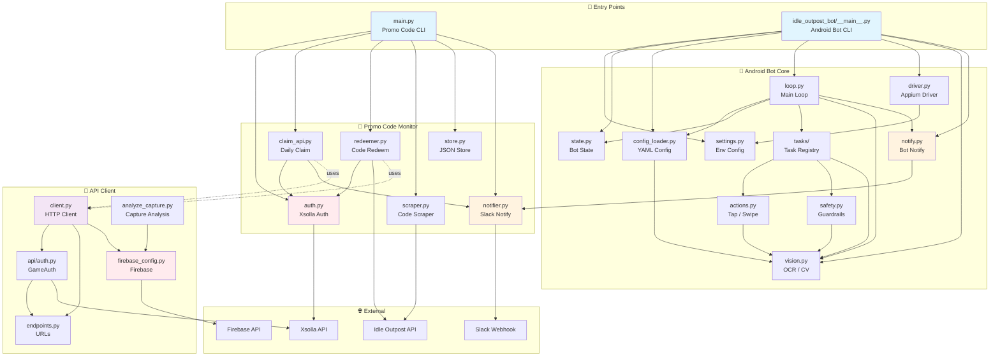
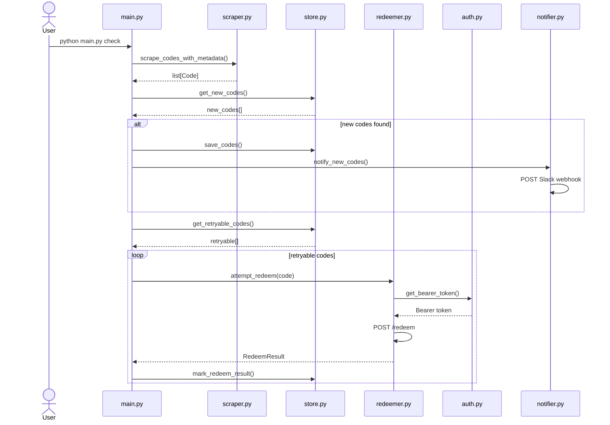

# idle-outpost Codebase Architecture

## Module Dependency Diagram



## Directory Structure

```text
idle-outpost/
├── main.py                      # Promo code monitor CLI
├── auth.py                      # Xsolla authentication
├── claim_api.py                 # Daily giveaway claimer
├── redeemer.py                  # Promo code redeemer
├── scraper.py                   # Code scraper from web
├── store.py                     # JSON-backed code storage
├── notifier.py                  # Slack notification
├── .env.example                 # Required env vars
│
├── idle_outpost_bot/            # Android automation bot
│   ├── __main__.py              # Bot CLI entry
│   ├── settings.py              # Environment settings
│   ├── state.py                 # Persistent bot state
│   ├── config_loader.py         # YAML screen config
│   ├── loop.py                  # Main automation loop
│   ├── driver.py                # Appium driver wrapper
│   ├── vision.py                # OCR + CV utilities
│   ├── actions.py               # Touch actions
│   ├── safety.py                # Guardrail checks
│   ├── calibrate.py             # Screen calibration
│   ├── discover.py              # Package discovery
│   ├── notify.py                # Bot notifications
│   ├── auto_calibrate.py        # Auto calibration tool
│   └── tasks/                   # Task implementations
│       ├── base.py
│       ├── registry.py
│       └── __init__.py
│
└── idle_outpost_api/            # HTTP API client
    ├── client.py                # HTTP client (httpx)
    ├── auth.py                  # Game authentication
    ├── endpoints.py             # Service endpoints
    ├── firebase_config.py       # Firebase configuration
    └── analyze_capture.py       # Capture analyzer
```

## Data Flow (Promo Code Monitor)



## Data Flow (Android Bot)

```mermaid
sequenceDiagram
    actor User
    participant __main__.py
    participant loop.py
    participant driver.py
    participant vision.py
    participant tasks/registry.py
    participant state.py

    User->>__main__.py: python -m idle_outpost_bot run
    __main__.py->>loop.py: run_loop()
    loop->>state.py: load_state()
    state.py-->>loop.py: BotState
    loop->>driver.py: session()
    driver.py-->>loop.py: WebDriver
    loop->>vision.py: Ocr(lang=...)
    loop->>loop.py: while running
    loop->>vision.py: grab_screenshot()
    vision.py-->>loop.py: PIL.Image
    loop->>vision.py: find_text(image, "text")
    vision.py-->>loop.py: OcrHit[]
    loop->>tasks/registry.py: run_task()
    tasks/registry.py->>driver.py: tap(x, y)
    tasks/registry.py-->>loop.py: TaskResult
    loop->>state.py: save_state()
```
